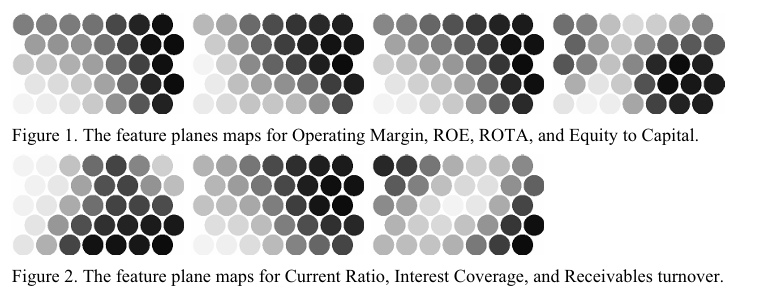
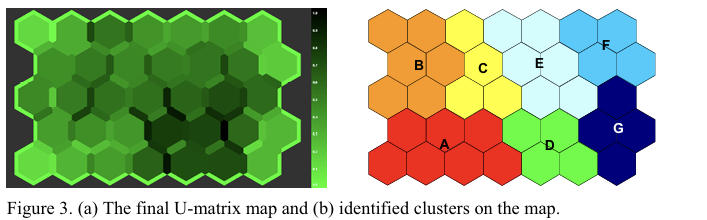
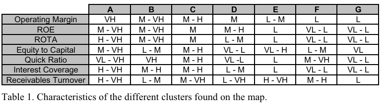
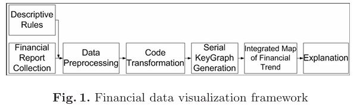
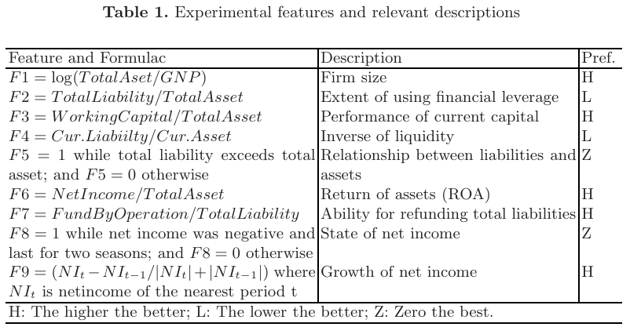
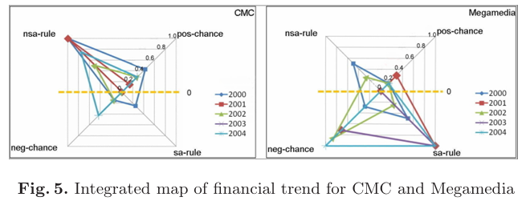

## Company Info
|   No. |   Publication date | Title                                                                                                                | Authors           | Relevance Score   |
|------:|-------------------:|:---------------------------------------------------------------------------------------------------------------------|:------------------|:------------------|
|     1 |               2002 | [Assessing the feasibility of self organizing maps for data mining financial information.](#no-1)                             | Eklund02[EBVV02]  |          $\star\star\star\star\star$         |
|     2 |               2005 | [Importance-driven visualization layouts for large time series data.](#no-2)                                                  | Hao05[HDK05]|       |                   |
|     3 |               2005 | [Interactive visualization of high dimensional marketing data in the financial industry.](#no-3)                              | Smeulders05[SH05] |                   |
|     4 |               2008 | [Visualization of financial trends using change discovery methods.](#no-4)                                                    | Chiu08[CHC08]     |      $\star\star\star$|
|     5 |               2012 | [Marketanalyzer: An interactive visual analytics system for analyzing competitive advantage using point of sale data.](#no-5) | Ko12[KMJE12]      |                   |

## 1. (2002) Assessing the feasibility of self organizing maps for data mining financial information. ($\star\star\star$)

- 51회 인용(2024.10)
- T Eklund, B Back, H Vanharanta, A Visa
- ECIS(European Conference on Information Systems) 2002 Proceedings

### 0. Abstract

이 논문은 국제 펄프 및 종이 회사들의 재무 성과를 분석하기 위해 자기 조직화 지도를 사용한 연구를 평가한다. 연구의 목적은 대량의 재무 데이터를 신속하고 정확하게 분석할 수 있는 데이터 마이닝 도구로서 자기 조직화 지도의 성능을 평가하는 것이다. 이를 위해 7개의 재무 비율 데이터를 인터넷에서 수집하여 1995년부터 2000년까지의 77개 회사와 6개 지역 평균을 분석하였다. 연구 결과는 자기 조직화 지도가 대규모 재무 데이터를 분석하는 데 유용한 도구가 될 수 있음을 보여준다.

### 1. Introduction

회사의 재무 성과에 관심을 가지는 여러 이해관계자가 존재한다. 투자자는 수많은 주식 중 유망한 투자를 찾고자 하고, 경영자는 경쟁 회사들과 자사 성과를 비교하여 개선할 부분을 찾고자 한다. 일반적인 스프레드시트를 사용하면 두세 개의 회사만을 비교할 수 있지만, 여러 비율을 동시에 고려해야 하는 경우 클러스터링 도구가 더 유용하다. 이 논문에서는 자기 조직화 지도를 사용하여 펄프 및 종이 회사들의 재무 비율을 분석하고, 유사한 재무 성과를 보이는 회사를 그룹화하였다.

### 2. Methodology

#### 2.1 자기 조직화 지도 (Self-Organizing Maps)
자기 조직화 지도를 적용하는 과정은 다음과 같다(Back et al., 1998):

1. 데이터 자료 선택: 네트워크의 학습 작업을 쉽게 하기 위해 입력 데이터를 전처리하는 것이 권장된다(Kohonen, 1997).
2. 네트워크 토폴로지, 학습률, 이웃 반경 선택: 이 매개변수들이 SOM 성능에 영향을 미친다.
3. 네트워크 구축: 입력 데이터를 네트워크에 여러 번 반복적으로 보여주면서 학습시킨다. 이 과정은 평균 양자화 오차가 충분히 작아질 때까지 계속된다.
4. 추가 분석을 위한 최적의 지도 선택: U-매트릭스(U-matrix)를 사용해 클러스터를 식별하고, 피처 플레인(feature plane)을 사용해 클러스터를 해석한다. 피처 플레인을 통해 각 뉴런마다 입력 변수의 값을 시각화할 수 있다.

네트워크 토폴로지란 격자의 형태를 의미한다. 사각형 격자와 육각형 격자가 흔히 사용되는데, 시각화 목적으로는 육각형 격자가 선호된다(Kohonen, 1997). 학습률은 입력 데이터 벡터가 네트워크에 미치는 영향을 의미하고, 이웃 반경은 네트워크의 어느 정도까지 영향을 미치는지 나타낸다. 평균 양자화 오차는 최적화된 뉴런과 입력 데이터 벡터 간의 평균 거리를 나타내며, 오차가 작을수록 지도는 더 잘 학습된 것으로 간주된다.

최종적으로 학습된 지도는 통합 거리 행렬(U-matrix) 방식을 사용하여 시각화된다. U-매트릭스는 고차원 데이터 공간에서 보이지 않는 관계를 발견할 수 있게 해준다. U-매트릭스는 인접한 뉴런 간의 거리를 계산해 행렬에 저장되며, 출력 지도는 이를 해석할 수 있게 한다. 뉴런 사이에 ‘벽’이 있다면 인접한 가중치 간 거리가 멀어지며, 이는 값이 상당히 다르다는 의미이다. U-매트릭스를 시각화할 때 거리 값은 색상으로 표현된다. 어두운 색상은 큰 거리를, 밝은 색상은 뉴런 간의 유사성을 나타낸다(Ultsch, 1993).

개별 피처 플레인을 보면 단일 벡터 열(즉, 이 연구에서는 하나의 재무 비율에 해당하는 지도)의 값을 시각화할 수 있다. 피처 플레인을 분석하여 각 회사가 단일 재무 비율에 따라 얼마나 잘 수행되었는지 파악할 수 있다(Kohonen et al., 1996). 따라서 피처 플레인을 사용하여 수익성이 좋은 회사들이 지도 상 어디에 위치하는지 쉽게 확인할 수 있고, 반대로 수익성이 나쁜 회사들의 위치도 파악할 수 있다.

#### 2.2 Choice of Companies
본 연구에서는 일본, 캐나다, 유럽 대륙, 북유럽(노르딕 국가), 미국의 회사들을 선정하였다. 아프리카, 아시아의 나머지 지역, 남아메리카는 정보 부족으로 인해 제외되었다. 회사는 Pulp and Paper International에서 발표한 연간 Top 150 순위(Rhiannon et al., 2001)를 기준으로 선택되었다. 각 지역의 평균도 추가적인 '회사'로 포함되었다. 총 83개의 회사가 분석에 포함되었다.

#### 2.3. Choice of data and information
이 연구의 출발점은 인터넷만을 재무 데이터의 출처로 사용하는 것이었다. 따라서 연구의 데이터 수집 부분은 주로 회사의 웹사이트와 인터넷의 다양한 데이터베이스에서 재무제표를 검색하여 이루어졌다.

많은 회사가 자사 홈페이지에서 3년 이상의 재무 정보를 제공하지 않았기 때문에, 대부분의 경우 이러한 데이터는 미국 회사의 경우 미국 증권거래위원회(SEC), 캐나다 회사의 경우 전자 문서 분석 및 검색 시스템(SEDAR), 일본 회사의 경우 Japan Financials와 같은 데이터베이스에서 보완되었다. 유럽 대륙 회사의 경우, 좋은 데이터베이스를 찾을 수 없어 우편으로 받은 연차 보고서로 보완하였다.

#### 2.4. Choice of Ratio
회사의 재무 분석을 수행하기 위해 재무제표에서 정보를 추출하였다. 이 재무제표를 바탕으로 7개의 재무 비율을 각 회사별로 계산하여 자기 조직화 지도를 학습시킬 때 입력 데이터로 사용하였다. 이 재무 비율들은 다음에서 간략하게 설명된다.

관련된 재무 비율의 선택은 국제 회계 차이를 보다 자세히 분석한 `Lehtinen(1996)`의 실증 연구를 기반으로 이루어졌다. 이 연구에서는 신뢰성과 타당성이 높은 7개의 재무 비율이 선택되었으며, 각 회사에 대해 계산되었다. 주요 비율은 수익성 비율, 유동성 비율, 지급 능력 비율, 효율성 비율의 네 가지 범주로 나눌 수 있다. 이 연구에서는 수익성이 대부분의 공기업에서 주된 동력으로 간주되기 때문에 수익성에 더 많은 중점을 두었다. 수익성 항목에서 영업 이익률(Operating Margin), 총자산수익률(ROTA), 자기자본수익률(ROE) 세 가지 비율이 선택되었다. 유동성 항목에서는 당좌 비율(Quick Ratio) 하나만 선택되었다. 지급 능력은 수익성만큼 중요하게 여겨졌기 때문에, **자본 대비 자기자본 비율(Equity to Capital)** 과 이자 보상 비율(Interest Coverage) 두 가지 비율이 선택되었다. 마지막으로, 효율성 항목에서는 매출채권 회전율(Receivables Turnover) 하나가 선택되었다.

### 3. Training the maps

이 연구에서 자기 조직화 지도(SOM)를 학습시키고 생성하는 데 사용된 소프트웨어는 SOM_PAK 3.1 버전으로, 코호넨의 자기 조직화 알고리즘을 기반으로 한다. 이 소프트웨어 패키지는 헬싱키 기술대학교의 SOM 프로그래밍 팀에 의해 개발되었다.

학습 과정 중 여러 테스트가 수행되어 적절한 매개변수를 결정하였다. 육각형 격자 형태가 출력 지도의 시각화를 위해 선호되었다. 또한 데이터 공간에서 안정적인 방향성을 얻기 위해 지도를 직사각형 형태로 구성하는 것이 바람직했다(Kohonen et al., 1996). 일반적으로 x축은 y축보다 약 30% 더 크게 설정하여 직사각형 출력 지도를 형성한다. 또 다른 권장 사항은 두 번째 학습 단계에서 학습 길이가 네트워크 유닛 수의 최소 500배 이상이 되어야 통계적 정확성에 도달할 수 있다는 것이다(Kohonen, 1997).

신경망의 학습 과정을 쉽게 하고 지도 품질을 향상하기 위해 데이터를 전처리하였다. 예를 들어, 하나의 재무 비율이 0에서 1 사이의 범위를 갖는 반면, 다른 재무 비율이 -100에서 100 사이의 범위를 가지면, 후자가 더 큰 영향을 미치게 된다. 그렇기 때문에 입력 데이터의 값이 다른 입력 데이터와 비교하여 그 중요도를 반영하거나 최소한 유사한 범위를 갖도록 전처리하는 것이 중요하다(Bishop, 1995). Eklund(2000)에서는 분산을 기반으로 정규화를 사용하여 데이터를 전처리했다. 이번 연구에서는 **히스토그램 평활화(histogram equalization)**를 사용해 전처리했다. 히스토그램 평활화는 드문 사건을 데이터 범위의 작은 부분에 매핑하고, 빈번한 사건은 넓게 분산시키는 방법이다. 히스토그램 평활화에 대한 자세한 정보는 Klimasauskas(1991)를 참조하길 바란다.

구축된 지도는 1995년부터 2000년까지의 입력 데이터를 사용해 학습되었다. 즉, 연구 기간 동안 단일 지도만 생성되었다. 각 해마다 지도를 하나씩 생성하지 않은 이유는 동일한 클러스터가 모든 해에 동일한 위치에 나타나기 때문이다. 해마다 지도를 학습시켰다면 서로 다른 클러스터가 나타났을 것이며, 각 클러스터를 따로 분석하고 해석해야 했을 것이다(Back et al., 1998).

최종적으로 학습된 지도는 7 x 5 뉴런 크기이다. 이 지도에서 육각형의 경계선 색상을 살펴보면 클러스터를 정의할 수 있다. 밝은 색상은 유사한 특성을 나타내고, 어두운 색상은 큰 거리를 나타낸다. 육각형 경계선의 색상은 클러스터를 정의하고 해석하는 데 매우 유용하다. 또한, 이 크기의 지도에서는 회사의 이동을 해석할 수 있는 방식으로 시각화하는 것이 가능하다.

최종적으로 생성된 지도와 피처 플레인을 시각화하는 데 사용된 소프트웨어는 Nenet 버전 1.1a이다. 이 소프트웨어는 헬싱키 기술대학교의 Nenet 팀에서 개발한 것으로, 자기 조직화 지도의 사용을 설명하는 데 매우 유용하다. 이 소프트웨어는 U-매트릭스 방법뿐만 아니라 보간된 2D U-매트릭스 방법과 개별 변수 수준 지도도 쉽게 시각화할 수 있다.

#### 3.1 클러스터 정의

최종적으로 학습된 **U-매트릭스 지도(Figure 3 a)** 와 그에 해당하는 **피처 플레인(Figures 1 and 2)** 을 분석함으로써 회사들의 클러스터와 그 특성이 식별되었다(Figure 3 b).

- 그룹 A는 가장 성과가 우수한 그룹으로 볼 수 있다. 이 그룹은 모든 수익성 비율에서 매우 높은 값을 보인다. 또한, 유동 비율을 제외한 모든 다른 비율에서도 높은 값을 보인다. 유동 비율은 절반의 회사에서 매우 낮지만, 나머지 절반의 회사에서는 매우 우수하다.

- 그룹 B는 거의 모든 비율에서 평균 이상의 성과를 보이는 그룹이다. 이 그룹은 수익성이 평균에서 매우 우수한 수준까지이며, 지급 능력과 효율성도 평균 수준이다. 이 그룹의 눈에 띄는 점은 유동성이 매우 높다는 것이다. 이 그룹에 속한 모든 회사는 매우 높은 유동성을 보인다.

- 그룹 C는 약간 평균 이상의 그룹이다. 이 그룹은 수익성과 유동성에서 평균 수준을 보이며, 효율성에서는 평균에서 매우 높은 값을 보인다. 이 그룹의 주요 특성은 높은 지급 능력을 가진다는 것이다. 또한, 높은 지급 능력으로 인해 이 그룹의 ROE 값은 낮게 나타난다.

- 그룹 D는 마지막 평균 그룹이다. 이 그룹의 수익성은 평균 수준이나, ROE 값은 종종 높은 편이다. 그룹 C와의 주요 차이점은 낮은 지급 능력과 유동성이다.

- 그룹 E는 성과가 평균 이하인 그룹이다. 수익성과 유동성이 낮거나 매우 낮으며, 지급 능력은 매우 높거나 낮게 나타난다. 그러나 효율성은 이 그룹에서 매우 높다.

- 그룹 F는 두 개의 가장 성과가 낮은 그룹 중 하나이다. 수익성이 매우 낮고 지급 능력도 평균 이하에서 보통 수준이다. 효율성과 유동성은 평균이며 일부는 높은 값을 보인다.

- 그룹 G는 가장 성과가 낮은 그룹으로, 모든 비율에서 낮은 값을 보인다.

각 그룹의 특성은 피처 플레인 분석을 통해 도출되었으며, 그 요약 내용은 표 1에 정리되어 있다.

(표 1에서는 각 그룹의 재무 비율 성과를 VL(매우 낮음), L(낮음), M(보통), H(높음), VH(매우 높음)으로 요약하여 표시함)

### 4. 회사들의 시간에 따른 벤치마크 분석

3장에서, 자기 조직화 지도(SOM)의 출력 지도에서 회사들의 클러스터를 식별하고 분석했다. 이 절에서는 1995년부터 2000년까지의 데이터에 기반하여 회사들의 이동을 보다 세부적으로 분석하고, 회사 간의 경쟁력을 벤치마크한다. Eklund(2000)에서는 여러 벤치마크가 수행되었는데, 여기서는 상위 5개 회사의 성과에 대한 더욱 정교한 버전의 벤치마크가 이루어졌다.

#### 4.1. 상위 5개 펄프 및 종이 회사
Figures 4와 5에서는 **Rhiannon et al.(2001)**이 발표한 상위 5대 펄프 및 종이 제조 회사가 서로 비교된다. Rhiannon에 따르면, 순매출 기준으로 가장 큰 펄프 및 종이 회사는 다음과 같다:

1. International Paper,
2. Georgia-Pacific,
3. Proctor & Gamble,
4. Stora Enso,
5. Oji Paper,
6. Nippon Unipac Holding,
7. Smurfit-Stone Container Corp.

각 연도별 회사들의 움직임은 화살표로 표시되었으며, Figure 4에서는 International Paper는 흰색 화살표로, Stora Enso는 회색 화살표로 표시되었다. Figure 5에서는 Georgia-Pacific은 흰색, Oji Paper는 회색, Smurfit-Stone Container Corp은 검은색 화살표로 나타냈다. Proctor & Gamble은 Rhiannon의 순위에서 3위였으나, 이 회사의 매출 중 약 30%만이 펄프나 종이 제품에서 나오기 때문에 이 분석에서는 제외되었다. 대신 Nippon Unipac Holding은 2001년에 합병되었기 때문에, 두 개의 별도 회사(Nippon Paper Industries와 Daishowa Paper)로 처리되었으며, 그 결과 Smurfit-Stone Container Corp이 상위 5개 회사 중 하나로 포함되었다.

International Paper (Figure 4)
International Paper는 1995년을 제외하고는 꾸준히 낮은 성과를 보였다. 특히 수익성 비율에서 부진한 성과를 보였으며, 1995년에는 그룹 A에 속했으나 그 이후로는 그룹 D, E, F에 속하며 성과가 악화되었다.

Georgia-Pacific (Figure 5)
Georgia-Pacific은 Fort James를 인수하면서 세계 2위의 자리에 올랐다. 1995년과 1999년을 제외하면 Georgia-Pacific의 성과는 전반적으로 좋지 않았다. 수익성은 평균에서 낮은 편이었고, 재무 건전성은 매우 낮았다. 이 회사는 1995년과 1999년에는 그룹 A에 속했으나, 그 외의 해에는 그룹 D 또는 E에 속했다. 그러나 International Paper보다는 성과가 나은 편이었다.

Stora Enso (Figure 4)
Stora Enso는 1995년에는 매우 좋은 성과를 보였으며(높은 수익성과 유동성, 그러나 낮은 재무 건전성으로 그룹 B에 속함), 1997년에는 성과가 매우 나빠져 그룹 D로 이동하였다(낮은 수익성, 유동성, 재무 건전성). 그 후 1998년에는 재무 건전성이 개선되었으나 수익성은 여전히 낮아 그룹 E에 속했다. 1999년에는 수익성이 상당히 개선되어 Stora Enso는 그룹 A로 이동하였고, 2000년에는 수익성이 더 높아졌지만 재무 건전성이 다소 떨어져 그룹 B로 이동했다.

Oji Paper (Figure 5)
Oji Paper는 분석 기간 동안 일관되게 낮은 성과를 보였다. 이는 일본 기업들의 평균 성과와도 일치하는데, Eklund et al.(2001)의 연구에서는 1998년 아시아 금융 위기의 영향을 받아 일본 기업들의 성과가 크게 하락한 것으로 나타났다. Oji Paper는 분석 기간 동안 대부분 그룹 G(가장 낮은 성과 그룹)에 속했다.

Smurfit-Stone Container Corp (Figure 5)
Smurfit-Stone Container Corp은 꾸준히 매우 낮은 성과를 보였다. 이 회사는 분석 기간 동안 큰 움직임이 없었으며, 1998년에는 성과가 더 나빴다. 이 회사는 꾸준히 낮은 수익성, 유동성, 매우 낮은 재무 건전성을 보였으며, 대부분의 해에 그룹 E에 속했다.

상위 5개 회사들은 Stora Enso를 제외하고는 성과가 매우 좋지 않았으며, 특히 수익성 비율에서 저조한 성과를 보였다. 1998년 Top 150 리스트에서는 상위 5위에 Kimberly-Clark와 UPM-Kymmene가 포함되었지만(현재 8위와 9위), 특히 Kimberly-Clark는 매우 좋은 성과를 보였다(Eklund et al., 2001). 산업의 지속적인 **통합(consolidation)**으로 인해 회사들이 매우 커졌지만, 그만큼 효율성이 떨어지는 경향이 있었다.

### *Data*

이 연구에서 사용된 데이터는 1995년부터 2000년까지의 77개 국제 펄프 및 종이 회사와 6개 지역 평균에 대한 재무 비율이다. 구체적으로 사용된 재무 비율은 다음과 같다:

`-` 수익성 비율

- Operating Margin (영업 이익률): 회사의 영업 이익을 매출액으로 나눈 값으로, 수익성 지표로 사용된다.
- Return on Total Assets (ROTA, 총자산수익률): 총 자산 대비 순이익을 나타내는 비율로, 자산의 효율성을 측정한다.
- Return on Equity (ROE, 자기자본수익률): 자기자본 대비 순이익을 나타내는 비율로, 주주의 투자 대비 이익을 평가한다.

`-` 유동성 비율

- Quick Ratio (당좌 비율): 유동 자산에서 재고 자산을 제외한 자산을 유동 부채로 나눈 값으로, 회사의 단기 지급 능력을 나타낸다.

`-` 안정성 비율

- Equity to Capital (자본 대비 자기자본 비율): 자기자본을 총 자본으로 나눈 값으로, 회사의 재무 구조 안정성을 평가한다.
- Interest Coverage (이자 보상 비율): 이자 비용을 감당할 수 있는지 여부를 평가하는 비율이다.

`-` 효율성 비율

Receivables Turnover (매출채권 회전율): 매출채권이 얼마나 자주 현금으로 전환되는지를 나타내는 비율이다.

이 데이터들은 주로 회사들의 웹사이트와 인터넷 데이터베이스에서 수집되었다.

`-` ***회사들의 시간에 따른 벤치마크 분석의 핵심***

- 분석대상: 세계 상위 5개 펄프 및 종이 회사 -> 이들의 재무성과가 해마다 어떻게 변동하는지?

## 2. (2005) Importance-driven visualization layouts for large time series data.
- 89회 인용(2024.10)
- MC Hao, U Dayal, **DA Keim**
- IEEE Symposium on Information Visualization 2005
  
### Abstract
이 논문의 초록(abstract)에서는 대규모 시계열 데이터를 시각적으로 분석하는 방법을 제안하고 있다. 시계열 데이터는 중요성의 정도가 다르고, 계층적 관계를 가질 수 있기 때문에, 이러한 관계를 효과적으로 표현할 수 있는 시각적 레이아웃이 필요하다는 점을 강조하고 있다. 제안된 기법은 크기와 위치를 통해 중요도와 계층 구조를 표현하면서도 규칙성을 유지해, 분석가가 데이터를 쉽게 비교할 수 있도록 돕는 것이 목표이다. 이 논문에서는 시계열 데이터 간 중요도 관계를 반영한 레이아웃을 생성하는 알고리즘을 개발하여, 다양한 실제 데이터에 적용하고, 기존의 TreeMap 알고리즘과 비교한 결과를 제시하고 있다. 이 연구는 매출 및 주식 데이터를 포함한 여러 실제 데이터에 적용되었으며, 그 유용성을 입증했다는 점을 보여준다.

### Introduction
서론(introduction)에서는 시계열 데이터가 실제 세계의 거의 모든 분야에서 중요한 데이터 유형임을 설명하고 있다. 기존의 시각화 기법들이 제한된 수의 시계열 데이터만을 다루거나, 대규모 데이터를 집계된 형태로 보여주는 방식에 집중해 왔다는 점을 지적하고 있다. 시계열 데이터를 동시에 여러 개 비교해야 할 때, 계층적 관계나 중요성의 차이를 시각적으로 표현하는 것이 중요하며, 이를 위해 레이아웃의 크기와 위치가 중요한 역할을 한다는 점을 강조한다. 이 논문은 시계열 데이터의 중요도와 계층적 관계를 반영하는 시각적 레이아웃을 생성하는 새로운 방법을 제시하며, 이러한 레이아웃을 통해 분석가가 데이터를 더 쉽게 비교할 수 있게 한다는 목표를 가지고 있다.

이러한 배경을 바탕으로, 논문은 중요도 기반 레이아웃 생성의 개념을 도입하고, 이를 위한 제약 조건을 형식화한 후, 효율적인 알고리즘을 제안하고 실제 데이터를 통해 그 유용성을 입증하고자 한다는 내용을 포함하고 있다.

## 3. (2005) Interactive visualization of high dimensional marketing data in the financial industry.
- 16회 인용
- R Smeulders, A Heijs
- Proceedings of the Ninth International Conference on Information Visualisation (IV’05)

### Abstract
이 논문의 초록에서는 금융 자산 관리 회사의 고차원 마케팅 데이터를 시각화하는 방법을 설명하고 있다. 데이터는 보통 30에서 100개의 변수와 25,000에서 50만 명에 이르는 고객 정보를 포함하고 있다. 이 연구에서는 변수 선택 도구로 상관 행렬의 시각화를 사용하여 데이터에서 패턴을 더 쉽게 찾을 수 있도록 하고, 이를 바탕으로 변수 범위를 선택한 후 클러스터 분석을 수행하여 5개의 변수를 시각화한다. 클러스터링된 데이터는 구 형태로 시각화되며, 추가적으로 정렬된 데이터를 볼륨 렌더링 및 등가표면을 사용하여 시각화한다. 이러한 시각화 방법을 통해 마케팅 연구자들은 고객 행동 패턴을 더 빠르게 파악할 수 있으며, 클러스터링을 통해 유사한 행동을 가진 고객 그룹을 식별할 수 있게 된다.

### Introduction
서론에서는 오늘날과 미래의 비즈니스 결정이 더 나은 데이터 해석에 의존하게 된다고 언급하고 있다. 기업들은 많은 데이터를 수집하여 이를 데이터베이스나 데이터 웨어하우스에 저장하고 있으며, 이를 통해 원래 데이터에 대한 깊은 통찰을 얻기 위해 더 많은 데이터를 계산하고 있다. 데이터의 진정한 가치는 비즈니스에 대한 지식을 얻는 데 있다. 마케팅 연구는 특히 데이터가 최신 상태여야 하는 영역이며, 고객의 요구가 빠르게 변화하기 때문에 데이터를 직관적으로 접근하는 것이 중요하다고 설명된다. 대규모 마케팅 데이터베이스는 많은 변수를 포함하고 있어 통계적 방법만으로는 고객 행동 패턴을 찾기 어렵다. 시각화 방법이 이러한 다차원 데이터를 분석하고 탐색하는 데 중요해지고 있으며, 이는 "시각적 데이터 마이닝"으로도 불린다.

## 4. (2008) Visualization of financial trends using change discovery methods. ($\star\star\star$)

- 13회 인용(2024.10)
- TF Chiu, CF Hong, YT Chiu
-  IEA/AIE (International Conference on Industrial, Engineering & Other Applications of Applied Intelligent Systems), 2008
### 0. Abstract
이 논문의 초록(abstract)에서는 기업의 재무 상태를 이해하기 위해 재무제표를 해석하는 것이 중요하다고 설명한다. 재무제표를 읽는 대신, 시각화 방법을 통해 비전문가가 재무 상태를 직관적이고 쉽게 이해할 수 있도록 도울 수 있다. 특히, 변화 발견(Chance Discovery) 방법이 재무 트렌드를 감지하는 데 적합할 수 있다고 언급된다. 이 연구에서는 두 회사의 재무 상황을 설명하기 위해 시리얼 KeyGraph를 사용하고, 5년간의 누적 시나리오를 설명하는 통합 지도를 생성한다. 최종적으로 시리얼 KeyGraph와 통합 지도를 통해 재무 트렌드를 시각화하는 방법을 제시한다.

### 1. Introduction
도입부(introduction)에서는 기업의 재무 위기가 주주뿐만 아니라 사회 전체에 영향을 미친다고 설명한다. 따라서 주주들이 기업의 재무 트렌드를 감지할 수 있도록 돕는 것이 중요한 문제로 대두된다. 전통적인 재무 예측 모델들은 정적 데이터를 사용하여 예측하지만, 이 연구에서는 시간에 따른 지속적인 변화를 고려하여 동적으로 재무 트렌드를 감지하고자 한다. 이를 통해 경영자와 이해관계자들이 재무 트렌드를 시각적으로 이해하고, 기업의 전략적 운영을 발견할 수 있도록 돕는 것이 목표로 설정된다.

### 3. Financial Data Visualization Framework
재무 데이터 시각화 프레임워크는 아래 그림 1과 같이 구성된다. 이 프레임 워크는 총 5단계로 나뉘며, 

단계는 다음과 같다. : 
- `1`: 서술 규칙
- `2`: 재무 보고서 수집 및 데이터 전처리
- `3`: 코드 변환
- `4`: Serial KeyGraph 및 통합 재무 트렌드 지도
- `5`: 설명 

#### `1` 서술 규칙 (Descriptive Rules)
관련 문헌을 검토하고 서술 규칙을 수집하는 것이다. 이 규칙들은 기업의 재무 위기 및 실패 가능성을 관찰하기 위해 구성되며, 종합적으로 기업의 상태를 검토하는 데 사용된다.

이 논문에서는 6개의 서술 규칙이 사용되었다.

`(1)` **상환 능력이 낮고 재무 레버리지가 높을 경우,** 기업이 실패할 가능성이 높아진다.

`(2)` **총 부채가 총 자산보다 많을 경우,** 재무 위기에 직면할 수 있다.

`(3)` **기업의 규모가 줄어들면서 성과도 저조할 경우,** 재무 실패로 이어질 수 있다.

`(4)` **이익이 적고 상환 능력이 낮을 경우,** 파산 위험이 커진다.

`(5)` **이익이 적고 기업 규모가 작은 경우,** 파산 가능성이 높다.

`(6)` **유동성 부족, 자산 활용의 비효율성, 과도한 재무 레버리지**는 재무 실패의 징후가 될 수 있다.

> 여기서 말하는 서술 규칙은 기업의 재무 상태가 긍정적이거나 부정적인 상황으로 나아가는지 여부를 평가하기 위한 기준 혹은 지침이다. 이 규칙들은 기업의 재무 데이터에서 중요한 지표들이 어떻게 변화하는 지를 설명하고, 그 지표들을 바탕으로 기업의 재무 위기 가능성을 예측한다. KeyGraph를 통해 이런 규칙들이 충족되었는지 혹은 충족되지 않았는지를 시각적으로 나타냄으로써, 기업의 재무 상태 변화를 더 직관적으로 분석할 수 있다.

#### `2` 재무 보고서 수집 및 데이터 전처리 (Financial Report Collection & Data Preprocessing)
프레임워크의 두 번째 단계는 재무제표를 수집하고 데이터 전처리를 수행하는 것이다. 데이터 수집 과정에서 9개의 특징이 서술 규칙과 관련 문헌에 대응하여 선택되었다. 이 특징들은 규칙의 존재를 관찰하고 KeyGraph에서 기회를 발견하는 데 사용된다. 각 특징은 해당 재무 활동에 의해 인과적으로 영향을 받는다.

데이터 전처리 단계에서는 각 특징(즉, 재무 비율)의 값이 계산되고 표준화된다. 각 특징의 값은 표준 정규 분포를 따른다고 가정된다. 표준화 후, 모든 특징은 $0.5$의 표준 편차를 기준으로 코드 값으로 변환된다. 예를 들어, 0<z(표준 편차)≤0.5이면 코드 값 0.5로 변환된다. 이는 "코드 변환" 단계를 위한 준비 단계이다.

#### `3` 코드 변환 (Code Transformation)
시리얼 KeyGraph를 생성하기 전에, 세 번째 단계인 "코드 변환"을 사전에 수행해야 한다. 이 변환에서는 이전 단계에서 획득한 각 특징의 코드가 표준 정규 분포 확률표에 따라 확률 값으로 변환된다.

예를 들어, 코드 값이 $0.5$(즉, $0<Z\leq 0.5$)이면 확률 값은 $0.1915$로 변환된다. 이와 유사하게, 코드 값이 $1.5$(즉, $1<Z\leq 1.5$)이면 확률 값은 $0.0919$로 변환된다. 평균에 가까운 코드 값은 더 높은 확률로 변환되고, 평균에서 멀리 떨어진 코드 값은 더 낮은 확률을 갖는다. 따라서 각 특징에서 얻은 확률 값은 기회 발견 영역에서 용어 발생 빈도로 볼 수 있다. 이 코드 변환을 수행하는 이유는 기회 발견의 원칙과 일치시키고, 시간 차원에서 연속적인 변화를 관찰하기 위함이다. 즉, 재무에서 특징의 의미가 기회 발견에서의 빈도와 대응할 수 있도록 하는 방법을 찾고자 했다.

#### `4` Serial KeyGraph 및 통합 재무 트렌드 지도 (Serial KeyGraph Generation & Integrated Map of Financeal Trend)
각 특징의 빈도(즉, 정수(확률 값 ∗ 100))가 얻어지면, KeyGraph 알고리즘에 따라 시리얼 KeyGraph가 생성된다.

시리얼 KeyGraph는 선택한 기간 동안 대상 기업을 관찰하기 위해 순차적으로 생성된 일련의 KeyGraph이다.

KeyGraph의 정의에 따르면, 허브는 기회의 후보로 간주된다. 이 연구에서는 기회를 선택하는 방법을 확장하여 연속적으로 나타나는 허브를 기회로 간주하고, 이를 통해 기업의 재무 상황과 조작을 검사할 수 있도록 한다. 6개의 서술 규칙을 사용하여 처음에는 좋은 상태와 나쁜 상태를 확인한다. 만족된 규칙과 만족되지 않은 규칙의 수를 통해 재무 트렌드와 변화를 감지할 수 있다. 이에 따라 네 가지 재무 상태를 KeyGraph에서 발견할 수 있다: 안정, 성장, 혼란에서 회복, 하락/위험, 실패.

마지막으로, 시리얼 시나리오를 요약하기 위해 재무 트렌드의 통합 지도가 생성되어 전체 기간 동안의 재무 트렌드 개요를 제공한다.

#### `5` 설명 (Explanation)
KeyGraph에서 녹색 노드는 긍정적인 효과를 나타내며, 노란색 노드는 부정적인 효과를 나타낸다. 같은 색의 노드는 동일한 방향의 변화를 지속적으로 표현하는 것을 의미한다. 기회는 심각한 상태를 나타내므로, 더 많은 기회가 있는 다이어그램은 상황이 상당히 좋거나 나쁘다는 것을 의미한다.

이해관계자와 관리자가 텍스트 표현보다 시각적 표현을 통해 동적 변화를 확인하는 것이 더 쉽고 편리해진다. 일반적으로, 연도별로 너무 적은 노드보다는 일정 수 이상의 노드가 있는 것이 좋다. 노드는 재무 활동을 나타내기 때문이다. 다이어그램은 이해관계자와 관리자가 기업의 상태를 쉽게 파악할 수 있도록 도와주며, 기업의 재무 상태를 감지하거나 다음 해의 재무 조작에 대한 조언을 제공하는 데도 사용될 수 있다.

### 4. Experiment and Explanation
이 연구는 타이완의 전자산업에 속한 "광학저장매체 회사"의 재무상태를 조사하는 것을 목표로 한다. 이 논문에서 사용된 데이터는 타이완 전자 산업 내 "광학 저장 매체 회사"의 재무 데이터를 바탕으로 한다. 구체적으로 CMC Magnetics Corporation과 Megamedia Corporation 두 회사를 실험 대상으로 선택하였다. CMC Magnetics는 재무적으로 안정된 회사를, Megamedia는 2005년에 상장 폐지된 재무 위기 회사로 선정되었다. 연구에서는 1997년부터 2004년까지의 계절별 재무제표가 Taiwan Economic Journal (TEJ) 데이터 뱅크에서 수집되었다.

수집된 데이터는 두 부분으로 나뉘었다. 첫 번째 부분은 1997년부터 1999년까지의 데이터를 표준화 계산의 기초로 사용했고, 두 번째 부분은 변환된 코드 값을 생성하기 위한 초기 값으로 사용되었다. 총 9개의 재무 비율이 실험에 사용되었으며, 이들은 연구에서 제시된 서술적 규칙을 확인하고 KeyGraph를 통해 변화를 감지하는 데 사용되었다.

#### `-` 4.1 Serial KeyGraph Experiment

#### `-` 4.2 Integrated Map of Financial Trend
CMC와 Megamedia의 Serial KeyGraph를 설명한 후, 표2

그림 5를 보면, CMC의 대부분의 재무 활동은 0선 위에 있었으며, 각 연도의 둘러싼 영역은 안정적으로 나타났따. 즉, CMC의 재무 트렌드는 안정적이고 건강한 상태로 2000년부터 2004년까지 이어졌음을 의미한다. 

반면, Megamedia의 대부분의 재무 활동은 0선 아래에 위치했고, 여러 해에 걸쳐 그 범위가 0선 아래에서 더 확장되었다. 이에 따라 Megamedia의 재무 트렌드는 하락하고 위험한 상태였으며, 재무 상태를 개선하려는 시도들이 효과적이지 않았음을 시사한다.

$\Rightarrow$ 결론적으로, CMC는 전반적으로 안정적인 상태였지만, Megamedia는 시간이 지남에 따라 재무 상태가 악화되고, 위험 신호가 점차 증가했음을 알 수 있다.

## 5. (2012) Marketanalyzer: An interactive visual analytics system for analyzing competitive advantage using point of sale data.
- 46회 인용(2024.10)
- S Ko, R Maciejewski, Y Jang
- Eurographics Conference on Visualization (EuroVis), 2012

### Abstract

이 논문의 초록(Abstract)에서는 MarketAnalyzer라는 시스템을 소개하고 있다. 이 시스템은 판매 시점 데이터(Point of Sale Data)를 이용하여 경쟁 우위를 분석하는 상호작용형 시각 분석 시스템이다. 경쟁 정보(Competitive Intelligence, CI)는 시장 내의 위험과 기회를 식별하고, 이를 통해 사업적 결정을 내리는 데 사용된다. 하지만 기존 도구들은 이러한 복잡한 데이터를 쉽게 분석하지 못한다. 따라서 이 논문은 MarketAnalyzer를 통해 판매 데이터와 시장 점유율의 변화를 한 화면에서 시각적으로 제공하고, 지리적 특성 및 인구통계학적 정보를 결합하여 시장 분석을 가능하게 한다고 설명한다. 또한 이 시스템은 두 가지 사례 연구를 통해 그 효과를 입증한다고 설명된다.

### Introduction
서론(Introduction)에서는 사업의 궁극적인 목표는 시장 점유율을 유지하거나 증가시키고, 시장 내에서 최대한의 이익을 얻는 것이라고 설명한다. 이를 위해 분석가들은 지속적으로 시장 점유율 데이터를 탐색하고 분석해야 하며, 이를 통해 시장 변화에 대한 예측을 할 수 있다. 이를 **경쟁 정보(Competitive Intelligence, CI)** 라고 부른다. 기업들은 경쟁사를 비교하고 시장 내 위험과 기회를 평가하여 새로운 판매 전략의 잠재적 영향을 분석하는 데 CI를 활용한다. 판매 시점 데이터는 이러한 분석에 중요한 역할을 하지만, 기존 시스템은 이러한 데이터를 효과적으로 관리하지 못하기 때문에 이 논문에서는 MarketAnalyzer라는 시각 분석 시스템을 제안하게 된다. MarketAnalyzer는 사용자에게 다양한 시각화 기법을 제공하여 복잡한 데이터를 효율적으로 분석하고 의사결정에 도움을 줄 수 있게 된다.

`-` Data

이 논문에서 사용한 데이터는 **판매 시점 데이터(Point of Sale Data)** 이다. 판매 시점 데이터는 소매업체가 공급업체와 공유하는 중요한 정보로, 시간적, 다변량적, 공간적 특성을 가진 데이터로 설명된다. 논문에서는 288개의 매장과 36개의 제품에 대한 데이터를 사용하여 시스템을 시연하고 있다. 이 데이터는 상점별로 판매량, 트렌드, 시장 점유율 성장률을 분석하기 위해 사용되며, 이를 통해 기업이 경쟁 우위를 확보하고 시장의 위험과 기회를 파악할 수 있게 된다.

