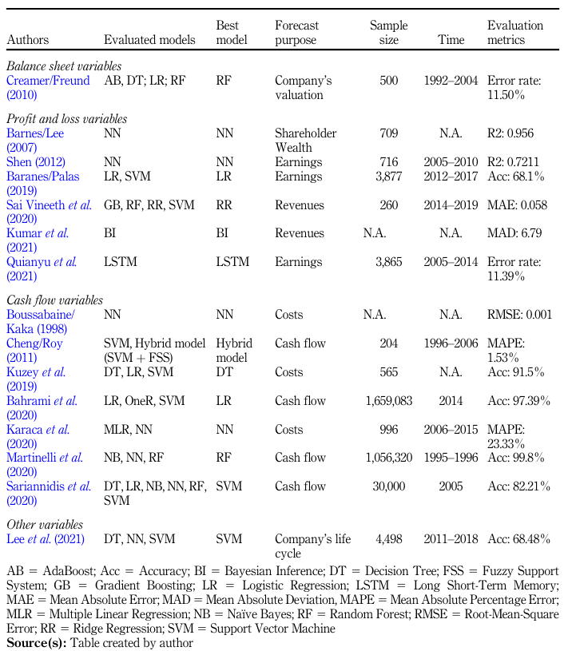

# PAPER LIST
|   No. |   Publication date | Title                                                                                                                | Authors           | Relevance Score   |
|------:|-------------------:|:---------------------------------------------------------------------------------------------------------------------|:------------------|:------------------|
|     1 |               2022 | [Detecting anomalies in financial data using machine learning algorithms.](#no-1)| M A Bakumenko, A Elragal | $\star$|
|     2 |               2023 | [Forecasting in financial accounting with artificial intelligence-A systematic literature review and future agenda](#no-2) | M Kureljusic, E Karger|$\star\star\star\star\star$ |

## 1. (2022) Detecting anomalies in financial data using machine learning algorithms
- 45회 인용(2024.10)
- A Bakumenko, A Elragal
- Systems

`-` Alexander Bakumenko
- MSc in Data Science degree from Luleå University of Technology, Sweden
- BSc in Business Informatics degree from Middlesex University, UK
- Artificial Intelligence, Explainable AI, Responsible AI, HCI, Decision Science

`-` Ahmed Elragal
- Prof. of Information Systems, Luleå University of Technology, Sweden (스웨덴 룰레오 공과대학교 정보시스템 교수)
- Decision theory, Data Science, Business Analytics, Information Systems, Enterprise Systems

> Systems 저널은 MDPI에서 발행하는 오픈 액세스(Open Access) 학술지이다. 이 저널은 시스템 과학 및 시스템 이론에 대한 연구를 다루며, 다양한 학문 분야에서 시스템과 관련된 이론적, 실험적 연구 결과를 발표합니다. 주로 시스템 분석, 설계, 최적화, 제어, 시뮬레이션, 모델링 등과 관련된 연구를 다룬다. Systems 저널의 주요 특징은 다음과 같다:
>1. 오픈 액세스(Open Access): 이 저널에 게재된 논문은 누구나 무료로 접근할 수 있으며, 연구 결과가 더 널리 공유되고 활용될 수 있도록 하는 것이 목적입니다.
>2. 학제 간 접근(Interdisciplinary Focus): Systems 저널은 시스템 과학의 여러 측면을 다루며, 공학, 생명과학, 사회과학, 경제학 등 다양한 분야와 관련된 연구 결과를 수용합니다.
>3. 피어 리뷰(Peer-Review): 이 저널에 게재되는 논문은 동료 연구자들에 의해 심사되며, 엄격한 피어 리뷰 과정을 거칩니다.
>4. 빠른 출판: MDPI는 신속한 출판 절차로 유명하며, Systems 저널 역시 논문 심사 및 출판 과정이 빠르게 진행되는 것이 특징입니다.

>Systems 저널은 오픈 액세스 저널로, 일정 수준의 신뢰성을 유지하고 있지만, 신뢰성 평가 시 저널의 임팩트 팩터나 해당 분야에서의 평판을 추가적으로 고려하는 것이 좋다. MDPI 저널은 전반적으로 다양한 연구를 빠르게 출판할 수 있는 플랫폼을 제공하는 반면, 일부에서는 신중한 검토 과정에 대한 우려가 제기된다.

### 0. Abstract
이 논문은 회계 데이터에서 오류와 사기를 탐지하는 것이 중요한 과제임을 강조하며, 머신러닝(ML) 기술을 활용하여 이를 해결하는 방법을 제안한다. 저자들은 지도 학습(supervised) 및 비지도 학습(unsupervised) 기법을 사용하여 일반 원장(General Ledger, GL) 데이터에서 사기 및 이상 징후를 탐지하는 방법을 제안한다. 논문에서는 실제 데이터에 기반한 실험을 통해 지도 학습과 비지도 학습 모델을 훈련하고, 다양한 기법을 사용하여 높은 위험을 지닌 회계 항목을 효과적으로 샘플링하고 탐지할 수 있음을 입증하고 있다.

### 1. Introduction

- **연구의 중요성 및 동기** : 최근 회계 감사와 관련된 작업의 복잡성이 증가하고 있으며, 특히 기업 자원 계획(ERP) 시스템에서 처리되는 방대한 데이터의 양 때문에 더 많은 자동화와 스마트 솔루션이 필요해졌습니다. 회계 데이터에서 이상 징후를 탐지하는 작업은 감사인의 중요한 일상 업무이며, 저자는 이를 머신러닝 기술을 통해 개선하려는 시도를 설명하고 있다.

- **문제 정의 및 목표** : 저자들은 기존의 샘플링 방식으로는 방대한 데이터를 모두 확인할 수 없으며, 불확실한 패턴이나 진화하는 사기 패턴을 탐지하는 데 한계가 있음을 지적한다. 따라서 이 논문의 목표는 다양한 머신러닝 기법을 사용해 일반 원장 데이터에서 이상 징후를 탐지하고, 감사 작업을 보다 효율적으로 수행할 수 있도록 돕는 것이다.

이 논문은 회계 및 감사 분야에서 머신러닝 기법을 적용하여 복잡한 데이터에서 숨겨진 패턴을 찾는 데 중점을 두고 있으며, 이를 통해 감사 비용을 절감하고 효율성을 높일 수 있는 가능성을 제시하고 있다.

이 논문에서 사용된 지도학습과 비지도학습의 주요 알고리즘은 아래와 같다.

#### `-` 지도 학습 (Supervised Learning)
- 로지스틱 회귀
- 서포트 벡터 머신
- 결정 트리
- 랜덤 포레스트
- k-최근접 이웃 알고리즘
- 나이브 베이즈
- 인공 신경망

#### `-` 비지도 학습 (Unsupervised Learning)

- Isolation Forest 
- Autoencoder

## 2. (2023) Forecasting in financial accounting with artificial intelligence-A systematic literature review and future agenda.
- 34회 인용(2024.10)
- M Kureljusic, E Karger
- Journal of Applied Accounting Research (JAAR)

`-` Marko Kureljusic
- 독일 뒤스부르크-에센 대학교 경제학 학사/석사/박사
- 박사과정에서 기계학습 알고리즘을 이용한 재무 예측의 적합성에 대한 연구 수행
- Machine Leaning, Deep Learning, Empirical Accounting Research

`-` Erik Karger
- Blockchain, Information Systems

>  JAAR은 Emerald Group Publishing에서 발행되며, 비즈니스 및 재무(Business, Finance) 분야에서 중요한 연구 성과를 게재한다. 이 저널은 SCImago Journal Rank(SJR)에서 0.567로 평가되었으며, 2023년 영향력 지수(Impact Score, IS)는 3.30으로 기록되었다. 또한, h-index는 31로, 최소 31편의 논문이 31번 이상 인용된 것을 의미하며, 해당 저널은 Q1 등급에 속한다. 이는 비즈니스 및 재무 분야에서 상위 학술지 중 하나로 평가된다는 것을 의미한다. 또한 엄격한 peer review과정을 통해 학문적 신뢰도를 유지하고 있는 저널이다.

## 0. Abstract
**이 논문의 목적은 재무 회계에서 인공지능(AI) 을 사용한 예측 모델에 대한 기존 연구 결과를 종합하고, 이 분야에서 아직 해결되지 않은 연구 과제를 제시하는 것이다.** 재무 회계는 규칙 기반의 시스템이며, 데이터가 체계적으로 구성되어 있어 AI 기반의 예측에 적합하다. 그러나 많은 회계 시스템은 최신 기술 발전에 아직 미치지 못하고 있다. AI를 사용한 예측은 보다 적극적인 경영 관리와 상세한 분석을 가능하게 한다. 연구진은 47개의 기존 연구를 분석하여 AI 기반 예측이 재무 회계에서 어떻게 사용되고 있는지를 종합한 결과를 제시하고, 향후 연구 과제를 제안한다. 이 논문은 AI 기반의 재무 예측 연구를 체계적으로 정리한 최초의 연구라는 점에서 의미가 있다.

## 1. Introduction
디지털 기술의 발전은 많은 산업 분야에 급격한 변화를 가져왔으며, 특히 **인공지능(AI)** 은 최근 몇 년 동안 많은 주목을 받고 있다. 재무 회계 분야에서도 AI의 적용 가능성이 높아지면서, 이를 활용한 예측 연구가 점점 더 많이 이루어지고 있다. 회계는 오랜 역사를 가진 전통적인 분야이지만, 디지털 전환의 영향으로 최근 급격한 변화가 일어나고 있다. 이 논문은 AI 기반의 예측 기술이 재무 회계의 다양한 영역에서 어떻게 사용되고 있는지 종합적으로 조사하고, 이 분야에서 일반화 가능한 지식을 확보하는 데 기여하는 것을 목표로 한다.

이를 위해 저자들은 두 가지 주요 연구 질문을 제시한다:

`1.` 재무 회계에서 AI 기반 예측 기술은 어떤 방식으로 사용되며, 그로 인해 어떤 이점이 발생하는가?

`2.` 향후 연구에서는 AI 기반 재무 예측 분야에 어떤 공헌을 할 수 있으며, 이를 위한 연구 과제는 무엇인가?

이 논문은 이러한 질문에 답하기 위해 체계적인 문헌 검토를 수행하고, 기존 연구들을 종합한 후 향후 연구 방향을 제시한다.

## 4. Findings (연구 결과)
AI 기반 예측이 재무 회계에서 중요한 가치를 지닌다는 사실은 여러 연구에서 이미 확인되었다(Ciampi et al., 2021; Bertomeu, 2020).
최종 샘플을 확보한 후, 우리는 논문 내용을 검토하여 각 논문이 다루는 내용을 파악하였다. 이 초기 평가에 따라 기존 연구는 크게 세 가지 범주로 나눌 수 있었다. 첫 번째로, 우리는 파산 예측에 대한 연구 결과를 제시하며, 이러한 예측은 기업의 계속 기업 가정(going concern assumption) 평가에 매우 중요하다. 파산 예측은 가장 많은 연구에서 다루어졌으며, 총 20편의 논문이 이 주제를 다루고 있다. 두 번째로, 우리는 재무 분석에 대한 연구 결과를 다루었다. 이 분야는 기업의 경제적 상황을 예측하는 데 중점을 두고 있다. 마지막으로, 우리는 부정 행위 및 오류 탐지에 관한 연구 결과를 다루며, 이는 재무 정보의 신뢰성을 평가하는 데 필수적이다.

- `4.1` 파산 예측 (Bankruptcy predictions)
- `4.2` 재무 분석 (financial analysis)
- `4.3` 부정 행위 및 오류 탐지 (fraud and error detection)

### 4.1 Bankruptcy
파산이나 **채무 과다(insolvency)** 의 위협은 특히 자본 제공자들에게 큰 위험으로 간주된다. 기업이 파산할 경우, 자본 제공자들은 투자한 자본을 잃을 수 있기 때문에, 이들은 기업의 미래 유동성 및 재무 상태를 예측하고자 한다(Agarwal & Taffler, 2008).

AI를 사용한 초기 파산 예측 연구는 `Wilson과 Sharda(1994)` 에 의해 제안되었다. 저자들은 **신경망(neural networks)** 과 **다변량 판별 분석(multivariate discriminant analysis, MDA)** 을 비교하였다. 두 모델 모두 지도 학습(supervised learning) 방식을 따르며, 훈련 데이터를 바탕으로 기업의 파산 가능성을 예측할 수 있다.  연구 결과, 신경망이 MDA보다 높은 예측 정확도를 제공함을 발견하였다.
`Lacher et al.(1995)` 역시 더 많은 데이터를 사용하여 유사한 결과를 얻었으며, `Alici(1996)`는 **코호넨 네트워크(Kohonen networks)** 라는 비지도 학습 방법을 사용해 파산 기업과 건실한 기업을 구분할 수 있음을 보여주었다. `Kim(2005)`은 더 많은 뉴런을 사용한 신경망을 제안하였으나, 기존 연구들보다 더 나은 결과를 제공하지 못하였다.

`Tsai와 Wu(2008)`는 **더 깊고 긴 학습 에폭(epochs)** 을 사용하여, 호주, 독일, 일본 기업들의 파산 예측 정확도를 향상시켰다. `Huang et al.(2008)`은 신경망의 예측 정확도를 향상시키기 위해 비율 분석을 사용하였으며, `Shi et al.(2009)`은 **배깅(bagging)**과 같은 앙상블 학습 기법이 예측 정확도를 높이는 데 기여함을 보여주었다. `Lu et al.(2015)`은 **서포트 벡터 머신(SVM)** 과 **입자 군집 최적화(particle swarm optimization, PSO)** 를 결합한 하이브리드 모델을 제안하였고, 이는 파산 예측에서 탁월한 성능을 보였다. `Antunes et al.(2017)`은 **가우시안 프로세스(Gaussian processes)** 와 같은 기법이 서포트 벡터 머신보다 우수한 성능을 제공함을 보여주었다. `Kostopoulos et al.(2017)`은 **랜덤 포레스트(Random Forest)** 가 서포트 벡터 머신보다 더 나은 예측 성능을 제공함을 발견하였다.

`Jones와 Wang(2019)`는 **트리넷(TreeNet)** 이 **로지스틱 회귀(logistic regression)** 보다 더 높은 예측 정확도를 보인다는 사실을 입증하였으며, `Uthayakumar et al.(2020)`은 **개미 군집 최적화 알고리즘(ant colony optimization algorithm)** 이 다른 모델들보다 우수한 성능을 보인다는 결과를 도출하였다. `Alexandropoulos et al.(2019)`은 **심층 신경망(deep neural networks)** 이 로지스틱 회귀 및 **나이브 베이즈(naive Bayes)** 보다 더 정확한 예측을 제공함을 보여주었다.

최근 연구에서는 **장기 단기 기억 신경망(long short-term memory, LSTM)** 을 사용한 연구들이 등장하였으며, `Jang et al.(2020)`은 추가적인 거시경제 및 산업 데이터가 예측의 신뢰성을 높이는 데 기여함을 발견하였다.

또한, 텍스트 데이터를 예측에 활용하려는 시도도 있다. `Mai et al.(2019)`는 연례 보고서의 텍스트 데이터를 사용하여, 신경망의 예측 정확도를 크게 향상시킬 수 있음을 보여주었다. 이는 랜덤 포레스트나 로지스틱 회귀보다 더 높은 성능을 제공하였다.

### 4.2 Financial analysis

재무 분석은 기업의 현재 및 미래 경제 상황을 파악하기 위해 정량적 및 정성적 회계 데이터를 검토하는 작업이다. 이를 위해 연간 재무제표는 내부 및 외부 분석가들에 의해 분석된다. 분석의 목적은 투자자, 은행, 비영리기구(NGO) 등 다양한 이해관계자들의 의사 결정을 돕는 것이다. 예를 들어, 투자자나 은행은 이 분석을 통해 기업의 투자 가능성을 평가하고, 비영리기구는 기업의 지속 가능성을 평가할 수 있다. 또한, 공급자들 역시 고객의 신용도를 평가하고, 장기적인 비즈니스 관계를 구축할지 여부를 결정하는 데 이 분석을 사용할 수 있다. 이러한 예측 작업에서 AI는 기업의 재무 상황을 보다 정확하게 분석하고, 이해관계자들이 더 나은 의사 결정을 내리는 데 도움을 줄 수 있다.

#### `-` 미래 비용 예측 (Forecasting future costs)

미래 비용 예측은 재무 분석의 중요한 요소 중 하나로, 이는 기업의 미래 재무 상태와 순자산에 직접적인 영향을 미친다. `Boussabaine와 Kaka(1998)`는 건설 프로젝트의 미래 비용을 예측하기 위해 **신경망(neural networks)** 을 사용하였으며, 실제 비용 곡선과 예측된 비용 곡선 사이의 차이가 거의 없음을 발견하였다. `Karaca et al.(2020)`도 신경망이 건설 비용 예측에서 다른 방법들보다 우수하다는 사실을 확인하였다. `Kuzey et al.(2019)`은 ML 모델을 사용하여 비용 시스템의 기능성에 영향을 미치는 요인들을 분석하였으며, 효율적인 비용 관리가 기업의 성과에 중요한 역할을 한다는 결론을 내렸다.

#### `-` 주주 가치, 주식 수익률 예측 (Forecasting of shareholder wealth and stock returns)

미래 주주 가치 및 주식 수익률을 예측하는 것은 오래전부터 학계에서 중요한 논의 주제였다. `Barnes와 Lee(2007)`는 신경망을 사용하여 주주 가치에 가장 큰 영향을 미치는 재무 비율들을 분석하였으며, 자본 수익률(ROE), 주가, **경제적 부가가치(EVA)** 가 주요 변수임을 밝혔다. `Creamer와 Freund(2010)` 은 **부스팅(boosting)**과 **트리 기반 알고리즘(tree-based algorithms)** 을 사용하여 기업의 과대평가 또는 과소평가 여부를 예측하는 연구를 진행하였다. 이들은 **토빈의 Q(Tobin’s Q)** 를 사용하여 기업의 시장 가치를 평가하였으며, **랜덤 포레스트(Random Forest)** 가 가장 우수한 예측 성능을 제공함을 발견하였다.

#### `-` 현금 흐름 예측 (Forecast cash flows
현금 흐름 예측 또한 기업의 재무 상태를 평가하는 데 중요한 요소로 간주된다. `Cheng과 Roy(2011)`는 서포트 벡터 머신(SVM), 퍼지 로직 모델(fuzzy logic models), **유전자 알고리즘(genetic algorithms)** 을 결합한 하이브리드 모델이 신뢰할 수 있는 현금 흐름 예측을 제공함을 발견하였다. `Bahrami et al.(2020)`은 로지스틱 회귀 모델이 고객의 지불일을 예측하는 데 SVM이나 OneR 알고리즘보다 더 나은 성능을 보였다고 보고하였다. 또한, IFRS 9에 따른 매출 채권의 측정은 예상 신용 손실 모델을 사용해야 하므로, 기업의 신용 위험 관리에도 중요한 역할을 한다.

#### `-` 매출 예측
매출 예측 역시 기업의 발전을 평가하는 중요한 지표 중 하나이다. `Sai Vineeth et al.(2020)`은 여러 ML 모델을 비교하여 **리지 회귀(ridge regression)** 가 다른 예측 모델들보다 더 나은 성능을 보였다고 결론지었다. `Kumar et al.(2021)`은 경쟁자 가격과 같은 동적 효과를 반영하는 **베이지안 일반화 가법 모델(Bayesian generalized additive models)** 을 사용하여 매출 예측의 정확도를 높였다. 또한, `Yang et al.(2020)`은 예측 과정에서 인간이 개입할 수 있는 순환적 프레임워크를 제안하였으며, AI와 인간의 협력이 중요한 역할을 할 수 있음을 밝혔다.

마지막으로, 이익 예측도 재무 분석에서 중요한 부분을 차지한다. `Shen(2012)`는 과거 데이터를 많이 사용할수록 신경망이 더 정확한 이익 예측을 제공한다고 밝혔으며, `Lu et al.(2015)`는 신경망이 로지스틱 회귀보다 더 나은 성능을 보였다고 결론지었다. `Tang et al.(2021)`은 나이브 베이즈 모델이 외부 데이터를 사용하여 이익 예측 성능을 크게 향상시킬 수 있음을 발견하였다.

Table 2는 재무 분석에서 사용된 다양한 예측 모델들과 그 정확도를 요약하고 있다.

*예측의 목적은 회사의 가치평가(Company's valuation), 주주 부(Shareholder wealth), 이익(Earnings), 매출(Revenue), 비용(Costs), Cash flow) 등이 있다.*

`*` ***변수 유형은 다음과 같다.***
|변수 유형|Description|
|:--------:|:---------:|
|Balance sheet variables (대차대조표 변수)|Creamer와 Freund(2010)의 연구에서 사용된 변수는 회사의 가치 평가를 예측하기 위한 변수로 사용되었다.|
|Profit and loss variables (손익 변수)|Barnes와 Lee(2007), Shen(2012) 등의 연구에서는 주주 부와 이익을 예측하기 위한 변수들이 사용되었다.|
|Cash flow variables (현금 흐름 변수)|Boussabaine와 Kaka(1998), Cheng과 Roy(2011) 등의 연구에서는 현금 흐름과 비용을 예측하기 위한 변수가 사용되었다.|
|Other variables (기타 변수)|Lee et al.(2021)의 연구에서는 회사의 생애 주기를 예측하는 데 사용된 변수들이 포함되어 있다.|

### 4.3 Frauds and errors
부정 행위와 오류는 기업에 심각한 경제적 피해를 주며, 이는 투자자, 주주, 채권자에게 큰 영향을 미친다. 부정 행위는 경영진이 고의적으로 재무 상태를 왜곡하는 행위로, 오류는 회계 기준의 비적용이나 오적용으로 인해 발생한다. 이와 관련하여 AI는 부정 행위와 오류를 탐지하는 데 중요한 역할을 할 수 있다. AI는 재무제표나 거래 데이터를 분석하여 이상 징후를 탐지하고, 부정 행위 가능성을 예측할 수 있으며, 기존의 재무 비율 분석보다 더 많은 데이터를 처리하여 사전 탐지가 가능하다.

다양한 AI 알고리즘이 사용되었으며, 예를 들어, 가우시안 분포 모델, 랜덤 포레스트, XGBoost 등이 부정 행위를 탐지하는 데 높은 정확도를 제공한다. 특히 텍스트 데이터를 분석하는 방법도 부정 행위를 탐지하는 데 유용하게 활용되고 있다. 최근에는 비정형 데이터(예: 텍스트 데이터)를 기반으로 한 AI 모델이 부정 행위 탐지에서 더 높은 성과를 보이고 있으며, 이로 인해 부정 행위 탐지 연구에서 비정형 데이터의 활용이 점차 중요해지고 있다.

또한, 비지도 학습을 사용하여 이상 거래를 실시간으로 탐지하려는 연구도 이루어지고 있으며, 이는 레이블이 없는 데이터에서도 패턴을 인식하여 부정 행위를 예측할 수 있음을 보여준다. 결국, AI 기반 부정 행위 및 오류 탐지 기술은 기존의 방법보다 더 높은 정확도를 제공하며, 다양한 데이터 소스를 분석함으로써 기업의 재무 정보에 대한 신뢰성을 높이는 데 기여할 수 있다.

### 5. Discussion and open research (논의 및 향후 연구 과제)
AI 기반 예측이 재무 회계 분야에서 중요한 역할을 할 수 있다는 사실이 이미 입증되었으며, 파산 예측, 재무 분석, 부정 행위 및 오류 탐지 분야에서 뛰어난 성과를 보여주고 있다. 그러나 AI 기반 시스템의 구현에는 여러 도전 과제가 남아 있으며, 이와 관련된 연구 공백이 존재한다. **설명 가능한 AI(Explainable AI)** 의 필요성이 커지고 있으며, 특히 회계 전문가들이 AI 모델이 도출한 결과를 이해하고 신뢰할 수 있도록 하는 것이 중요하다.

데이터 품질과 양도 AI 성능에 큰 영향을 미치는 요소로, 더 많은 양질의 데이터가 필요하다. 또한, 기존 연구는 대부분 구조화된 데이터를 사용하고 있지만, 비정형 데이터(예: 텍스트 데이터)의 통합을 통한 복합 모델의 필요성이 제기되고 있다. AI와 인간 전문가 간의 협력 모델도 중요하게 다루어져야 하며, 이는 AI가 제시한 예측 결과에 대한 신뢰성을 높이는 데 기여할 수 있다.

마지막으로, AI 기반 예측 모델의 성공적인 구현을 위해 윤리적 문제와 규제가 해결되어야 하며, 이러한 요소들이 연구와 실무에 반영되어야 한다. AI 기술은 앞으로 재무 회계 분야에서 더 복잡한 과제를 처리할 수 있을 것이며, 인간 회계사의 역할은 지속적으로 변화할 것이다.

### 6. Conclusion
현재까지 AI 기반 예측이 재무 회계에서 사용되는 세 가지 주요 응용 분야가 있다. 이러한 응용 분야는 파산 예측, 재무 분석, 사기 및 오류 탐지로 나뉜다. 특히, 기존 및 미래의 투자자들은 기업의 미래 발전에 대한 지식이 나쁜 투자를 피하는 데 도움이 될 수 있기 때문에 이러한 예측으로부터 혜택을 받을 수 있다. 이전 연구들은 서포트 벡터 머신(Support Vector Machine), 신경망(Neural Network), 랜덤 포레스트(Random Forest)가 세 가지 응용 분야 모두에서 정확하고 강력한 예측을 제공한다고 보여준다.

그러나 한 가지 예측 모델이 다른 모델들보다 유의미하게 더 정확한 예측을 제공하는지에 대한 증거는 거의 없다. **특히 재무 분석의 경우, 다양한 재무 변수를 예측하기 때문에 일반화할 수 있는 지식을 도출하는 것이 어렵다(예: 수익, 현금 흐름 및 수익). 미래 연구는 이 연구 질문을 해결하기 위해 공통 속성을 가진 다양한 데이터 세트에서 모델의 예측 성능을 평가해야 한다.** 또한 대부분의 연구는 예측 모델의 구현 및 유지 관리와 관련된 문제를 고려하지 않았다. 따라서 이전 연구에서는 예측 과정에서 인간의 역할이 대부분 간과되었다. 미래 연구는 이러한 연구 격차를 해소하고 계산 과학과 회계 연구를 더 밀접하게 연결할 수 있는 중요한 기여를 할 수 있다. DSR(설계 과학 연구)을 사용함으로써, 예측 모델의 구현을 포괄적으로 다루는 정보 시스템(IS) 인공물을 개발하고 평가할 수 있다.