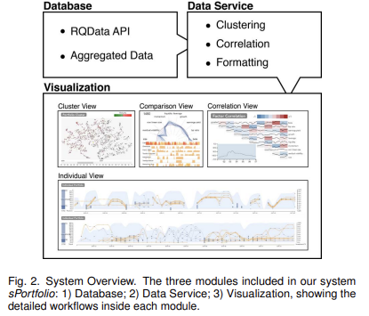

# PAPER LIST
|   No. |   Publication date | Title                                                                                                                | Authors           | Relevance Score   |
|------:|-------------------:|:---------------------------------------------------------------------------------------------------------------------|:------------------|:------------------|
|     1 |               2019 | [sPortfolio: Stratified Visual Analysis of Stock Portfolios](#no-1)| X Yue, J Bai et al. | $\star\star\star\star\star$|

## 3. (2019) sportfolio: Stratified visual analysis of stock portfolios
- 35회 인용 (2024.10)
- [Xuanwu Yue](https://yxw.is/); Jiaxin Bai; Qinhan Liu; Yiyang Tang; Abishek Puri; Ke Li
- IEEE Transactions on Visualization and Computer Graphics, 2019

`-` Xuanwu Yue
- BSc. in Software Engineering, Shandong University (2012 - 2016)
- Ph.D. in Computer Science & Engineering, The Hong Kong University of Science and Technology (2016 - 2020)
- 현재 Sinovation Ventures의 난징 AI 연구소에서 선임 데이터 분석가로 일하고 있으며, 중국 시장을 주요 대상으로 하는 선구적인 AI 헤지펀드인 Baiont Capital과 함께하고 있습니다. 주요 연구 분야는 금융 데이터의 시각적 분석으로, 특히 정량적 트레이딩, 시장 분석, 고빈도 트레이딩에 중점을 두고 있다. Sinovation Ventures에 합류하기 전, Xuanwu는 홍콩과학기술대학교(HKUST) 컴퓨터과학 및 공학부에서 Huamin Qu 교수의 지도 아래 HKUST VisLab에서 박사 학위(2016년 9월 ~ 2020년 6월)를 취득했다. 2016년 6월에 산둥대학교 소프트웨어학부에서 학사 학위를 취득했으며, 학부 시절에는 Baoquan Chen 교수와 Yunhai Wang 교수의 지도 아래 융합 연구 센터(IRC)에서 연구 조교로 활동했다.

`-` Ke Li
- RiceQuant Co.Ltd 소속 연구원.

> RiceQuant는 2014년에 설립된 중국 선전에 본사를 둔 금융 기술 회사로, 주로 퀀트(계량적) 투자와 관련된 플랫폼을 제공한다. 이 회사는 RQAlpha라는 오픈 소스 퀀트 트레이딩 엔진을 운영하며, 이를 통해 사용자들이 퀀트 전략을 생성하고 백테스트할 수 있는 기능을 지원한다. 주로 A주 시장을 대상으로 한 퀀트 투자 서비스를 제공하며, 투자 전략 최적화에 도움을 주기 위해 금융 전문가와 퀀트 트레이더들이 협력할 수 있는 환경을 마련하고 있다. 다양한 금융 기관과 퀀트 트레이더들이 효율적인 투자 전략을 수립하고 실행할 수 있도록 돕는 데 중점을 두고 있으며, 알고리즘 거래 및 고빈도 거래 분야에서도 두각을 나타내고 있다. 또한, 여러 차례의 투자 유치를 통해 자금을 확보하였으며, 알리바바와 같은 주요 투자자들로부터 후원을 받기도 하였다.

### 0. ABSTRACT
이 논문은 정량적 투자의 핵심인 다중 요인 모델이 주식의 위험과 수익률 간의 관계를 설명하는 데 초점을 맞추고 있다고 설명한다. 그러나 이 모델은 방대한 양의 요인 데이터를 생성하며, 이를 분석하는 데 어려움이 있다. 특히, 기존의 포트폴리오 시각화 시스템은 주로 포트폴리오 수익률과 주식 보유에만 초점을 맞추고 있어 시장 동향을 이해하거나 실행 가능한 통찰을 제공하는 데 한계가 있다. 이를 해결하기 위해 sPortfolio라는 시스템이 제안되었으며, 이 시스템은 위험 요인 수준, 다중 포트폴리오 수준, 단일 포트폴리오 수준에서 데이터를 분석하고 시각화하여 효율성을 높인다 .

### 1. INTRODUCTION
정량적 투자는 컴퓨터 기술의 발전과 함께 투자 산업에서 점점 더 중요한 역할을 하고 있으며, 2017년 말 기준으로 약 9300억 달러가 관련 전략을 통해 운용되고 있다. 주식이나 기타 금융 상품의 위험 요인을 분석하는 것이 정량적 투자의 핵심인데, 이를 지원하는 도구는 여전히 제한적이다. 기존 데이터 분석 소프트웨어는 필요한 요구를 충족시키지 못하며, 따라서 효율적인 요인 연구와 포트폴리오 분석을 위한 시각적 분석 시스템이 필요하다. 이 논문은 이러한 요구를 충족시키기 위해 개발된 시스템을 소개하며, 방대한 데이터 양과 차원의 복잡성 문제를 해결하기 위한 방안도 함께 논의한다.

### 3. BACKGROUND

이 섹션에서는 중국 A주 시장에서 요인 투자에 대한 배경과 협력 회사 및 도메인 전문가들과의 논의를 바탕으로 도출한 6가지 구체적인 작업에 대해 설명한다. 또한, 이 섹션에서는 자주 사용되는 투자 용어들에 대한 설명도 포함되어 있다.

|Term|Explanation|
|:----|:--------|
|위험 요인(Risk Factor)|수익률에 영향을 미치는 일반적인 요인들의 집합|
|요인 수익률(Factor Return)|특정 요인에 귀속되는 수익률|
|요인 노출(Factor Exposure)|주식이나 포트폴리오가 특정 위험 요인에 얼마나 노출되어 있는지를 나타내는 값|
|요인 투자(Factor Investing)|수익률 차이를 설명할 수 있는 특성과 속성에 기반해 증권을 선택하는 투자 전략)|
|포트폴리오(Portfolio)|주식과 같은 금융 자산을 모아놓은 그룹|
|백테스팅(Backtesting)|거래 전략이나 분석 방법을 과거 데이터에 적용하여 실제 결과를 얼마나 정확하게 예측하는지 확인하는 과정|
|가치 가중 평균(Value weighted Average)|포함된 각 증권의 시장 가치에 따라 조정된 증권 가격을 측정하는 방법|
|섹터(Sector)|경제의 큰 세그먼트, 예를 들어 금융, 에너지, 정보기술 등으로 구분되는 산업군|

#### 3.1 Data Abstraction

`-` **Data Overview**

본 논문에서 시각화된 데이터는 각 포트폴리오의 백테스팅 기록, 각 주식의 요인 노출도, 각 주식의 섹터 범주, 그리고 해당 요인의 요인 수익률로 구성되어 있다.

백테스팅 데이터는 RiceQuant 플랫폼의 정량적 투자자들에 의해 제공된 다양한 전략에 대한 8,451개의 기록으로 구성되어 있다. 각 백테스팅 기록은 특정 포트폴리오 전략을 나타내며, 포트폴리오는 특정 기간 동안의 주식 목록과 해당 주식의 보유량을 포함한다. 포트폴리오의 기간은 2016년에서 2018년 사이이며, 전체 중국 A주 시장 주식의 99%를 포함하고 있다. 기밀 유지 문제로 인해, 포트폴리오의 이름은 `0001`부터 `8451`까지의 숫자로 대체되었다.

주식의 요인 노출도는 시장에 비해 주식이 특정 위험 요인에 얼마나 노출되어 있는지를 측정하는 값이다. RiceQuant에 따르면, 각 주식의 요인 노출도는 기업의 재무제표 데이터를 바탕으로 해당 정의를 사용하여 계산되며, 시장 내에서 표준화되어 모든 요인에 대해 시장 지수가 0 노출도를 가지도록 보정된다. 예를 들어, 어떤 주식이 크기 요인에 대해 큰 양의 긍정적인 노출도를 가질 경우, 해당 기업은 시장 내 다른 기업들보다 더 큰 시가총액을 가졌음을 의미합니다. 결과적으로, 해당 기업 주식의 수익률은 크기 요인 수익률의 변동에 의해 부분적으로 설명될 수 있습니다. 포트폴리오의 요인 노출도는 포트폴리오 내 주식들의 가치 가중 평균으로 측정됩니다.

또한, 각 주식의 산업 섹터 범주도 데이터 세트에 포함된다. 섹터 범주는 주식이 속한 산업 부문을 나타내며, 현지 주식 시장에는 총 28개의 산업 섹터가 존재한다. 우리는 주식이 특정 섹터에 속하는지 여부를 원핫 인코딩을 통해 표시한다. 포트폴리오의 산업 포지션은 보유 주식의 섹터에 대한 원핫 인코딩 값의 가치 가중 평균으로 집계됩니다. 요약하자면, 각 포트폴리오에는 2016년부터 2018년까지 일별로 10개의 요인 노출도와 28개의 섹터 포지션이 있으며, 총 8,451개의 포트폴리오가 존재합니다.

요인 수익률 데이터는 Barra China Equity Model 5 (CNE-5)에서 도입된 10개의 선택된 요인의 일별 요인 수익률로 구성되어 있다. 요인 수익률은 특정 요인에 기인하는 수익률이다. 자산의 수익률은 해당 자산의 위험 요인에 대한 노출도와 요인 수익률을 곱한 값과 기업 고유의 수익률로 나눌 수 있다. RiceQuant에 따르면, 요인 수익률은 주식 시장에서 구축된 다음 다변량 회귀 모델에서 얻어진다.

$$r_j^t = \sum_{s=1}^S X_{js}^t f_s^t + u_j^t$$

- $r_j^t$: $t$시점에서 $j$주식의 수익률
- $X_{js}^t$: $t$ 시점에서 $j$ 주식의 $s$요인에 대한 노출도
- $f_s^t$: $t$ 시점에서 $j$ $s$ 요인의 요인 수익률
- $u_j^t$: $j$주식의 잔여 수익률

요인 수익률 데이터는 다변량 시계열 데이터의 성격을 가지고 있다. 2016년부터 2018년까지의 일별 요인 수익률 데이터를 RiceQuant에서 얻었다.

#### 3.2 Task Analysis
지난 수십 년 동안 요인 연구와 포트폴리오 분석은 금융 분야에서 매우 중요한 주제로 자리 잡아왔다. 우리는 도메인 사용자의 요구를 충족시키기 위해 애자일 소프트웨어 개발 방법을 사용하여, 사용자 중심의 시스템을 개발하고자 한다. 전체 프로세스는 8개월 동안 진행되었으며, 6명의 전문가와 긴밀히 협력하였다. 논문의 공저자인 $E_A$와 함께 $E_B$, $E_C$는 모두 RiceQuant의 제품 관리자들로, RiceQuant는 중국 본토에서 정량적 거래 서비스를 4년 넘게 제공해 왔으며, 주요 고객은 중국의 은행과 금융 기관들이다. 세 제품 관리자들은 요인 투자의 최전선에서 활동하며 산업 요구 사항을 수집해왔다. 이들은 포트폴리오 관리와 같은 포트폴리오 평가에 큰 관심을 가지고 있다.

또 다른 내부 전문가인 $E_D$(논문 공저자는 아님)는 요인 모델 평가와 개발에 헌신한 금융 연구자이다. 모델의 효과와 요인의 혼잡도는 모델 평가의 중요한 측면이다. $E_E$(논문 공저자는 아님)는 아시아 시장에서 10년간 요인 투자를 통해 거래해온 시니어 펀드 매니저이다. 대부분의 트레이더들은 포트폴리오 전략 분석이 자신들에게 도움이 될 것이라고 확신한다.

따라서, 우리는 도메인 전문가들과 경험 많은 시장 참여자들과의 일련의 구조화된 인터뷰를 통해 분석 작업 목록을 요약하였다. 사용자는 사용자 중심 디자인 프레임워크를 따랐으며, 논의, 브레인스토밍, 설계, 프로토타이핑, 프레젠테이션, 구현 및 배포를 통해 개발되었다. 여러 차례의 반복 과정을 거쳐 그들의 피드백을 수집하고, 이를 여섯 가지 주요 질문 세트로 압축하였다. 이 질문들은 세 가지 수준으로 분류된다:

1. **Risk Factor** : 투자자들에게 리스크 요인에 대한 전반적인 시장 감각을 제공.
    - T.1 특정 기간 동안 리스크 요인 모델의 결과는 얼마나 효과적인가?
    - T.2 특정 시점에서 각 요인의 '혼잡도'는 어떤가?

2. **Multiple-Portfolio-Level** : 투자자들이 과거 주식 포트폴리오 전략을 비교하고 이해하며 복제할 수 있도록 돕는다.
    - T.3 다양한 포트폴리오 전략 그룹이 위험과 산업을 다르게 평가하는 방식은 무엇인가?
    - T.4 투자자들이 포트폴리오 전략을 어떻게 복제했는지 이해할 수 있는 정량적 요인은 무엇인가?

3. **Single-Portfolio-Level** : 투자자가 펀드나 포트폴리오의 세부적인 요소를 파악하는 데 도움을 준다.
    - T.5 펀드가 채택한 거래 스타일은 무엇인가?
    - T.6 포트폴리오의 미래 수익을 어떻게 추측할 수 있는가?

### 4. SYSTEM PIPELINE
sPortfolio는 세 가지 주요 모듈로 구성된 웹 기반 풀 스택 애플리케이션이다. 이 세 가지 모듈은 **`데이터베이스 모듈`**, **`데이터 서비스 모듈`**, **`시각화 모듈`** 이다(Fig. 2 참조).

1. **데이터베이스 모듈** : MongoDB 기반으로, 두 가지 그룹의 정보를 저장한다. 첫 번째 그룹은 RiceQuant에서 제공하는 RQData API를 통해 직접 수집된 정보이다. 이 정보는 일별 주식 요인 노출도, 포트폴리오의 주식 수량 및 가격, 그리고 포트폴리오의 총 시장 가치를 포함한다. 두 번째 그룹은 RQData에서 얻은 직접 정보를 집계한 것으로, 포트폴리오의 섹터 포지션, 포트폴리오 수준의 요인 노출도, 그리고 포트폴리오 수익률과 같은 계산된 정보를 포함한다.

2. **데이터 서비스 모듈** : Python Pandas 및 TensorFlow 기반으로 동작하며, 데이터베이스에 있는 데이터를 추가로 처리하여 요인 노출도와 섹터 포지션을 기반으로 한 포트폴리오의 클러스터링 결과, 다양한 기간에 걸친 요인 간 상관관계를 계산하는 고급 정보를 생성한다. 이 두 모듈은 백엔드 서비스로 함께 작동하며, 시스템의 응답 속도를 향상시키기 위해 전용 서버에 호스팅된다.

3. **시각화 모듈** : 사용자가 인사이트를 얻을 수 있도록 네 가지 구조화된 뷰를 제공한다.

`*` *시각화 모듈의 4가지 구조화된 뷰*
|View|Description|
|:----|:---------|
|**The portfolio cluster view**| 요인 노출도 또는 섹터 포지션에 따라 클러스터링된 포트폴리오를 보여준다.|
|**The factor correlation view**|전체 시장의 위험 요인 수익률과 상관관계를 요약한다.|
|**The comparison view**|사용자가 투자 스타일을 빠르게 비교하기 위해 여러 포트폴리오 클러스터를 선택할 수 있게 한다.|
|**The individual portfolio view**|포트폴리오 관리에 대한 세부 정보를 확인할 수 있다.|

컴퓨팅 확장성 측면에서, 데이터 서비스 모듈은 시스템 전체 파이프라인에서 가장 많은 시간을 소비하는 경향이 있다. 하지만 데이터 서비스 모듈이 수천 개의 포트폴리오를 처리하고 시각화 모듈이 일반적인 브라우저(Chrome)에서 응답하는 데 걸리는 시간은 약 60초 정도다. 위의 통계는 4코어 CPU와 내장 GPU를 사용한 랩톱에서 측정되었다. 우리는 고성능 컴퓨팅 서버 또는 클라우드 환경으로 마이그레이션하면 시간이 크게 단축될 것으로 기대한다.

다음은 sPortfolio가 사용되는 일반적인 워크플로우다. 사용자는 포트폴리오 클러스터 뷰에서 시간 창을 슬라이드하여 클러스터링을 새로 고친다(Fig.1A 참조). 동시에 다양한 요인 간 상관관계와 수익률이 요인 상관관계 뷰에서 새로 고쳐진다(Fig.1B 참조). 사용자가 상관관계와 수익률을 더 큰 뷰로 보고 싶다면, 블록 위에 마우스를 올려 요인 상관관계 뷰에서 더 큰 그래프를 볼 수 있다. 그런 다음 사용자는 포트폴리오 클러스터 뷰에 점으로 표시된 포트폴리오 중 일부를 선택하고, 선택한 포트폴리오의 요인 노출도 및 산업 보유 현황을 비교 뷰(Fig.1C 참조)에서 포트폴리오 개요로 확인할 수 있다. 비교 뷰에서 포트폴리오 ID를 클릭하면, 개별 포트폴리오 뷰(Fig.1D 참조)에서 해당 포트폴리오의 주식 보유 상황이 전체 생애 주기에 걸쳐 표시된다.

### 5. DATA MODEL
이 섹션에서는 데이터 클러스터링 결과를 달성하기 위한 데이터 구성 방법과 시장 요인 수익률로부터 요인 간 상관관계를 도출하는 방법에 대해 설명한다.

#### 5.1 Clustering
포트폴리오 데이터는 다양한 기간에 걸쳐 생성된 다변량 시계열 데이터이다. 매 거래일마다 각 포트폴리오에는 39개의 차원, 즉 10개의 요인 노출도, 28개의 섹터 포지션, 그리고 현금 비율이 기록된다. 따라서, 전체적으로 우리는 20일에서 400일 사이의 기간을 가진 8,451개의 포트폴리오 데이터를 보유하고 있다. 이러한 포트폴리오를 분석할 때 두 가지 문제가 발생한다. 
- 첫째, 포트폴리오의 기간이 다르기 때문에 포트폴리오 간의 거리와 유사성을 직접 측정할 수 없다.
- 둘째, 샘플 수에 비해 특징의 수가 상대적으로 많기 때문에 패딩 및 컷팅 기술을 직접 사용하더라도 차원 축소 알고리즘의 효과와 효율성을 보장할 수 없다.

이 문제를 해결하기 위해 두 가지 구성 요소로 차원을 축소하는 파이프라인을 제안한다. 첫 번째 구성 요소는 다양한 기간의 다변량 시계열 데이터를 잠재 공간의 벡터로 매핑하는 `LSTM 오토인코더`이다. 잠재 공간의 차원은 각 포트폴리오의 전략을 효율적이고 효과적으로 클러스터링할 수 있도록 너무 크거나 작아서는 안 된다. 두 번째 구성 요소는 잠재 벡터를 2차원 벡터로 축소하는 `차원 축소 알고리즘`으로, 이는 포트폴리오 클러스터 뷰에서 $x$ 및 $y$ 좌표로 사용된다.

`-` 5.1.1 **LSTM Auto-Encoder**

오토인코더는 데이터를 잠재 공간에서 표현하기 위해 학습하는 신경망 유형이며, 차원 축소에 널리 사용된다. 일반적으로 인코더 네트워크(E)와 디코더 네트워크(D)의 두 가지 구성 요소로 이루어져 있다. 여기서 우리는 LSTM 구조를 둘 다 채택하였다. $i$번째 포트폴리오의 잠재 표현은 인코더 네트워크로부터 얻어지며, $h^{(i)} = E(p^{(i)}, \theta_e)$로 표현된다. 여기서 $\theta_e$는 인코더의 매개변수이다. 그런 다음 디코더 네트워크는 잠재 표현으로부터 원래 시퀀스를 재구성하려고 한다. $\hat{p}^{(i)} = D(h^{(i)}, \theta_d)$로 표현되며, 인코더와 디코더 네트워크를 결합하기 위해 재구성된 시퀀스는 $\hat{p}^{(i)} = D(E(p^{(i)}, \theta_e), \theta_d)$로 표현된다. 

훈련 과정에서, 우리는 오토인코더가 생성한 재구성된 시퀀스와 원래 시퀀스 간의 유클리드 거리를 최소화하려고 한다. 이를 통해 인코더와 디코더 네트워크의 매개변수 $\theta_e$와 $\theta_d$를 동시에 최적화한다. 최적화된 매개변수는 $\theta_e^*$ 와 $\theta_d^*$로 나타낸다. 최적화된 매개변수를 사용하여 각 포트폴리오의 잠재 표현을 계산할 수 있다.

$$\theta_e^*, \theta_d^* = \tt{argmin}_{\theta_e, \theta_d}\sum_{I}^{N}(p^{(i)}-D(E(p^{(i)}, \theta_e), \theta_d))^2 \tag{2}$$

각 포트폴리오 $p^{(i)}$의 잠재 표현은 최적화된 파라미터 $\theta_e^*$를 사용하여 인코더 네트워크에서 계산된다. i번째 포트폴리오의 잠재 표현은 $h^{(i)} = E(p^{(i)}, \theta_e^*)$이다. 동시에, 잠재 표현의 수집 결과는 $H = E(p^{(i)}, \theta_e^*)$로 표현될 수 있다.

>  TensorFlow 1.8을 사용하여 LSTM 오토인코더를 구현했다. LSTM의 은닉 유닛 수는 50개이며, 배치 사이즈는 64로 설정되었다. 우리는 Adam-optimizer를 사용하였으며, 훈련 시간은 약 5시간이 소요되었다. 훈련은 Nvidia 960m GPU에서 수행되었다.

`-` 5.1.2  **Unsupervised Dimensional Reduction Algorithms**

인코더를 사용하여 원래 포트폴리오 데이터를 인코딩한 후, 우리는 포트폴리오의 인코딩된 표현인 $H$를 얻는다. 그런 다음 차원 축소 기술을 사용하여 이러한 표현 $H$를 2차원 벡터 $C$로 변환한다. 여기서 우리는 포트폴리오의 지역 구조에 더 중점을 두기 때문에 t-SNE 알고리즘을 선택했다. 반면, t-SNE 알고리즘은 글로벌 최적점으로 수렴하는 안정성을 유지할 수 있다.

$C = tSNE(H) \qquad (3)$

여기서 C는 $c^{(i)}$의 집합을 나타낸다. 이를 통해, 각 포트폴리오 $p^{(i)}$의 좌표 $c^{(i)}$를 얻어 포트폴리오 클러스터 뷰에 표시할 수 있게 된다. 

> 시스템에서는 Python의 scikit-learn 패키지에서 제공하는 t-SNE 알고리즘을 사용한다.

#### 5.2 Factor Correlation

요인 수익률은 해당 요인에 대한 노출이 1이고, 다른 요인에 대한 노출이 없는 벤치마크 포트폴리오의 수익률을 의미한다. 우리는 2016년부터 2018년까지의 10가지 스타일 요인의 일별 수익률 데이터를 얻었다. 그런 다음, 우리는 누적된 요인 수익률과 요인 수익률 간의 상관관계를 계산하였다.

`-` 5.2.1 **Accumulated Factor Return**

누적 수익률은 특정 기간 동안 얻거나 잃은 금액을 총합한 값이다. 누적된 수익률은 원래 수익률보다 요인의 추세를 더 명확하게 보여줄 수 있다. 누적된 요인 수익률의 표현식은 다음과 같이 나타낼 수 있다:

$R_j^i = \prod_1^i(r_j^k+1)-1$

여기서 $r_j^k$는 k번째 날 j번째 요인의 수익률이다.

`-` 5.2.2 **Correlations of Factor Return**

우리는 모든 요인 수익률의 상호 상관관계를 측정하기 위해 두 가지 방법을 제안했다. 첫 번째 방법은 특정 시점에서 요인 간의 상관관계를 측정하는 것이다.

Denote $r_j^{n:m} = <r_j^n, r_j^{n+1}, \dots, r_j^m>$

$\rho_{j,k}^i = corr(r_j^{i-20:i+20}, r_k^{i-20:i+20}) \qquad (4)$

두 번째 방법은 선택된 시간 범위 내에서의 상관관계이다. $s$가 선택된 첫 번째 날이고 $t$가 마지막 날이라면, 이 상관관계의 표현식은 다음과 같다:

$\rho_{j,k} = corr(r_j^{s:t}, r_k^{s:t}) \qquad (5)$

