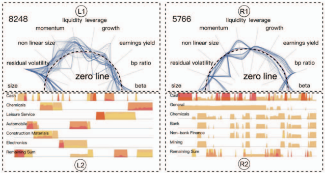
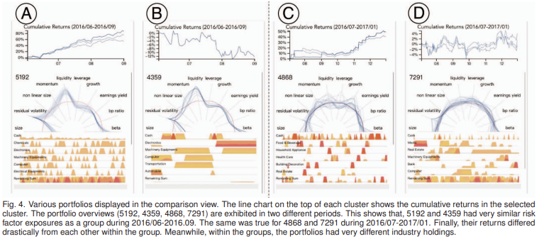
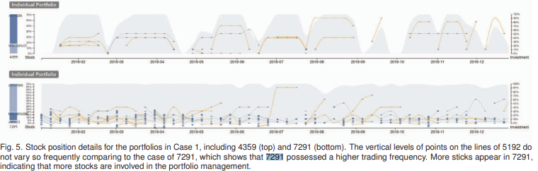

# PAPER LIST
|   No. |   Publication date | Title                                                                                                                | Authors           | Relevance Score   |
|------:|-------------------:|:---------------------------------------------------------------------------------------------------------------------|:------------------|:------------------|
|     1 |               2019 | [sPortfolio: Stratified Visual Analysis of Stock Portfolios](#no-1)| X Yue, J Bai et al. | $\star\star\star\star\star$|

## Contents
- [0. Abstract](#section-0)
- [1. Introduction](#section-1)
- [2. Related Work](#section-2)
- [3. Background](#section-3)
- [4. System Overview](#section-4)
- [5. Data Model](#section-5)
- [6. Visual Design](#section-6)
- [7. Evaluation](#section-7)
- [8. Discussion](#section-8)
- [9. Conclusion](#section-9)

## 1. (2019) sportfolio: Stratified visual analysis of stock portfolios
- 35회 인용 (2024.10)
- [Xuanwu Yue](https://yxw.is/); Jiaxin Bai; Qinhan Liu; Yiyang Tang; Abishek Puri; Ke Li
- IEEE Transactions on Visualization and Computer Graphics, 2019

`-` Xuanwu Yue
- BSc. in Software Engineering, Shandong University (2012 - 2016)
- Ph.D. in Computer Science & Engineering, The Hong Kong University of Science and Technology (2016 - 2020)
- 현재 Sinovation Ventures의 난징 AI 연구소에서 선임 데이터 분석가로 일하고 있으며, 중국 시장을 주요 대상으로 하는 선구적인 AI 헤지펀드인 Baiont Capital과 함께하고 있습니다. 주요 연구 분야는 금융 데이터의 시각적 분석으로, 특히 정량적 트레이딩, 시장 분석, 고빈도 트레이딩에 중점을 두고 있다. Sinovation Ventures에 합류하기 전, Xuanwu는 홍콩과학기술대학교(HKUST) 컴퓨터과학 및 공학부에서 Huamin Qu 교수의 지도 아래 HKUST VisLab에서 박사 학위(2016년 9월 ~ 2020년 6월)를 취득했다. 2016년 6월에 산둥대학교 소프트웨어학부에서 학사 학위를 취득했으며, 학부 시절에는 Baoquan Chen 교수와 Yunhai Wang 교수의 지도 아래 융합 연구 센터(IRC)에서 연구 조교로 활동했다.

`-` Ke Li
- RiceQuant Co.Ltd 소속 연구원.

> RiceQuant는 2014년에 설립된 중국 선전에 본사를 둔 금융 기술 회사로, 주로 퀀트(계량적) 투자와 관련된 플랫폼을 제공한다. 이 회사는 RQAlpha라는 오픈 소스 퀀트 트레이딩 엔진을 운영하며, 이를 통해 사용자들이 퀀트 전략을 생성하고 백테스트할 수 있는 기능을 지원한다. 주로 A주 시장을 대상으로 한 퀀트 투자 서비스를 제공하며, 투자 전략 최적화에 도움을 주기 위해 금융 전문가와 퀀트 트레이더들이 협력할 수 있는 환경을 마련하고 있다. 다양한 금융 기관과 퀀트 트레이더들이 효율적인 투자 전략을 수립하고 실행할 수 있도록 돕는 데 중점을 두고 있으며, 알고리즘 거래 및 고빈도 거래 분야에서도 두각을 나타내고 있다. 또한, 여러 차례의 투자 유치를 통해 자금을 확보하였으며, 알리바바와 같은 주요 투자자들로부터 후원을 받기도 하였다.

### 0. ABSTRACT
이 논문은 정량적 투자의 핵심인 다중 요인 모델이 주식의 위험과 수익률 간의 관계를 설명하는 데 초점을 맞추고 있다고 설명한다. 그러나 이 모델은 방대한 양의 요인 데이터를 생성하며, 이를 분석하는 데 어려움이 있다. 특히, 기존의 포트폴리오 시각화 시스템은 주로 포트폴리오 수익률과 주식 보유에만 초점을 맞추고 있어 시장 동향을 이해하거나 실행 가능한 통찰을 제공하는 데 한계가 있다. 이를 해결하기 위해 sPortfolio라는 시스템이 제안되었으며, 이 시스템은 위험 요인 수준, 다중 포트폴리오 수준, 단일 포트폴리오 수준에서 데이터를 분석하고 시각화하여 효율성을 높인다 .

### 1. INTRODUCTION
정량적 투자는 컴퓨터 기술의 발전과 함께 투자 산업에서 점점 더 중요한 역할을 하고 있으며, 2017년 말 기준으로 약 9300억 달러가 관련 전략을 통해 운용되고 있다. 주식이나 기타 금융 상품의 위험 요인을 분석하는 것이 정량적 투자의 핵심인데, 이를 지원하는 도구는 여전히 제한적이다. 기존 데이터 분석 소프트웨어는 필요한 요구를 충족시키지 못하며, 따라서 효율적인 요인 연구와 포트폴리오 분석을 위한 시각적 분석 시스템이 필요하다. 이 논문은 이러한 요구를 충족시키기 위해 개발된 시스템을 소개하며, 방대한 데이터 양과 차원의 복잡성 문제를 해결하기 위한 방안도 함께 논의한다.

### 2. RELATED WORK
#### 2.1 Factor Investing
정량적 투자는 대략 1960년대 자본 자산 가격 결정 모형(CAPM)이 발명되면서 시작되었다. 그 이후로 다양한 이론이 여러 매크로 및 기업 특유의 리스크 팩터를 사용하여 주식 수익률을 설명하기 위해 제안되었다. 오늘날 많은 투자자들이 기술 발전 덕분에 리스크 팩터를 기반으로 포트폴리오 전략을 연구하고 만들 수 있다. 2017년 IPE 보고서에 따르면, 팩터 관련 포트폴리오 전략으로 관리되는 자산의 가치는 2016년 말까지 5,590억 달러에 이르렀다.

팩터 투자는 수학적 방법을 사용하여 포트폴리오를 구성한다. 전통적인 경우에서, 투자자들은 현장 방문을 하거나 경영진과 상호작용함으로써 기업에 대한 심층 연구를 수행한다. 하지만 팩터 투자자들은 기업의 장부가 대비 주가 비율과 같은 공개적으로 이용 가능한 포괄적인 데이터를 취득하여, 팩터 모델을 적용하여 시장 내에서 효과적인 리스크 팩터를 찾는다. 주식의 리스크 팩터 노출은 해당 주식이 시장에 비해 갖는 리스크 수준이다. 팩터 투자에서는 주식 수익률과 팩터 노출 간의 관계를 연구하는데, 여기에는 주가 대비 수익률, 주가 대비 장부가 비율 등이 포함된다. 다변량 회귀를 실행한 후, 각 팩터의 수익률은 서로 독립적이어야 한다. 이를 통해 투자자들은 자신이 선호하는 리스크 팩터 노출을 설정하여 다양한 포트폴리오를 구축할 수 있다.

앞서 언급했듯이, 이전에 제안된 모든 팩터 모델 중에서 Barra 리스크 모델은 정량적 투자 업계에서 가장 널리 채택된 모델이다. 이 모델은 Barra Inc.의 설립자인 Bar Rosenberg가 2000년 Grinold와 Kahn이 논의한 바와 같이 개발하였다. 이후 MSCI가 Barra Inc.를 인수하면서 다양한 주식 시장에 맞춰 모델이 빈번하게 업데이트되었다. 이 모델은 수십 년 전에 제안된 전통적인 팩터뿐만 아니라 여러 새로운 팩터도 고려하여 정량적 거래 커뮤니티에서 인기를 얻었다. 예를 들어, 미국 주식 시장을 위한 Barra 리스크 모델에서는 총 13개의 스타일 팩터와 13개의 산업 팩터가 포함되어 있다. 이는 CAPM의 한 가지 팩터나 Fama-French 모델의 세 가지 팩터보다 훨씬 많다. Barra 리스크 모델은 더 많은 팩터를 포함하여 실증적인 결과가 더 우수하고 주식 수익률에 대한 예측이 더 정확하다. 이 논문에서 사용된 포트폴리오 팩터 데이터는 일반성을 잃지 않으면서 Barra 리스크 모델을 기반으로 한다.

#### 2.2 Portfolio Visualization and Performance Visualization
지난 20년 동안 포트폴리오 데이터 시각화는 많은 연구와 시스템이 제안된 인기 있는 주제이다. 일반적으로, 초기 연구는 포트폴리오의 성과를 측정하는 데 중요한 수익률 정보와 주식 보유 포지션을 시각화하였다. Matthias 등은 배경을 세분화하고 색상을 적용하여 수익률 값을 인코딩하는 선 그래프를 제안하였다. Ziegler 등은 실시간으로 주식, 산업 부문 및 국가의 수익률과 변동성을 표시하고 비교하기 위해 픽셀 바 차트를 사용하였다. 이들은 모두 선 그래프의 배경을 추가 정보를 나타내기 위해 활용하였다. 선 그래프 외에도, 많은 이전 연구는 여러 기간의 수익률을 시각화할 수 있는 히트맵을 기반으로 했으며, 이를 통해 동일한 공간에서 표시되는 정보의 양이 크게 증가하였다. 또한, Lei 등은 수익률을 기준으로 모든 주식을 그룹화하고 이를 동심원으로 표시하여 효율적인 시장 수익률 관찰을 가능하게 하였다. Xiong 등은 상호 펀드 포트폴리오 구성에서 다른 지리적 지역의 수익률을 연구하였다. 그 외에도 FinVis나 PortfolioCompare와 같은 시스템은 비전문가들이 기대 수익률을 기반으로 포트폴리오를 선택하는 데 도움을 주었다. 주식 보유를 시각화하기 위해, Jungmeister와 Csallner 등은 상호작용의 유연성을 개선하여 트리맵을 구현하였다. Dwyer 등은 주식 보유 기반으로 자금의 군집화 결과를 표시하는 "2.5 차원" 그래프를 제안하였다.

그러나 우리가 알기로는 ***주식 포트폴리오의 스타일 팩터 정보를 시각화하는 시스템은 존재하지 않는다.*** 우리와 협력한 도메인 전문가들 또한 유사한 내부 시스템이 개발된 적이 없다고 주장한다. 이전의 연구들은 대부분 시장의 전체 상황을 분석하거나 특정 포트폴리오만 분석했으며, 포트폴리오에 대한 심층적인 계층 분석을 위한 필수적인 측면을 포함하지 않았다. 하지만 실제로는 리스크 팩터 연구와 포트폴리오 분석 모두 투자 의사결정에서 매우 중요하다. 이와 관련하여, 우리는 아직 제안된 시스템을 찾지 못했다.

#### 2.3 Financial Multivariate Time Series Data Visualization
금융 데이터 시각화는 주로 시계열 데이터와 관련이 있다. 주식 시장뿐만 아니라 은행 및 보험 업계에서도 모두 시계열 데이터를 다룬다. Lei 등은 금융 시계열 데이터에 대해 "시각적 서명" 개념을 제안하였다. Sorenson 등은 Bloomberg Inc.에서 이산적인 기호 기반 이벤트를 결합하여 가격 변동 분석을 돕는 시계열 시각화를 개발하였다. 또한, 금융 데이터 시각화에 대한 뛰어난 조사 연구들이 있다.

우리의 경우, 주식 포트폴리오 데이터는 일별 팩터 데이터, 산업 부문 데이터, 주식 데이터를 포함하는 다변량 시계열 데이터이다. 이와 유사한 데이터 형식은 대부분의 정량적 투자 시나리오에서도 존재한다. 시계열 데이터에 대한 다양한 시각화 기법이 시각화 커뮤니티에서 제안되었다. 일반적으로, 이전 연구들은 트렌드와 패턴을 탐지하기 위한 효율적인 레이아웃 기술을 기여하거나 특정 영역을 대상으로 한 연구들이다. 정량적 투자 분석에서는 팩터 관점과 주식 보유 관점에서 시간 변수가 다르다. 전자는 트렌드와 이상 탐지를 강조하고 후자는 거래 시점을 중점적으로 다룬다.

### 3. BACKGROUND

이 섹션에서는 중국 A주 시장에서 요인 투자에 대한 배경과 협력 회사 및 도메인 전문가들과의 논의를 바탕으로 도출한 6가지 구체적인 작업에 대해 설명한다. 또한, 이 섹션에서는 자주 사용되는 투자 용어들에 대한 설명도 포함되어 있다.

|Term|Explanation|
|:----|:--------|
|위험 요인(Risk Factor)|수익률에 영향을 미치는 일반적인 요인들의 집합|
|요인 수익률(Factor Return)|특정 요인에 귀속되는 수익률|
|요인 노출(Factor Exposure)|주식이나 포트폴리오가 특정 위험 요인에 얼마나 노출되어 있는지를 나타내는 값|
|요인 투자(Factor Investing)|수익률 차이를 설명할 수 있는 특성과 속성에 기반해 증권을 선택하는 투자 전략)|
|포트폴리오(Portfolio)|주식과 같은 금융 자산을 모아놓은 그룹|
|백테스팅(Backtesting)|거래 전략이나 분석 방법을 과거 데이터에 적용하여 실제 결과를 얼마나 정확하게 예측하는지 확인하는 과정|
|가치 가중 평균(Value weighted Average)|포함된 각 증권의 시장 가치에 따라 조정된 증권 가격을 측정하는 방법|
|섹터(Sector)|경제의 큰 세그먼트, 예를 들어 금융, 에너지, 정보기술 등으로 구분되는 산업군|

#### 3.1 Data Abstraction

`-` **Data Overview**

본 논문에서 시각화된 데이터는 각 포트폴리오의 백테스팅 기록, 각 주식의 요인 노출도, 각 주식의 섹터 범주, 그리고 해당 요인의 요인 수익률로 구성되어 있다.

백테스팅 데이터는 RiceQuant 플랫폼의 정량적 투자자들에 의해 제공된 다양한 전략에 대한 8,451개의 기록으로 구성되어 있다. 각 백테스팅 기록은 특정 포트폴리오 전략을 나타내며, 포트폴리오는 특정 기간 동안의 주식 목록과 해당 주식의 보유량을 포함한다. 포트폴리오의 기간은 2016년에서 2018년 사이이며, 전체 중국 A주 시장 주식의 99%를 포함하고 있다. 기밀 유지 문제로 인해, 포트폴리오의 이름은 `0001`부터 `8451`까지의 숫자로 대체되었다.

주식의 요인 노출도는 시장에 비해 주식이 특정 위험 요인에 얼마나 노출되어 있는지를 측정하는 값이다. RiceQuant에 따르면, 각 주식의 요인 노출도는 기업의 재무제표 데이터를 바탕으로 해당 정의를 사용하여 계산되며, 시장 내에서 표준화되어 모든 요인에 대해 시장 지수가 0 노출도를 가지도록 보정된다. 예를 들어, 어떤 주식이 크기 요인에 대해 큰 양의 긍정적인 노출도를 가질 경우, 해당 기업은 시장 내 다른 기업들보다 더 큰 시가총액을 가졌음을 의미합니다. 결과적으로, 해당 기업 주식의 수익률은 크기 요인 수익률의 변동에 의해 부분적으로 설명될 수 있습니다. 포트폴리오의 요인 노출도는 포트폴리오 내 주식들의 가치 가중 평균으로 측정됩니다.

또한, 각 주식의 산업 섹터 범주도 데이터 세트에 포함된다. 섹터 범주는 주식이 속한 산업 부문을 나타내며, 현지 주식 시장에는 총 28개의 산업 섹터가 존재한다. 우리는 주식이 특정 섹터에 속하는지 여부를 원핫 인코딩을 통해 표시한다. 포트폴리오의 산업 포지션은 보유 주식의 섹터에 대한 원핫 인코딩 값의 가치 가중 평균으로 집계됩니다. 요약하자면, 각 포트폴리오에는 2016년부터 2018년까지 일별로 10개의 요인 노출도와 28개의 섹터 포지션이 있으며, 총 8,451개의 포트폴리오가 존재합니다.

요인 수익률 데이터는 Barra China Equity Model 5 (CNE-5)에서 도입된 10개의 선택된 요인의 일별 요인 수익률로 구성되어 있다. 요인 수익률은 특정 요인에 기인하는 수익률이다. 자산의 수익률은 해당 자산의 위험 요인에 대한 노출도와 요인 수익률을 곱한 값과 기업 고유의 수익률로 나눌 수 있다. RiceQuant에 따르면, 요인 수익률은 주식 시장에서 구축된 다음 다변량 회귀 모델에서 얻어진다.

$$r_j^t = \sum_{s=1}^S X_{js}^t f_s^t + u_j^t$$

- $r_j^t$: $t$시점에서 $j$주식의 수익률
- $X_{js}^t$: $t$ 시점에서 $j$ 주식의 $s$요인에 대한 노출도
- $f_s^t$: $t$ 시점에서 $j$ $s$ 요인의 요인 수익률
- $u_j^t$: $j$주식의 잔여 수익률

요인 수익률 데이터는 다변량 시계열 데이터의 성격을 가지고 있다. 2016년부터 2018년까지의 일별 요인 수익률 데이터를 RiceQuant에서 얻었다.

#### 3.2 Task Analysis
지난 수십 년 동안 요인 연구와 포트폴리오 분석은 금융 분야에서 매우 중요한 주제로 자리 잡아왔다. 우리는 도메인 사용자의 요구를 충족시키기 위해 애자일 소프트웨어 개발 방법을 사용하여, 사용자 중심의 시스템을 개발하고자 한다. 전체 프로세스는 8개월 동안 진행되었으며, 6명의 전문가와 긴밀히 협력하였다. 논문의 공저자인 $E_A$와 함께 $E_B$, $E_C$는 모두 RiceQuant의 제품 관리자들로, RiceQuant는 중국 본토에서 정량적 거래 서비스를 4년 넘게 제공해 왔으며, 주요 고객은 중국의 은행과 금융 기관들이다. 세 제품 관리자들은 요인 투자의 최전선에서 활동하며 산업 요구 사항을 수집해왔다. 이들은 포트폴리오 관리와 같은 포트폴리오 평가에 큰 관심을 가지고 있다.

또 다른 내부 전문가인 $E_D$(논문 공저자는 아님)는 요인 모델 평가와 개발에 헌신한 금융 연구자이다. 모델의 효과와 요인의 혼잡도는 모델 평가의 중요한 측면이다. $E_E$(논문 공저자는 아님)는 아시아 시장에서 10년간 요인 투자를 통해 거래해온 시니어 펀드 매니저이다. 대부분의 트레이더들은 포트폴리오 전략 분석이 자신들에게 도움이 될 것이라고 확신한다.

따라서, 우리는 도메인 전문가들과 경험 많은 시장 참여자들과의 일련의 구조화된 인터뷰를 통해 분석 작업 목록을 요약하였다. 사용자는 사용자 중심 디자인 프레임워크를 따랐으며, 논의, 브레인스토밍, 설계, 프로토타이핑, 프레젠테이션, 구현 및 배포를 통해 개발되었다. 여러 차례의 반복 과정을 거쳐 그들의 피드백을 수집하고, 이를 여섯 가지 주요 질문 세트로 압축하였다. 이 질문들은 세 가지 수준으로 분류된다:

1. **Risk Factor** : 투자자들에게 리스크 요인에 대한 전반적인 시장 감각을 제공.
    - T.1 특정 기간 동안 리스크 요인 모델의 결과는 얼마나 효과적인가?
    - T.2 특정 시점에서 각 요인의 '혼잡도'는 어떤가?

2. **Multiple-Portfolio-Level** : 투자자들이 과거 주식 포트폴리오 전략을 비교하고 이해하며 복제할 수 있도록 돕는다.
    - T.3 다양한 포트폴리오 전략 그룹이 위험과 산업을 다르게 평가하는 방식은 무엇인가?
    - T.4 투자자들이 포트폴리오 전략을 어떻게 복제했는지 이해할 수 있는 정량적 요인은 무엇인가?

3. **Single-Portfolio-Level** : 투자자가 펀드나 포트폴리오의 세부적인 요소를 파악하는 데 도움을 준다.
    - T.5 펀드가 채택한 거래 스타일은 무엇인가?
    - T.6 포트폴리오의 미래 수익을 어떻게 추측할 수 있는가?

### 4. SYSTEM PIPELINE
sPortfolio는 세 가지 주요 모듈로 구성된 웹 기반 풀 스택 애플리케이션이다. 이 세 가지 모듈은 **`데이터베이스 모듈`**, **`데이터 서비스 모듈`**, **`시각화 모듈`** 이다(Fig. 2 참조).

1. **데이터베이스 모듈** : MongoDB 기반으로, 두 가지 그룹의 정보를 저장한다. 첫 번째 그룹은 RiceQuant에서 제공하는 RQData API를 통해 직접 수집된 정보이다. 이 정보는 일별 주식 요인 노출도, 포트폴리오의 주식 수량 및 가격, 그리고 포트폴리오의 총 시장 가치를 포함한다. 두 번째 그룹은 RQData에서 얻은 직접 정보를 집계한 것으로, 포트폴리오의 섹터 포지션, 포트폴리오 수준의 요인 노출도, 그리고 포트폴리오 수익률과 같은 계산된 정보를 포함한다.

2. **데이터 서비스 모듈** : Python Pandas 및 TensorFlow 기반으로 동작하며, 데이터베이스에 있는 데이터를 추가로 처리하여 요인 노출도와 섹터 포지션을 기반으로 한 포트폴리오의 클러스터링 결과, 다양한 기간에 걸친 요인 간 상관관계를 계산하는 고급 정보를 생성한다. 이 두 모듈은 백엔드 서비스로 함께 작동하며, 시스템의 응답 속도를 향상시키기 위해 전용 서버에 호스팅된다.

3. **시각화 모듈** : 사용자가 인사이트를 얻을 수 있도록 네 가지 구조화된 뷰를 제공한다.

`*` *시각화 모듈의 4가지 구조화된 뷰*
|View|Description|
|:----|:---------|
|**The portfolio cluster view**| 요인 노출도 또는 섹터 포지션에 따라 클러스터링된 포트폴리오를 보여준다.|
|**The factor correlation view**|전체 시장의 위험 요인 수익률과 상관관계를 요약한다.|
|**The comparison view**|사용자가 투자 스타일을 빠르게 비교하기 위해 여러 포트폴리오 클러스터를 선택할 수 있게 한다.|
|**The individual portfolio view**|포트폴리오 관리에 대한 세부 정보를 확인할 수 있다.|

컴퓨팅 확장성 측면에서, 데이터 서비스 모듈은 시스템 전체 파이프라인에서 가장 많은 시간을 소비하는 경향이 있다. 하지만 데이터 서비스 모듈이 수천 개의 포트폴리오를 처리하고 시각화 모듈이 일반적인 브라우저(Chrome)에서 응답하는 데 걸리는 시간은 약 60초 정도다. 위의 통계는 4코어 CPU와 내장 GPU를 사용한 랩톱에서 측정되었다. 우리는 고성능 컴퓨팅 서버 또는 클라우드 환경으로 마이그레이션하면 시간이 크게 단축될 것으로 기대한다.

다음은 sPortfolio가 사용되는 일반적인 워크플로우다. 사용자는 포트폴리오 클러스터 뷰에서 시간 창을 슬라이드하여 클러스터링을 새로 고친다(Fig.1A 참조). 동시에 다양한 요인 간 상관관계와 수익률이 요인 상관관계 뷰에서 새로 고쳐진다(Fig.1B 참조). 사용자가 상관관계와 수익률을 더 큰 뷰로 보고 싶다면, 블록 위에 마우스를 올려 요인 상관관계 뷰에서 더 큰 그래프를 볼 수 있다. 그런 다음 사용자는 포트폴리오 클러스터 뷰에 점으로 표시된 포트폴리오 중 일부를 선택하고, 선택한 포트폴리오의 요인 노출도 및 산업 보유 현황을 비교 뷰(Fig.1C 참조)에서 포트폴리오 개요로 확인할 수 있다. 비교 뷰에서 포트폴리오 ID를 클릭하면, 개별 포트폴리오 뷰(Fig.1D 참조)에서 해당 포트폴리오의 주식 보유 상황이 전체 생애 주기에 걸쳐 표시된다.

### 5. DATA MODEL
이 섹션에서는 데이터 클러스터링 결과를 달성하기 위한 데이터 구성 방법과 시장 요인 수익률로부터 요인 간 상관관계를 도출하는 방법에 대해 설명한다.

#### 5.1 Clustering
포트폴리오 데이터는 다양한 기간에 걸쳐 생성된 다변량 시계열 데이터이다. 매 거래일마다 각 포트폴리오에는 39개의 차원, 즉 10개의 요인 노출도, 28개의 섹터 포지션, 그리고 현금 비율이 기록된다. 따라서, 전체적으로 우리는 20일에서 400일 사이의 기간을 가진 8,451개의 포트폴리오 데이터를 보유하고 있다. 이러한 포트폴리오를 분석할 때 두 가지 문제가 발생한다. 
- 첫째, 포트폴리오의 기간이 다르기 때문에 포트폴리오 간의 거리와 유사성을 직접 측정할 수 없다.
- 둘째, 샘플 수에 비해 특징의 수가 상대적으로 많기 때문에 패딩 및 컷팅 기술을 직접 사용하더라도 차원 축소 알고리즘의 효과와 효율성을 보장할 수 없다.

이 문제를 해결하기 위해 두 가지 구성 요소로 차원을 축소하는 파이프라인을 제안한다. 첫 번째 구성 요소는 다양한 기간의 다변량 시계열 데이터를 잠재 공간의 벡터로 매핑하는 `LSTM 오토인코더`이다. 잠재 공간의 차원은 각 포트폴리오의 전략을 효율적이고 효과적으로 클러스터링할 수 있도록 너무 크거나 작아서는 안 된다. 두 번째 구성 요소는 잠재 벡터를 2차원 벡터로 축소하는 `차원 축소 알고리즘`으로, 이는 포트폴리오 클러스터 뷰에서 $x$ 및 $y$ 좌표로 사용된다.

`-` 5.1.1 **LSTM Auto-Encoder**

오토인코더는 데이터를 잠재 공간에서 표현하기 위해 학습하는 신경망 유형이며, 차원 축소에 널리 사용된다. 일반적으로 인코더 네트워크(E)와 디코더 네트워크(D)의 두 가지 구성 요소로 이루어져 있다. 여기서 우리는 LSTM 구조를 둘 다 채택하였다. $i$번째 포트폴리오의 잠재 표현은 인코더 네트워크로부터 얻어지며, $h^{(i)} = E(p^{(i)}, \theta_e)$로 표현된다. 여기서 $\theta_e$는 인코더의 매개변수이다. 그런 다음 디코더 네트워크는 잠재 표현으로부터 원래 시퀀스를 재구성하려고 한다. $\hat{p}^{(i)} = D(h^{(i)}, \theta_d)$로 표현되며, 인코더와 디코더 네트워크를 결합하기 위해 재구성된 시퀀스는 $\hat{p}^{(i)} = D(E(p^{(i)}, \theta_e), \theta_d)$로 표현된다. 

훈련 과정에서, 우리는 오토인코더가 생성한 재구성된 시퀀스와 원래 시퀀스 간의 유클리드 거리를 최소화하려고 한다. 이를 통해 인코더와 디코더 네트워크의 매개변수 $\theta_e$와 $\theta_d$를 동시에 최적화한다. 최적화된 매개변수는 $\theta_e^{*}$ 와 $\theta_d^{*}$로 나타낸다. 최적화된 매개변수를 사용하여 각 포트폴리오의 잠재 표현을 계산할 수 있다.

$$
\theta_e^{*}, \theta_d^{*} = \tt{argmin}_{\theta_e, \theta_d}\sum_{I}^{N}(p^{(i)}-D(E(p^{(i)}, \theta_e), \theta_d))^2 \tag{2}
$$

각 포트폴리오 $p^{(i)}$의 잠재 표현은 최적화된 파라미터 $\theta_e^*$를 사용하여 인코더 네트워크에서 계산된다. i번째 포트폴리오의 잠재 표현은 $h^{(i)} = E(p^{(i)}, \theta_e^*)$이다. 동시에, 잠재 표현의 수집 결과는 $H = E(p^{(i)}, \theta_e^*)$로 표현될 수 있다.

>  TensorFlow 1.8을 사용하여 LSTM 오토인코더를 구현했다. LSTM의 은닉 유닛 수는 50개이며, 배치 사이즈는 64로 설정되었다. 우리는 Adam-optimizer를 사용하였으며, 훈련 시간은 약 5시간이 소요되었다. 훈련은 Nvidia 960m GPU에서 수행되었다.

`-` 5.1.2  **Unsupervised Dimensional Reduction Algorithms**

인코더를 사용하여 원래 포트폴리오 데이터를 인코딩한 후, 우리는 포트폴리오의 인코딩된 표현인 $H$를 얻는다. 그런 다음 차원 축소 기술을 사용하여 이러한 표현 $H$를 2차원 벡터 $C$로 변환한다. 여기서 우리는 포트폴리오의 지역 구조에 더 중점을 두기 때문에 t-SNE 알고리즘을 선택했다. 반면, t-SNE 알고리즘은 글로벌 최적점으로 수렴하는 안정성을 유지할 수 있다.

$$
C = \text{tSNE}(H) \tag{3}
$$

여기서 C는 $c^{(i)}$의 집합을 나타낸다. 이를 통해, 각 포트폴리오 $p^{(i)}$의 좌표 $c^{(i)}$를 얻어 포트폴리오 클러스터 뷰에 표시할 수 있게 된다. 

> 시스템에서는 Python의 scikit-learn 패키지에서 제공하는 t-SNE 알고리즘을 사용한다.

#### 5.2 Factor Correlation

요인 수익률은 해당 요인에 대한 노출이 1이고, 다른 요인에 대한 노출이 없는 벤치마크 포트폴리오의 수익률을 의미한다. 우리는 2016년부터 2018년까지의 10가지 스타일 요인의 일별 수익률 데이터를 얻었다. 그런 다음, 우리는 누적된 요인 수익률과 요인 수익률 간의 상관관계를 계산하였다.

`-` 5.2.1 **Accumulated Factor Return**

누적 수익률은 특정 기간 동안 얻거나 잃은 금액을 총합한 값이다. 누적된 수익률은 원래 수익률보다 요인의 추세를 더 명확하게 보여줄 수 있다. 누적된 요인 수익률의 표현식은 다음과 같이 나타낼 수 있다:

$$
R_{j}^{i} = \prod_1^i(r_j^k+1)-1
$$

여기서 $r_j^k$는 k번째 날 j번째 요인의 수익률이다.

`-` 5.2.2 **Correlations of Factor Return**

우리는 모든 요인 수익률의 상호 상관관계를 측정하기 위해 두 가지 방법을 제안했다. 첫 번째 방법은 특정 시점에서 요인 간의 상관관계를 측정하는 것이다.

Denote $r_{j}^{n:m} = <r_j^n, r_j^{n+1}, \dots, r_j^m>$

$$
\rho_{j,k}^{i} = corr(r_{j}^{i-20:i+20}, r_{k}^{i-20:i+20}) \tag{4}
$$

두 번째 방법은 선택된 시간 범위 내에서의 상관관계이다. $s$가 선택된 첫 번째 날이고 $t$가 마지막 날이라면, 이 상관관계의 표현식은 다음과 같다:

$$
\rho_{j,k} = corr(r_j^{s:t}, r_k^{s:t}) \tag{5}
$$

### 6. VISUAL DESIGN
sPortfolio는 네 가지 주요 구성 요소로 이루어져 있다: 포트폴리오 클러스터 뷰(Fig. 1A), 요인 상관관계 뷰(Fig. 1B), 비교 뷰(Fig. 1C), 그리고 개별 포트폴리오 뷰(Fig. 1D). 우리는 이러한 뷰의 디자인을 효과적으로 시각 정보를 전달할 수 있도록 설계 원칙을 따랐다.

첫째로, 전체적인 프레임워크 설계는 Shneiderman의 만트라 "먼저 개요를 보여주고, 확대와 필터링을 제공하며, 필요할 때 세부 사항을 보여준다." [48]를 따른다. 포트폴리오 관리에서 다차원적 시계열 데이터가 방대하기 때문에, 모든 정보를 한 화면에 동시에 표시하는 것은 어려운 과제이다. 따라서 시스템은 포트폴리오의 개요를 먼저 제공하고, 사용자가 데이터를 필터링하고 세부 정보를 확대할 수 있는 다양한 상호작용을 제공한다.

또한, 시스템은 다양한 상호작용을 제공하여 사용자 요청에 따라 데이터의 세부적인 정보를 표시하므로, 정보를 적절히 배치하는 것이 중요하다. 사용자가 효과적으로 분석할 수 있도록 설계되었다. 사용자가 항목을 기억하는 대신, 옆에 나란히 비교하는 것이 더 효율적이라는 이론에 따라, 우리는 시스템 디자인에서 화면 공간을 최대한 활용하여 다른 데이터 세부 정보를 나란히 표시한다.

마지막으로, 우리는 시스템의 뷰와 상호작용을 설계하여 사용자가 직관적이고 논리적으로 분석을 수행할 수 있도록 한다. 각 뷰 내 상호작용과 뷰 간 상호작용은 사용자가 서로 다른 세부 정보를 쉽게 전환하여 데이터를 효율적으로 검토할 수 있도록 설계되었다.

#### 6.1 Portfolio Cluster View
우리는 사용자가 유사한 포트폴리오를 효율적으로 관찰할 수 있도록 포트폴리오 클러스터 뷰를 제공한다. 시장은 매일 변화하므로, 특정 시기에는 서로 다른 패턴과 통찰력을 제공할 수 있다(T3). 포트폴리오 클러스터 뷰는 사용자가 시장을 더 잘 이해할 수 있도록 돕는다. 또한, 포트폴리오 클러스터 뷰는 sPortfolio의 진입점 역할을 하며, 수천 개의 포트폴리오를 한꺼번에 분석하는 데 있어 클러스터로 구분된 데이터는 사용자가 "가치 있는" 클러스터와 이상치를 찾는 데 도움을 줄 수 있다.

포트폴리오 클러스터 뷰는 두 가지 부분으로 나뉜다: 클러스터링 공간과 타임라인(Fig. 1A). 섹션 5의 데이터 모델을 기반으로 우리는 모든 포트폴리오를 클러스터링 공간에 투영하고 각 포트폴리오 i의 좌표 $c^{(i)}$를 얻는다. 각 노드는 포트폴리오를 나타내며 색상은 해당 포트폴리오의 수익률을 인코딩한다. 중국 A주 시장의 현재 관행에 따르면, 빨간색은 높은 수익률을 나타내고, 녹색은 낮은 수익률을 의미한다. 두 개의 더 큰 노드는 중국 A주 시장의 두 가지 주요 벤치마크 포트폴리오인 CSI 300과 CSI 500이다.

타임라인은 브러싱 기능을 포함하고 있으며, 이는 포트폴리오 클러스터 뷰(Fig. 1A) 및 요인 상관관계 뷰(Fig. 1B)에서 상호작용을 유발할 수 있다. 브러싱 후, 선택된 기간 동안 포트폴리오의 클러스터링을 다시 수행하고 요인 수익률 상관관계를 계산한다.

#### 6.2 Factor Correlation View

요인 상관관계 뷰(Fig. 1B)는 각 요인의 누적 시장 수익률과 요인 수익률 간의 상관관계를 통해 위험 요인의 시장 성과를 보여준다. 이 정보는 사용자가 특정 기간 동안 요인 모델의 유효성을 확인하는 데 도움을 주며(T1), 펀드 매니저들 간의 투자 트렌드도 파악할 수 있게 한다(T2). 이는 가까운 미래에 포트폴리오의 수익률에 영향을 미칠 수 있다(T6).

요인 상관관계 뷰는 세 가지 주요 정보를 포함한다. 
- 첫째, 오른쪽 상단의 히트맵은 각 요인 간의 상관관계를 색상으로 인코딩하여 보여준다. 히트맵의 x축과 y축은 요인의 유형을 나타내며, 오른쪽에서 왼쪽, 상단에서 하단으로 요인들을 나열한다. 각 블록의 색상은 선택된 기간 동안 두 요인의 상관관계를 나타내며, 이는 섹션 5에서 설명한 $\rho_{j,k}$ 값을 나타낸다. 히트맵에서 파란색은 음의 상관관계, 빨간색은 양의 상관관계를 의미한다. 색상의 채도를 사용하여 상관관계 절대값의 크기를 인코딩한다. 각 블록 내부에는 해당 상관관계의 추세를 자세히 보여주는 선 그래프가 포함되어 있다. 선 그래프의 $i$번째 위치는 섹션 5에서 설명한 $\rho_{j,k}^i$ 값에 해당한다. 모든 선 그래프의 세로 축 범위는 통일되어 있다.

- 둘째, 대각선 부분(점선 사각형)은 항상 회색 배경을 가지며, 각 블록의 선 그래프는 해당 요인의 누적 시장 수익률 $R_j^i$를 보여준다.

- 셋째, 왼쪽 하단 부분은 선 그래프의 세부 사항을 표시하는 데 사용된다. 사용자가 특정 블록에 마우스를 올리면, 해당 블록의 선 그래프와 배경 색상이 함께 왼쪽 하단에 표시된다. 또한, $y$축은 정확한 금액을 나타내고, $x$축은 해당 기간을 인코딩한다.

**설계 근거:**

우리는 요인 수익률과 상관관계를 다양한 규모에서 관찰할 수 있도록 뷰를 세 가지 부분으로 나누었다. 대안적인 설계로는 선 그래프에 어안(fish-eye) 뷰를 적용하는 방법이 있지만, 우리는 시간 축을 왜곡하는 어안 뷰가 사용자에게 혼란을 줄 수 있다고 판단하였다. 대신에, 우리는 정보를 더 큰 시간 스케일에서 전달하기 위해 색상 채널을 사용하기로 결정했다. 선 그래프는 로컬 트렌드를 더 명확하게 보여준다.

#### 6.3 Comparison View
비교 뷰는 다양한 포트폴리오의 개요를 제공하여, 한눈에 포트폴리오의 일반적인 패턴을 보여주고(T3), 포트폴리오 간의 위험 및 산업 선호도를 빠르게 비교할 수 있게 해준다(T4). 포트폴리오 클러스터 뷰와 요인 상관관계 뷰와 함께, 비교 뷰는 포트폴리오의 가까운 미래 수익에 대한 예측을 돕는다(T6).

**설명:**

Fig.1C에 나타난 것처럼, 비교 뷰는 좌우로 이어지는 영역들로 나누어지며, 각 영역은 포트폴리오 클러스터 뷰에서 선택된 클러스터에 대응한다. 각 영역의 상단에는 모든 포트폴리오의 누적 수익이 표시되며, 그 아래에는 클러스터 내 각 포트폴리오의 개요가 차례로 표시된다. 클러스터링 결과로 인해, 한 영역 내의 포트폴리오들은 유사한 위험 및 산업 선호도를 나타내야 한다.

섹터 그래프는 호라이즌 그래프(Horizon Graph)로, 현금, 보유된 상위 5개 섹터, 그리고 나머지 섹터의 합계를 위에서 아래로 나열하여 총 7개의 부분을 인코딩한다. 시간은 좌에서 우로 흐르며, 호라이즌 선의 수직 수준과 색상은 금액을 나타낸다.

**설계 근거** : 포트폴리오에 대한 두 가지 정보를 제공해야 하므로, 개요는 두 부분으로 나뉘며, 각각 요인 노출도와 섹터 포지션을 다룬다. 요인 시그니처의 설계에서는 시간 차원을 의도적으로 생략한 평행 좌표계를 사용했다. 이는 클러스터 뷰(Fig. 1A)에서 이미 지정된 기간 이후, 데이터의 분포가 포트폴리오 스타일을 설명하는 데 있어 가장 중요한 우선순위이기 때문이다(T3). 이러한 맥락에서, 특정 데이터(예: 이상치)의 정확한 타이밍은 중요하지 않으며, 경우에 따라 잡음으로 간주될 수 있다고 도메인 전문가가 설명했다. 다른 설계 방식으로는 축을 수평으로 확장하는 것이 있을 수 있지만, 사용자들은 전체 그림에 집중하기보다는 데이터를 수직으로 비교하는 경향이 있었다. 우리가 채택한 원형 축 설계는 사용자들이 전체 시그니처를 더 쉽게 인식하고, 빠르게 비교할 수 있도록 도와준다.

우리는 섹터 그래프에 스택된 영역 차트를 시도했지만, 주식이 반복적으로 매수 및 매도되는 경우가 많기 때문에, 섹터에 대한 스택된 영역 차트의 전용 영역이 계속해서 나타났다 사라지는 경향이 있었다. 이는 변화와 추세를 간단히 따라가는 데 어려움을 주었으며, 또한 가능한 색상 선택이 부족하여 더 많은 섹터를 표시하는 데 어려움이 있었다.

비교 뷰의 전체 설계는 매우 공간 효율적이다. 다양한 포트폴리오가 하나의 보기에서 표시되며, 포트폴리오 간의 차이를 빠르게 식별할 수 있게 한다. 이 차이점에는 수익률, 요인, 섹터 등이 포함된다.

>Fig.3은 포트폴리오 개요를 보여주며, 두 가지 주요 부분으로 구성된다: 상단 부분은 요인 시그니처(Fig.3L1), 하단 부분은 섹터 그래프(Fig.3L2)이다. 요인 시그니처에는 CNE-5 모델의 10가지 위험 요인의 노출 값을 나타내는 10개의 동심원 축이 있다. 각 거래일마다 포트폴리오의 10가지 요인 노출 값이 해당 축에 투영된 점들을 연결하여 선으로 나타난다. 값이 클수록 중심에서 멀어진다. 시그니처 내의 색상은 선이 겹치는 곳에서 더 어두워진다. 요인 시그니처는 각 요인의 노출 값의 변동 범위를 식별하는 데 도움이 된다.

>Fig.4 비교 뷰에 표시된 다양한 포트폴리오들. 각 클러스터의 상단에 있는 선 그래프는 선택된 클러스터의 누적 수익률을 보여준다. 포트폴리오 개요(5192, 4359, 4868, 7291)는 두 가지 다른 기간에 전시되었다. 이는 2016년 6월부터 2016년 9월까지 5192와 4359가 그룹 내에서 매우 유사한 리스크 팩터 노출을 가졌음을 보여준다. 2016년 7월부터 2017년 1월까지 4868과 7291도 마찬가지였다. 마지막으로, 그룹 내에서 이들의 수익률은 크게 차이가 났다. 한편, 같은 그룹 내에서도 포트폴리오의 산업 보유 종목은 매우 달랐다.

#### 6.4 Individual Portfolio View
개별 포트폴리오 뷰는 포트폴리오의 주식 보유 수준에서 관리 세부 사항을 표시하며, 사용자가 포트폴리오의 전략(T4)과 관리 스타일(T5)을 더 잘 분석하고 확인할 수 있도록 도와준다.

**설명** : 개별 포트폴리오 뷰(Fig.1D)에서는 타임라인을 인코딩하는 하나의 수평 축과 각각 주식 비율과 총 투자 비율을 나타내는 두 개의 수직 축이 있다. 그래프에는 배경 정보와 전경 정보 두 가지가 포함된다. 배경에서 테마 리버의 높이는 총 투자 비율을 나타내며, 이는 오른쪽의 수직 축과 대응된다.

전경에서는 각 타임스탬프마다 여러 개의 수평 스틱이 아래에서 위로 쌓여 있으며, 각 스틱은 특정 주식을 나타낸다. 서로 가까운 스틱은 작은 그룹을 형성하며, 동일한 그룹에 속한 주식들은 작은 범위 내에서 유사한 비율을 차지한다. 각 타임스탬프에서 최대 5개의 주식 그룹이 있으며, 범위는 0에서 주식이 차지한 최대 비율까지 고르게 분포된다. 정확한 양은 왼쪽 수직 축에서 확인할 수 있다. 스틱을 연결하는 선은 주식이 계속 보유되고 있는 것을 나타내며, 주식이 모두 매도되면 연결이 멈춘다. 마우스 호버 이벤트가 발생하면 이 선의 색상이 눈에 띄는 빨간색으로 바뀌며, 해당 주식의 주문서 ID가 마우스 위치 근처에 표시된다. 포트폴리오의 전체 수명 동안 주식이 매수 및 매도됨에 따라 개별 포트폴리오 뷰의 선은 이에 맞춰 변동하여 포트폴리오의 거래 빈도를 나타낸다.

좌측에 표시된 스택된 막대 차트는 대화형 범례로, 선택 시 특정 기준을 충족하는 주식들의 선을 강조 표시하는 이벤트를 트리거한다. 예를 들어, 포트폴리오 수명 동안 30% 이상 보유된 주식, 10-30% 동안 보유된 주식, 10% 미만 동안 보유된 주식 등이 있다.

**설계 근거** : 우리는 여러 가지 대안적인 설계(선 차트 및 스택된 영역 차트)를 고려했다. 그러나 포함된 주식의 수가 증가함에 따라 그래프의 인지 부하가 급격히 증가했다. 선 차트는 주식이 5개 이하일 때 효과적으로 작동하지만, 일반적인 포트폴리오의 경우 10-60개의 주식이 포함되면 선의 교차가 너무 많아 시각적 혼란이 발생한다. 스택된 영역 차트의 경우, 주식이 반복적으로 매수 및 매도될 때 주식을 추적하기 어려우며, 더 많은 주식이 포함되면 색상 선택이 부족해지는 문제가 발생할 수 있다. 우리의 개별 포트폴리오 뷰 설계는 더 많은 주식을 보여주면서도 정보를 명확하게 전달할 수 있도록 했다.

>Fig.5 사례 1의 포트폴리오에 대한 주식 보유 내역, 4359(상단)과 7291(하단)을 포함한다. 5192의 선에서 포인트들의 수직 레벨은 7291에 비해 자주 변하지 않으며, 이는 7291이 더 높은 거래 빈도를 가졌음을 보여준다. 7291에서 더 많은 막대가 나타나, 더 많은 주식이 포트폴리오 관리에 포함되었음을 나타낸다.

#### 6.5 Cross-view Interaction
개별 포트폴리오 뷰 내의 상호작용 외에도, 시스템은 효율적인 분석을 돕기 위해 다양한 뷰 간 상호작용을 지원한다.

**시간 관련 상호작용** : 이러한 상호작용은 사용자가 특정 기간 내에서 포트폴리오를 분석하는 데 집중할 수 있도록 한다. 기본적으로 시스템은 2016년부터 2018년까지의 모든 포트폴리오를 표시한다. 사용자는 포트폴리오 클러스터 뷰에서 타임라인을 브러싱하여 특정 기간으로 확대할 수 있다. 브러싱 후 포트폴리오 클러스터 뷰와 요인 상관관계 뷰가 이에 맞춰 업데이트된다. 이후 사용자는 세부 분석을 위한 상호작용을 계속 진행할 수 있다(T1, T2).

**점진적 확대 분석을 위한 드릴 다운(Drill-down) 상호작용** : 이 상호작용은 사용자가 관심 있는 포트폴리오를 철저히 분석할 수 있도록 안내한다. 포트폴리오 클러스터 뷰에서 사용자는 관심 있는 클러스터를 선택할 수 있으며, 이를 통해 비교 뷰에 다양한 포트폴리오의 개요가 표시되어 포트폴리오의 일반적인 패턴(T3)을 빠르게 비교할 수 있게 된다(T4). 이후 사용자는 비교 뷰에서 특정 포트폴리오를 클릭하여 개별 포트폴리오 뷰에서 해당 포트폴리오의 전략을 확인할 수 있다. 개별 포트폴리오 뷰는 포트폴리오의 주식 보유 상태를 보여주며, 사용자가 포트폴리오의 전략(T4)과 거래 스타일(T5)을 확인하는 데 도움을 준다. 개별 포트폴리오 뷰는 2016년부터 2018년까지의 포트폴리오 전체 기간 동안의 주식 보유 상태를 보여준다. 포트폴리오 클러스터 뷰(Fig.1A)에서 해당 포트폴리오의 노드는 노란색 원으로 강조 표시된다. 포트폴리오 클러스터 뷰에서 개별 포트폴리오 뷰로의 상호작용은 사용자가 전체 포트폴리오 풀에서 관심 있는 클러스터로, 그리고 결국 특정 포트폴리오의 세부 관리까지 확대하여 드릴 다운 분석을 수행할 수 있도록 안내한다.

### 7. EVALUATION
다음 섹션에서는 세 가지 사례 연구를 자세히 설명한다. sPortfolio 시스템은 투자자들이 수천 개의 포트폴리오를 효율적으로 비교하고 분석할 수 있도록 설계되었으며, 이를 통해 다양한 시장 상황을 더 잘 이해할 수 있게 한다. 시스템을 객관적으로 평가하기 위해, 우리는 펀드 매니저($E_E$), 퀀트 연구원($E_D$), RiceQuant의 제품 관리자($E_A, E_B, E_C$)와 함께 세 가지 사례 연구를 진행하였다.

#### 7.1 Multiple Portfolio Comparison
투자자들이 자신과 다른 포트폴리오를 돌아보면서 "스타 포트폴리오"의 우수한 성과나 다른 포트폴리오의 저조한 성과의 원인을 찾고자 할 때, 펀드 관리 전문가인 EE는 시장을 초과하거나 저조한 성과를 낸 포트폴리오를 비교하고, 그 기간 동안 얻은 통찰을 확인하고 싶었다(T3). $E_E$는 먼저 수천 개의 포트폴리오를 그룹으로 분류한 후, 깊이 있게 분석할 그룹을 선택하고자 했다(T3). 그런 다음, EE는 그룹별로 포트폴리오의 전략(T4)과 거래 스타일(T5)을 비교하였다.

$E_E$는 포트폴리오 클러스터 뷰에서 두 시점의 네 개의 클러스터를 선택한 다음, 비교 뷰에서 두 개씩 비교하였다(Fig. 4 참조). $E_E$는 두 그룹 내에서 포트폴리오가 유사한 전략, 특히 요인 투자와 관련하여 유사한 전략을 취하고 있음을 발견했다. 요인 시그니처는 Sec.6.3과 Fig.3에서 도입된 시각적 설계로, $E_E$는 대부분의 선이 소형주 요인에서 안쪽으로 크게 구부러지고, 유동성 요인에서는 바깥쪽으로 크게 구부러지는 것을 관찰했다. 이는 많은 주식이 작은 시장 자본을 가지고 있으며, 높은 유동성을 가지고 있음을 의미한다. 다른 두 포트폴리오의 요인 시그니처에서는 거의 모든 요인에서 선이 0에 가까워졌으며, 이는 이 포트폴리오들이 시장 포트폴리오와 매우 유사하다는 것을 의미했다.

그 후 $E_E$는 비교 뷰에서 포트폴리오 ID를 클릭하여 각 포트폴리오의 주식 보유 현황을 관찰하였다. 첫 번째 두 개의 그래프에서는 선이 크게 움직이지 않았고, 주식이 포트폴리오에서 큰 비율을 차지하고 있음을 보여주었다. 반면, 다른 두 포트폴리오에서는 선이 계속해서 위아래로 움직이며, 주식이 포트폴리오 비중의 5% 이상을 차지하지 않는 경향이 있었다. 이러한 관찰을 통해 $E_E$는 첫 번째 두 개의 포트폴리오가 저빈도 거래 방식을 채택한 반면, 나머지 두 개의 포트폴리오는 고빈도 거래 방식을 채택했다는 결론에 도달했다

재미있게도, $E_E$는 누적 수익률 그래프에서 한 포트폴리오는 50% 이상의 수익을 창출한 반면, 동일한 그룹 내의 다른 포트폴리오는 작은 수익을 기록하거나 손실을 본 것을 발견했다. 같은 그룹의 포트폴리오들이 같은 요인 시그니처를 가졌음에도 불구하고(Fig.4 참조), 해당 기간 동안 수익률은 크게 달랐다. $E_E$는 이 차이의 이유가 궁금해졌다. 그는 비교 뷰를 더 자세히 살펴본 결과, 동일한 그룹 내의 포트폴리오들이 유사한 위험 노출에도 불구하고 서로 다른 산업 전략을 사용하고 있음을 발견했다. 포트폴리오의 산업 전략은 이름이나 순위에서 유사하지 않았다. $E_E$는 산업 전략이 이 수익률 차이의 이유라고 판단하였다.

#### 7.2 Single Portfolio Performance and Factor Crowdedness
주식과 마찬가지로, 과거에 높은 수익을 기록한 요인은 더 많은 자본을 유치하게 되어 해당 요인의 수익률을 더욱 높이는 경향이 있다. 그러나 모든 금융 상품의 예상 수익률에는 한계가 있으며, 요인도 예외는 아니다. 우리는 오랜 기간 동안 우수한 수익률을 기록한 요인들이 높은 수준의 **과밀성(crowdedness)**을 가지고 있다고 가정하며, 이러한 요인들이 가까운 미래에 손실을 입을 것으로 예측한다(T2). 이는 과밀한 요인들이 비과밀한 요인보다 하락 위험이 더 크기 때문이다승하는 요인을 쫓아가면, 그 요인의 과밀성이 점점 높아지면서 결국 수익률이 지속되지 못할 것이다(T6). 따라서 요인 과밀성은 포트폴리오의 미래 수익률을 추측하는 좋은 지표이다.

$E_D$는 sPortfolio를 사용하여 데이터에서 높은 요인 과밀성의 증거를 찾고자 했다(T2). 먼저, 2016년 상반기로 타임 윈도우를 이동하여 포트폴리오 클러스터 뷰에서 요인 노출도에 따라 포트폴리오를 그룹화했다. 여러 포트폴리오가 클러스터 중에서 두드러졌으며, 벤치마크 수익률에 비해 우수한 성과를 나타내는 밝은 빨간색으로 표시되었다. $E_D$는 이러한 포트폴리오들을 선택하여, 높은 수익률의 원인이 된 요인들을 확인했다(T4). Fig.6A에 나타난 선택된 포트폴리오들의 요인 시그니처는 동일한 위험 선호도와 전략을 보여주었다. 대부분의 포트폴리오가 유동성, 비선형 크기, 책가 대 시장가 비율, 크기 위험 요인을 선호하며, 이 네 가지 요인에 대한 큰 노출도를 보여주었다. 요인 시그니처의 선들은 이 네 축에서 $0$선에서 크게 벗어났다.

$E_D$는 이러한 네 가지 위험 요인이 해당 포트폴리오의 수익률에 미치는 영향을 확인하기 위해 요인 상관관계 뷰(Fig.6C)로 이동하여 2016년 상반기의 네 가지 요인의 누적 수익률을 확인했다(T4). 크기와 비선형 크기 요인은 지속적으로 음의 수익률을 기록한 반면, 나머지 두 요인은 큰 변동이 없었다. 이 경우, 크기와 비선형 크기 노출이 음의 수익률을 발생시켰기 때문에, 포트폴리오는 긍정적인 수익을 냈다. $E_D$는 이 두 가지 위험 요인이 해당 기간 동안 높은 요인 과밀성을 가지고 있다고 의심했다(T2). 이 가설을 확인하기 위해, $E_D$는 타임 윈도우를 1년 후인 2017년 상반기로 이동시키고, 비교 뷰에서 이전에 선택한 포트폴리오의 ID를 클릭하여 강조 표시했다. 2017년 상반기 동안 같은 포트폴리오의 수익률을 확인하기 위해, $E_D$는 포트폴리오 클러스터 뷰에서 강조 표시된 포트폴리오를 선택했다. 요인 상관관계 뷰(Fig.6D)에서, $E_D$는 크기 요인의 수익률이 후반기에 반대 방향으로 바뀌었지만, 비선형 크기 요인은 변하지 않았음을 관찰했다. 2016년 상반기에 네 가지 위험 요인을 보여준 같은 포트폴리오는 2017년 초에도 동일한 위험 선호도를 유지했으며(Fig.6B), 그들의 요인 시그니처는 매우 유사했다(T4). 그러나 두 번째 기간 동안 포트폴리오는 부정적인 수익률을 기록했는데, 이는 포트폴리오 매니저들이 높은 요인 과밀성을 예측하지 못하고 요인 수익률이 계속해서 좋을 것이라고 추측했기 때문이다. $E_D$는 2016년 중반에 크기 요인이 매우 높은 요인 과밀성을 가지고 있었다는 결론을 내렸다.

#### 7.3 Model Effectiveness Measurement
리스크 요인을 기반으로 투자하는 투자자들은 리스크 요인과 수익률 간의 관계를 해석할 수 있는 모델을 선택하거나 개발해야 한다. 이들이 사용하는 모델은 대부분 통계 기반으로, 모델에서 사용하는 요인은 시장에서 생성된 최신 데이터를 사용해 자주 업데이트해야 한다. 다요인 모델에서 요인 수익률 간에 강한 상관관계가 발생하면 요인이 비효율적으로 작동할 수 있다(T1). 이 논문에서 채택한 Barra 리스크 모델도 예외는 아니다. RiceQuant의 제품 관리자들($E_A, E_B, E_C$)은 그들이 시스템에 입력한 데이터가 2012년에 만들어진 모델에서 계산되었음을 인지하고 있었다. 그들은 시스템을 사용해 현재 Barra 리스크 모델에서 사용 중인 요인의 유효성을 검증할 단서를 찾고자 했다(T1).

시간대별 요인의 유효성을 정확히 비교하기 위해, 제품 관리자($E_A$)는 비교 뷰에서 두 달의 기간을 슬라이드하여 요인 상관관계 뷰를 새로 고치고 요인들 간의 상관관계를 관찰했다(T1). 강렬한 빨간색이나 파란색은 각각 강한 양의 상관관계 또는 음의 상관관계를 나타낸다. $E_A$는 여러 시간 구간의 상관관계 뷰를 검토한 후, 2016년 3월부터 4월까지의 상관관계 뷰에서 색상이 다른 기간에 비해 가장 강렬하다는 것을 발견했다. 상관관계 뷰의 여러 블록이 강렬한 빨간색이나 파란색으로 표시되었으며, 이로 인해 EA는 해당 기간 동안 Barra 리스크 모델에서 생성된 요인이 비효율적이었다고 의심하게 되었다.

그의 의심을 증명하기 위해, $E_A$는 시간 창을 2016년 전체로 확장한 후, 포트폴리오 클러스터 뷰에서 몇 가지 포트폴리오 그룹을 무작위로 선택하여 비교 뷰에서 더 자세히 분석했다(Fig. 1C). 선택된 모든 그룹은 리스크 전략 측면에서 서로 다르며, 그들의 리스크 시그니처가 서로 다른 방향으로 기울어져 있었다(T4). 포트폴리오의 상위 5개 산업 보유량도 서로 달랐다(T4). $E_A$는 몇 개의 포트폴리오 ID를 클릭하여 그들의 주식 보유 상태를 확인했다. 일부 포트폴리오는 많은 주식을 낮은 비율로 보유하는 분산 전략을 채택한 반면, 다른 포트폴리오는 훨씬 집중된 전략을 취했다. 그러나 모든 포트폴리오 그룹에는 한 가지 공통점이 있었다. $E_A$는 모든 포트폴리오 수익률 선이 2016년 3월에서 4월 동안 변동폭이 컸음을 발견했다. 이는 해당 기간 동안 높은 변동성을 나타냈다. 이론적으로는 요인 모델에서 계산된 수익률은 서로 독립적이어야 하며, 서로 다른 리스크 요인을 가진 포트폴리오는 분산투자의 이점을 누려야 한다. 따라서 수익률은 평탄해야 하고 변동성은 작아야 한다. 그러나 해당 기간 동안의 높은 변동성은 요인 간 의존성을 증명했다(T1). $E_A$는 이후 모델이 때때로 시장에서 비효율적이라는 결론에 도달했다.

### 8. Discussion
이전 사례 연구에서 시스템의 사용성은 입증되었으며, 전문가들로부터 긍정적인 피드백을 받았다. 이는 사용자의 요구를 충족하는 데 성공했음을 확인한다. 또한, 우리는 본 연구에서 중국 A주 시장 데이터를 사용하여 시스템의 효율성을 증명했지만, 이 시스템은 리스크 팩터 모델이 채택된 전 세계 시장 데이터와도 호환될 수 있다. 2019년 4월, 우리는 이 시스템을 RiceQuant의 플랫폼에서 상용화하기 위한 파일럿 연구를 성공적으로 수행했으며, 해당 플랫폼은 100개 이상의 중국 금융 기관과 50,000명의 사용자를 지원한다. 우리는 시스템 출시 후 더 큰 규모의 사용자 조사를 통해 추가적인 피드백을 수집할 계획이다.

이 시스템은 여전히 개선의 여지가 있다. 여기서는 현재 시스템의 세 가지 주요 제한 사항과 재정 분야 외의 다른 일반화된 도메인에 시스템을 적용하기 위해 고려할 수 있는 잠재적인 개선 방안에 대해 논의한다.

첫 번째 제한 사항은 비교 뷰의 확장성 문제이다. 사례 연구에서 사용자는 일반적으로 두세 개의 포트폴리오를 포함한 약 다섯 개의 클러스터를 비교할 필요가 있었다. 우리 시스템은 이러한 요구를 잘 처리할 수 있다. 그러나 사용자가 동시에 더 많은 포트폴리오를 관찰해야 할 경우, 현재 디자인은 크게 도전받을 수 있다. 이러한 문제는 다른 데이터 형식을 가진 도메인에 시스템을 적용하거나 거시 경제 연구와 같은 재정 분야의 다른 작업에서 발생할 수 있다.

두 번째 제한 사항은 시스템이 포트폴리오를 계층적으로 분석하고 계층을 순차적으로 시각화하지만, 계층 간의 상호 관계에 대한 통찰을 시각화하지 않는다는 점이다. 본 시스템의 주요 사용자가 계층 자체에 관심이 있는 정량적 거래자들이기 때문에 이러한 디자인이 도입되었다. 그러나 금융 연구자가 시스템을 사용한다면, 계층 간 패턴 탐색을 가능하게 하는 디자인을 확장해야 할 것이다.

세 번째 제한 사항은 이 시스템이 주식 포트폴리오의 효율적인 탐색을 허용하지만, 목표 수익을 달성하기 위해 팩터를 어떻게 유지할지, 또는 섹터의 영향을 어떻게 관리할지에 대한 권장 사항이 부족하다는 것이다. 현재까지 산업 전문가들은 시스템에서 얻은 통찰을 다른 시스템으로 옮겨 주식 추천을 생성하고 있다. 그러나 만약 이러한 기능을 하나로 통합할 수 있다면, 산업 전문가와 금융 연구자들에게 훨씬 더 효율적일 것이다.

### 9. CONCLUSION
본 연구에서는 주식 포트폴리오의 시각적 분석을 조사하였다. 8개월 동안 정량적 거래 서비스 제공 회사(RiceQuant)와 두 명의 고위 트레이더와 긴밀히 협력한 결과, 주식 포트폴리오, 다중 팩터 모델, 시장 상황을 더 잘 이해하기 위한 세 가지 수준의 분석 과제가 도출되었다. 우리의 시스템은 세 가지 대표적인 사례 연구를 통해 검증되었으며, 이는 RiceQuant와 함께 상용화하기 위한 성공적인 파일럿 연구로서 역할을 했다. 현재 시스템의 상용화를 위한 일정이 집중적으로 논의되고 있으며, 이후에는 대규모 사용자 조사를 진행할 계획이다. 우리의 결과는 sPortfolio가 주식 포트폴리오 탐색 및 다중 팩터 모델 해석을 통한 거래 전략 분석에서 효율적으로 작동함을 나타냈다.

앞으로는 계층 관계 분석을 통해 정량적 투자 전략의 자동 생성에 기여할 수 있는 시스템 확장을 계획하고 있다. 또한, 주식 포트폴리오 외에 다른 유형의 포트폴리오나 시장 데이터를 조사하여 동일한 팩터 모델의 성능을 비교함으로써 모델을 보다 포괄적으로 이해하고 강화할 예정이다. 더불어, 자동화된 포트폴리오 추천 시스템 구현도 고려하고 있다. 예를 들어, 협업 필터링(collaborative filtering)을 통해 사용자가 각 포트폴리오에 매긴 평점을 기반으로 유사성을 측정하여 유망한 포트폴리오를 추천할 수 있다. 이때, 사용자의 선호도에 기반한 협업 필터링(사용자 기반)과 포트폴리오(항목 기반)가 측정될 수 있다. 이와 같은 맥락에서, 신경 협업 필터링(neural collaborative filtering)이나 심층 학습 모델과 같은 추천 시스템에서 흔히 사용되는 다른 기술도 시스템을 강화하는 데 적용할 수 있을 것이다.

### ACKNOWLEDGEMENTS
> 이 연구는 홍콩 RGC GRF 16241916의 지원을 일부 받았다.