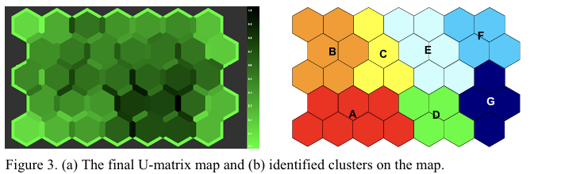
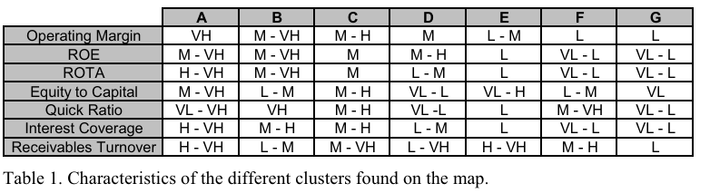
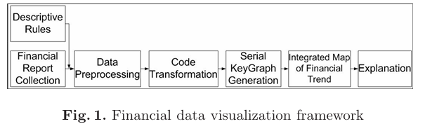
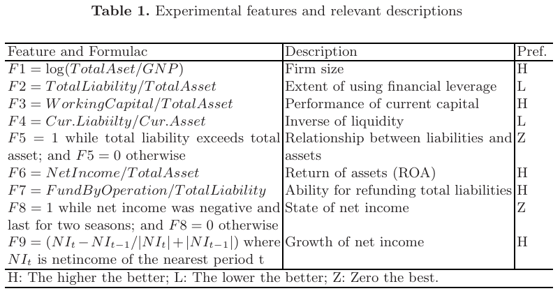

# PAPER LIST

> **updates** : re-scoring

## 1. Stock

| No.  | Publication date | Title                                                                                              | Authors                            | Relevance Score   |
|------|------------------|----------------------------------------------------------------------------------------------------|------------------------------------|----------------------|
| 1    | 1992             | [Adapting treemaps to stock portfolio visualization.](#st-no1)                                                | Jungmeister and Turo [JT92]        |                     |
| 2    | 1996             | [Circle segments: A technique for visually exploring large multidimensional data sets.](#st-no2)              | Ankerst et al. [AKpK96]            |                      |
| 3    | 1999             | [Visualizing the stock market.](#st-no3)                                                                      | Wattenberg [Wat99]                 |                      |
| 4    | 2001             | [Visualizing time-varying correlations across stock markets.](#st-no4)                                         | Groenen and Franses [GF00]         |                      |
| 5    | 2003             | [Visualization of stock market charts.](#st-no5)                                                              | Simunic [Sim03]                    |                      |
| 6    | 2003             | [Bimodal visualization: A financial trading case study.](#st-no6)                                              | Taskaya and Atkinson [TA03]        |                      |
| 7    | 2004             | [Visualizing changes in fund manager holdings in two and a half-dimensions.](#st-no7)                          | Dwyer and Gough [DG04]             |                      |
| 8    | 2004             | [Using manyeyes to represent financial data.](#st-no8)                                                        | Shen and Eades [SE04]              |                      |
| 9    | 2005             | [Importance-driven visualization layouts for large time series data.](st-no9)                                | Hao et al. [HDKS05]                |                      |
| 10   | 2006             | [Regular treemap layouts for visual analysis of hierarchical data.](#st-no10)                                   | Schreck et al. [SHMK06]            |                      |
| 11   | 2007             | [Trajectory-based visual analysis of large financial time series data.](#st-no11)                               | Schreck et al. [STKFT07]           |                      |
| 12   | 2007             | [Applying animation to the visual analysis of financial time-dependent data.](#st-no12)                         | Teikuusvorn and Kohlhammer [TK07]  |                      |
| 13   | 2008             | [Nasdaq velocity and forces: An interactive visualization of activity and change.](#st-no13)                    | Dao et al. [DBBS08]                |                      |
| 14   | 2009             | [A visualization approach for frauds detection in financial market.](#st-no14)                                  | Huang et al. [HLN09]               |                      |
| 15   | 2009             | [Stockviz: Analyzing the trend of stocks in major auto, oil, consumer, and technology companies.](#st-no15)      | Sawant [Saw09]                     |      $\star$                |
| 16   | 2009             | [Visual cluster analysis of trajectory data with interactive kohonen maps.](#st-no16)                           | Schreck et al. [SBVLK09]           |           $\star$           |
| 17   | 2010             | [A visual analytics system for financial time-series data.](#st-no17)                                           | Lei and Zhang [LZ10]               |           $\star$          |
| 18   | 2010             | [Financial markets in motion: Visualizing stock price and news interactions during the 2008 crisis.](#st-no18)  | Wu and Phillips [WP10]             |          $\star$            |
| 19   | 2010             | [Visual market sector analysis for financial time series data.](#st-no19)                                       | Ziegler et al. [ZGK10]             |         $\star$             |
| 20   | 2011             | [Visual signatures for financial time series.](#st-no20)                                                       | Lei and Zhang [LZ11]               |         $\star$             |
| 21   | 2011             | [A Novel Explorative Visualization Tool for Financial Time Series Data Analysis.](#st-no21)                    | Sarlin et al. [SWK+11]             |        $\star$          |
| 22   | 2012             | [Sphere-based information visualization: Challenges and benefits.](#st-no22)                                    | Brath and MacMurchy [BM12]         |       $\star$            |
| 23   | 2013             | [Financial visualization case study: Correlating time series and discrete events for decisions.](#st-no23)      | Sorenson and Brath [SB13]          |       $\star$               |
| 24   | 2016             | [Integrated visual analysis of patterns in time series and text data - workflow and application.](#st-no24)     | Wanner et al. [WS+16]              |       $\star$               |

## 2. Company Info

|   No. |   Publication date | Title                                                                                                                | Authors           | Relevance Score   |
|------:|-------------------:|:---------------------------------------------------------------------------------------------------------------------|:------------------|:------------------|
|     1 |               2002 | [Assessing the feasibility of self organizing maps for data mining financial information.](#ci-no1)                             | Eklund02[EBVV02]  |          $\star\star\star$         |
|     2 |               2005 | [Importance-driven visualization layouts for large time series data.](#ci-no2)                                                  | Hao05[HDK05]|       |                   |
|     3 |               2005 | [Interactive visualization of high dimensional marketing data in the financial industry.](#ci-no3)                              | Smeulders05[SH05] |                   |
|     4 |               2008 | [Visualization of financial trends using change discovery methods.](#ci-no4)                                                    | Chiu08[CHC08]     |      $\star\star\star$|
|     5 |               2012 | [Marketanalyzer: An interactive visual analytics system for analyzing competitive advantage using point of sale data.](#ci-no5) | Ko12[KMJE12]      |                   |

## 3. Financial Data

|   No. |   Publication date | Title                                                                                                                | Authors           | Relevance Score   |
|------:|-------------------:|:---------------------------------------------------------------------------------------------------------------------|:------------------|:------------------|
|     1 |               2022 | [Detecting anomalies in financial data using machine learning algorithms.](#fs-no1)| M A Bakumenko, A Elragal | $\star$|
|     2 |               2023 | [Forecasting in financial accounting with artificial intelligence-A systematic literature review and future agenda](#fs-no2) | M Kureljusic, E Karger|$\star\star\star\star\star$ |

---

# 1. Stock

## [Stock] 1. (1992) Adapting treemaps to stock portfolio visualization.
- 69회 인용
- [WA Jungmeister](https://unilu.academia.edu/jungmeister/CurriculumVitae), D Turo

### Abstract
이 논문은 트리맵 시각화 기법을 확장하여 주식 포트폴리오 관리에 적용한 프로토타입 애플리케이션을 소개하고 있다. 이 프로토타입은 대량의 계층적 데이터를 시각화함으로써 포트폴리오 관리에 필요한 정보를 효율적으로 제공하며, 사용자는 디스플레이의 여러 요소를 동적으로 조정할 수 있다. 포트폴리오 관리에서 흔히 발생하는 요구 사항을 해결하는 예시를 통해 트리맵의 개념이 구체적으로 설명된다.

### Introduction
디지털 시대의 도래로 주식 거래소 정보를 데스크탑 컴퓨터에서 실시간으로 접근할 수 있게 되면서, 금융 관리자와 포트폴리오 관리자들이 대규모 포트폴리오를 더욱 효율적으로 관리할 수 있는 환경이 조성되었음을 언급하고 있다. 그러나 정보의 양이 많아짐에 따라 이를 효과적으로 처리하고 해석하는 능력이 중요해진다. 기존의 정보 처리 방식인 전자식 티커 테이프나 그래픽 소프트웨어는 작은 데이터 세트를 다루는 데는 유용하지만, 대량의 포트폴리오 데이터를 시각화하고 통합하는 데는 한계가 있다. 트리맵은 계층적으로 구조화된 대량의 데이터를 시각적으로 표현하는 방법으로, 기업 관리 구조와 포트폴리오 구조라는 이중 계층을 가진 포트폴리오 관리에 특히 적합하다고 제안된다.

## [Stock] 2. (1996) Circle segments: A technique for visually exploring large multidimensional data sets.
- 330회 인용(2024.10)
- M Ankerst, **DA Keim**, HP Kriegel

`-` [Daniel Keim](https://www.uni-konstanz.de/centre-for-human-data-society/people/prof-dr-daniel-keim/)

- Professor of Computer Science, Data Analysis and Visualization, University of Konstanz (독일 콘스탄츠 대학교의 컴퓨터 과학 교수)
- Data Analysis, Information Visualization, Visual Analytics, Visualization, Clustering

*독일 콘스탄츠 대학교는 특히 데이터 시각화와 대규모 데이터 분석에 강점을 가진 대학으로 세계적으로 인정받고 있음*

`-` Hans-Peter Kriegel (Daniel Keim의 지도교수)
- Professor für Informatik, Ludwig-Maximilians-University Munich (독일 뭰헨 대학교 컴퓨터 과학 교수)
- Database Systems, Data Mining
- DBSCAN(Density-Based Spatial Clustering of Applications with Noise) 알고리즘의 공동 개발자
- 고차원 데이터 탐색, 이상 탐지, 시각화 기술, 유사성 검색 등의 주제에 관해 다수의 논문 발표

### Abstract
이 논문에서는 대규모 고차원 데이터를 시각화하기 위한 새로운 기법인 서클 세그먼트(circle segments) 기법을 설명한다. 이 기법은 pixel-per-value 기법으로 분류될 수 있으며, 각 데이터 값을 하나의 색상 픽셀로 표현한다. 기본 아이디어는 원의 세그먼트를 사용하여 각 데이터 차원을 시각화하는 것이다. 데이터가 k개의 차원으로 이루어져 있다면, 원은 k개의 세그먼트로 분할되며, 각 세그먼트는 하나의 데이터 차원을 나타낸다. 첫 번째 실험 결과, 서클 세그먼트 기법은 기존의 recursive pattern 기법이나 전통적인 선 그래프 기법보다 더 표현력 있는 시각화를 제공한다는 것을 보여준다.

### Introduction
오늘날 탐색적 데이터 분석의 중요한 문제 중 하나는 분석해야 할 데이터의 양이 급격히 증가하고 있다는 점이다. 다양한 분야에서 자동화된 활동들은 점점 더 많은 데이터를 생성하고 있으며, 이러한 데이터는 대규모 데이터베이스에 저장된다. 그러나 효과적인 데이터 탐색 방법이 없다면 이러한 데이터베이스는 단순한 데이터 저장소로 전락하게 된다. 대규모 데이터베이스의 데이터 탐색은 매우 어려운 작업이며, 많은 연구자들이 대규모 데이터에서 유용한 정보를 추출할 수 있는 방법을 찾고 있다.

기존의 시각화 기법으로는 고차원 데이터를 효과적으로 시각화하는 데 한계가 있다. 이 논문에서는 하나의 데이터 값당 하나의 픽셀을 사용하는 pixel-per-value 기법을 기반으로 한 새로운 시각화 기법을 제안한다. 이를 통해 매우 큰 양의 데이터를 시각화할 수 있으며, 화면에 표시할 수 있는 데이터 양을 크게 늘릴 수 있다. 서클 세그먼트 기법은 이러한 대규모 데이터의 시각화를 위해 설계된 기법이다.

이 기법은 특히 **쿼리 의존적 시각화(query-dependent visualizations)** 에 중점을 두고, 가장 관련성이 높은 데이터 항목들을 화면 중앙에 배치하여 데이터를 탐색하고 분석하는 과정을 지원하는 데 중점을 둔다고 설명된다.

`-` Data Description

해당 논문에서 사용한 데이터는 프랑크푸르트 증권거래소에서 10년 동안 수집된 주식 가격 데이터를 기반으로 한다. 이 데이터는 7개의 주식 가격 변동 정보를 포함하며, 이를 통해 다양한 시각화 기법의 비교가 이루어졌다. 각 데이터 기록은 시간에 따른 주식 가격의 변동을 나타내며, 색상으로 높은 주가와 낮은 주가를 구분하여 사용자에게 직관적인 시각적 피드백을 제공하는 방식으로 사용되었다.

## [Stock] 3. (1999) Visualizing the stock market.
- 299회 인용(2024.10)
- M Wattenberg
- CHI EA '99: CHI '99 Extended Abstracts on Human Factors in Computing Systems

### Abstract
이 논문에서는 새로운 2차원 시각화 알고리즘을 설명하고 있다. 이 알고리즘은 수백 개의 항목에 대한 세부 정보를 제공하면서 데이터의 전반적인 패턴을 강조하는 데 중점을 둔다. 이 기법은 Shneiderman의 트리맵 기술을 기반으로 하여 계층 구조와 유사성 정보를 모두 사용한다. 이 시각화는 SmartMoney의 웹 페이지인 "Map of the Market"에 구현되어 500개 이상의 상장 기업에 대한 현재 데이터를 제공하는 데 사용된다.

### Introduction
금융 저널리즘의 주요 목표 중 하나가 "오늘 시장이 어떻게 움직이고 있는가?"라는 질문에 답하는 것이라고 설명한다. 시장의 전반적인 지표는 상승할 수 있지만, 특정 기술주가 하락하거나 특정 기업(예: 애플)의 주식이 상승할 수 있기 때문에 단순한 지수로 시장을 요약하는 것은 많은 정보를 숨기게 된다. 기존의 주식 가격 정보는 지나치게 세부적이라 읽기 어려우며, 전체적인 추세를 파악하기 어렵다. 이 논문에서는 이를 해결하기 위해 Shneiderman의 트리맵 다이어그램과 관련된 새로운 상호작용 그래픽 디스플레이를 설명하고 있다. 이 디스플레이는 사용자가 수백 개의 주식 성과를 동시에 추적할 수 있도록 하며, 전체적인 추세를 놓치지 않게 한다.

`(참고)`

SmartMoney는 미국의 개인 금융 잡지로, 주식 투자, 금융 관리, 세금, 은퇴 계획 등의 정보를 제공하는 매체였다. 원래 Dow Jones & Company와 Hearst Corporation이 공동으로 소유했으며, 월스트리트 저널(Wall Street Journal)의 자매지로 알려져 있었다.

SmartMoney는 특히 투자자들이 실시간으로 주식 시장 정보를 시각화할 수 있도록 돕는 **"Map of the Market"** 이라는 웹 기반 시각화 도구를 도입해 주목받았다. 이 도구는 treemap 기법을 사용하여, 주식 시장의 주요 지표들을 직관적으로 보여주는 웹 기반의 시각화 서비스였다. 이를 통해 사용자들은 각 주식의 시세 변동을 한눈에 확인할 수 있었다. SmartMoney 잡지는 2012년 9월에 인쇄판 발행을 중단하고, 이후에는 주로 온라인에서 금융 관련 콘텐츠를 제공했다.

## [Stock] 4. (2000) Visualizing time-varying correlations across stock markets.
- 77회 인용(2024.10)
- PJF Groenen, PH Franses
- Journal of Empirical Finance, 2000

`-` Patrick John Fitzgerald
- 네덜란드 Erasmus University Rotterdam 통계학 교수
- Master's: Leiden University (1988)
- PhD: Leiden University (1993, under the supervision of Willem J. Heiser with the thesis titled "The majorization approach to multidimensional scaling: some problems and extensions")
### Abstract
이 논문은 주식 시장 수익률 간의 시간에 따른 상관관계를 시각적으로 표현하는 그래픽 방법을 제안한다. 이 방법은 **다차원 척도법(MDS)** 을 적용하여 상관관계를 시각화하며, 주식 시장 간 유사한 행동을 보이는 안정적이거나 새롭게 나타나는 클러스터를 관찰하는 데 유용할 수 있다. 또한, 이 방법은 다변량 경제 모델을 구축하는 데 도움을 줄 수 있는 탐색적 도구로 사용될 수 있다. 이 논문은 13개의 주요 주식 시장의 수익률과 절대 수익률을 예시로 들어 설명한다

### Introduction
이 논문은 기본적으로 그래픽적 기술 기법을 제안하며, 이 기법은 주식 시장 간의 유사성을 파악하는 데 도움이 된다. 이를 통해 통계적 모델 설계를 가이드할 수 있으며, 흥미로운 가설을 세우는 데 기여할 수 있다. 국제 주식 시장의 상관구조가 시간에 따라 변할 가능성을 허용하는 것이 경제적 동기에서 중요하다. 특히, 하나의 세계 요인이 국가별 주식 시장 행동을 지배하는지 여부가 핵심 질문으로 등장한다. 또한, 신흥 시장이 여전히 신흥 시장이라고 할 수 있는지, 즉 시간이 지남에 따라 다른 시장들과 다른 동적 패턴을 보이는지에 대한 문제도 다뤄진다. 이 방법은 또한 포트폴리오 설계에 있어 상관관계 변화를 반영하는 정보를 포함하는 데 유용할 수 있다.

## [Stock] 5. (2003) Visualization of stock market charts.
- 26회 인용(2024.10)
- K Šimunić
- International Conference in Central Europe on Computer Graphics and Visualization, 2003

### Abstract
이 논문은 주식 시장 차트의 시각화 시스템을 제안한 연구이다. 주식 시장 분석에서 차트 모양이 중요한 역할을 하며, 기술적 분석에서는 주로 차트 모양을 기반으로 결정을 내린다. 이 연구에서는 기존 차트 모양을 클러스터링하여 유사한 차트를 대표하는 차트를 생성한다. 이를 통해 2D 지도에서 이러한 대표 차트를 시각화하고 줌 기능, 세부 수준 조정 및 선택 도구를 구현하였다. 이 시스템은 주식 시장의 동적 흐름을 자동으로 생성하는 새로운 접근법을 제시한다.

### Introduction
주식 시장은 복잡한 데이터가 발생하는 중요한 영역이다. 주식 시장 투자자는 두 가지 분석 방법을 사용하여 결정을 내리는데, 첫 번째는 '기본적 분석'이며, 두 번째는 '기술적 분석'이다. 기술적 분석은 주식의 과거 가격 패턴을 연구하는 반면, 기본적 분석은 회사의 재무 상태, 경영진, 경쟁 위치 등을 분석한다. 기술적 분석의 기본은 장기 및 단기 차트를 분석하여 특정 기준을 충족하는 차트를 찾는 것이다. 그러나 이 분석 방식은 모든 차트를 포함하지 못할 수 있는 한계가 있다. 이 연구에서는 주식 데이터의 기존 차트 모양에 대한 통찰을 제공하는 시각화 시스템을 제안한다.

`-` Data Description

이 논문에서 사용된 데이터는 2000년 나스닥(Nasdaq) 주식 시장에서 가져온 데이터이다. 500개의 회사 데이터를 사용하였고, 2000년 11월 16일부터 12월 29일까지의 30 거래일 동안의 주가 변동을 다루고 있다. 차트 모양에만 집중하기 위해, 첫날 기준으로 정규화된 주가 증가율을 사용하여 데이터를 처리하였다.

## [Stock] 6. (2003) Bimodal visualization: A financial trading case study. 
- 13회 인용(2024.10)
- T Taskaya, K Ahmad 
- Proceedings of the Seventh International Conference on Information Visualization (IV’03)

### Abstract
이 논문은 두 가지 정보 모달리티, 즉 수치적 데이터와 텍스트 데이터를 다루는 시각화 시스템을 제안한다. 현재의 적용 분야는 금융 거래 예측이며, 이 시스템은 뉴스 기사와 시계열 데이터를 종합하여 금융 상품의 매수/매도 신호를 생성한다.

### Introduction
금융 거래자는 일반적으로 높은 양의 데이터 스트림에 접근할 수 있으며, 이 데이터는 특정 가치에서 얼마나 많은 주식이 거래되었는지를 알려준다. 거래자는 이러한 시계열 데이터를 사용하여 미래의 수량과 가치를 예측한다. 또한, 금융 상품의 매수/매도 결정은 시계열 데이터의 행동과 관련된 다른 정보원, 예를 들어 경제 뉴스와 같은 자료를 참고하여 이루어진다.

이 연구는 이러한 환경에서 두 가지 주요 모달리티인 수치 데이터와 텍스트 데이터를 동시에 처리할 수 있는 시스템을 제안하며, 이 시스템은 정보 분석 후 매수/매도 결정을 지원하는 프로토타입을 설명한다.

## [Stock] 7. (2004) Visualizing changes in fund manager holdings in two and a half-dimensions.
- 62회 인용(2024.10)
- T Dwyer, DR Gallagher
- Information Visualization, 2004

### Abstract
이 논문에서는 시간이 지남에 따라 변화하는 고차원 포트폴리오 보유 데이터 세트를 시각화하기 위한 다중 보기(overview and detail) 방법을 탐구한다. 이 방법은 다차원 스케일링(multidimensional scaling)과 그래프 시각화 기술을 활용하여 고차원 데이터를 위한 2차원 매핑을 찾는다. 개요 및 세부 보기에서 시간은 제3 차원에 매핑되어 데이터의 변화를 2.5차원으로 시각화한다. 저자들은 이 패러다임의 유용성을 영국의 대규모 펀드 매니저 주식 포트폴리오 이동 시각화 프로토타입 시스템을 통해 입증한다.

## [Stock] 8. (2004) Using moneytree to represent financial data.
- 10회 인용(2024.10)
- X Shen, P Eades
- Proceedings of the Eighth International Conference on Information Visualisation, 2004

### Abstract
이 논문에서는 환경 정보 시각화를 통해 금융 데이터를 표현하는 방법을 제안한다. 환경 시각화는 사용자의 주의력을 분산시키며 주변 환경과 잘 어우러져야 한다. 이를 통해 대량의 금융 데이터를 이해하기 쉬운 이미지로 변환하고, 이미지가 변할 때마다 정보를 제공하는 것을 목표로 한다. 연구 프로젝트에서는 다양한 나무 이미지를 사용하여 실시간 주식 가격과 거래량의 변화를 시각적으로 나타낸다.

### Introduction
전통적인 데스크탑 컴퓨터 화면의 한계를 넘어, 과학자, 예술가, 그래픽 디자이너들이 새로운 정보 표현 방법을 모색하고 있다. 대형 화면에서 시각적 주의력은 매우 좁기 때문에, 사용자 주의력의 주변에서 정보를 제공하는 것이 중요하다. 환경 정보 시각화는 사용자 주의의 중심이 아닌 주변에서 정보를 제공하는 미적인 디스플레이를 사용하여, 사람들이 필요할 때 적절한 정보를 얻을 수 있도록 한다.

이 프로젝트에서는 동적인 주식 가격과 거래량 데이터를 나무 이미지로 표현하여, 사용자에게 시각적으로 가격 변화를 알린다. 두 가지 목표는 다음과 같다: 첫째, 주식 가격과 거래량 데이터를 보여주는 즐거운 시각적 장식을 제공하는 것이다. 둘째, 이 데이터를 사용자에게 알리는 것이다.

이와 같은 방식으로 재무 데이터 시각화는 전통적인 2D 차트와 비교하여 덜 위협적이고 정보의 다양한 차원을 하나의 프레임 안에서 표현할 수 있게 된다. MoneyTree 시각화는 사용자의 일상 환경에 중요 정보를 배치하며, 사용자에게 예술 작품처럼 느껴지도록 디자인된다.

## [Stock] 9. (2005) Importance-driven visualization layouts for large time series data.
- 89회 인용(2024.10)
- MC Hao, U Dayal, **DA Keim**, T Schreck
- IEEE Symposium on Information Visualization, 2005

### Abstract
이 논문은 시간 시계열 데이터를 시각화하는 효율적인 방법을 제시한다. 시간 시계열 데이터는 실제 세계의 다양한 분야에서 중요한 데이터 유형으로, 많은 수의 시계열을 동시에 모니터링하고 분석해야 할 필요가 있다. 각 시계열은 내재적인 계층 관계와 개별 시계열 간의 중요도가 다르게 나타날 수 있다. 따라서, 시계열 데이터를 시각적으로 분석하는 효과적인 기술은 데이터의 상대적 중요성과 계층적 순서를 크기와 위치로 인코딩해야 하며, 분석가가 비교를 용이하게 할 수 있도록 높은 정도의 규칙성을 제공해야 한다. 본 연구에서는 이러한 시각화를 위한 프레임워크를 제안하며, 시간 시계열 간의 중요성 관계를 기반으로 한 목표 함수를 정의한다. 이를 통해 계층 및 중요성 기반의 관계를 반영하는 레이아웃을 생성하는 효율적인 알고리즘을 개발하였다. 실제 판매 및 주식 데이터를 포함한 여러 데이터셋에 적용하여, 제안한 기법의 유용성을 입증하였다.

### Introduction
시간 시계열은 많은 응용 분야에서 매우 중요한 데이터 유형이다. 정보 시각화 기술은 주로 제한된 수의 시계열을 지원하거나, 대량의 시계열 집합의 집계된 뷰를 고려하는 데 중점을 두어왔다. 기존 시스템 중 하나인 Polaris는 분석가가 테이블 기반 그래픽 디스플레이의 시각적 사양을 쉽게 조정하고 개선할 수 있도록 한다. Schumann의 시간 휠은 시간 축을 디스플레이 중앙에 배치하고, 변수를 시간 축 주위에 원형으로 배열하는 방식을 사용한다. Van Wijk는 클러스터링 기반 시각화를 도입하여 다수의 시계열 데이터를 캘린더 기반 뷰로 응축한다. 본 논문에서는 동시에 여러 개의 시간 시계열을 효과적으로 보기 위한 적절한 시각화 레이아웃을 생성하는 문제를 다룬다. 연구의 목표는 분석가가 시간 시계열의 상대적 중요성과 계층 관계를 빠르게 인지할 수 있도록 지원하며, 높은 규칙성을 가진 레이아웃을 통해 데이터의 비교를 용이하게 하는 것이다. 

본 연구의 기여는 다음과 같다: 

`(1)` 시계열 집합에 대한 중요성 기반 레이아웃 생성 아이디어를 도입한다. 

`(2)` 효과적인 레이아웃이 제공해야 할 제약 조건을 공식화한다. 

`(3)` 위의 기준을 최적화하는 효율적인 알고리즘을 제공한다.

## [Stock] 10. (2006) Regular treemap layouts for visual analysis of hierarchical data.
- 54회 인용(2024.10)
- T Schreck, **D Keim**, F Mansmann
- Proceedings of the 22nd Spring Conference on Computer Graphics, 2006

### Abstract
계층적 관계는 많은 응용 분야에서 중요한 역할을 한다. 계층적으로 구조화된 데이터 세트를 적절하게 시각화하는 것은 데이터 분석가가 효과적으로 계층 구조를 분석하는 데 도움을 줄 수 있다. 기존의 정보 시각화 기법은 계층적으로 구조화된 데이터 세트를 시각화하기 위한 여러 유용한 기술을 제공해왔다. 그러나 많은 데이터 요소 유형에서 발생하는 특정 정규성 요구 사항을 지원하는 데는 개선이 필요하다. 본 논문에서는 인기 있는 TreeMap 계층 레이아웃 알고리즘의 기존 변형을 분석하고, 전역적으로 정규 레이아웃을 제공하는 계층 데이터 세트의 공간 효율적인 레이아웃을 지원하는 새로운 TreeMap 알고리즘을 소개한다. 이 알고리즘을 자세히 설명하고, 실제 데이터 세트에 대한 응용 사례 및 합성 데이터 세트에서 수행한 실험을 통해 그 유용성을 보여준다.

### Introduction
현대 정보 시스템에 의해 생성되는 정보의 양이 증가하면서 정보 과부하 현상을 처리하기 위한 적절한 도구가 필요하다. 정보 시각화는 사용자가 증가하는 정보 양을 처리할 수 있도록 시각적으로 지원하는 도구를 제공하는 것을 목표로 한다. 많은 응용 분야에서 중요한 데이터 특성 중 하나는 데이터 세트의 요소 간의 계층적 관계이다. 정보 시각화는 계층 구조를 표시하기 위한 유용한 아이디어를 제시해왔으며, 여기에는 3D 시각화 기법인 Cone Tree나 하이퍼볼릭 트리 등 여러 기법이 포함된다. 본 논문에서는 계층적으로 구조화된 데이터 세트를 위한 공간 효율적인 레이아웃을 제공하며, 표시의 높은 정규성을 요구하는 새로운 시각화 접근 방식을 개발한다. TreeMap 알고리즘의 장점을 활용하여, 본 연구는 데이터 세트의 레이아웃을 개선하기 위한 다양한 TreeMap 변형을 제안한다.

`-` Data

논문에서는 S&P 500 주식 가격 데이터를 사용하였다. 이 데이터는 **Hierarchical Agglomerative Clustering Algorithm (HAC)** 를 통해 사전 처리된 데이터 세트로, 60개의 시계열로 구성되어 있으며, 각각 48개의 값을 가지고 있다. 이러한 시계열 데이터는 계층적으로 군집화되어 시각화에 사용되며, 바 차트 형식으로 표시하기 위해 높은 정규성을 요구한다. 이로 인해 GTM(그리드 트리맵) 알고리즘의 적용이 적합하다고 판단되었다.

## [Stock] 11. (2007) Trajectory-based visual analysis of large financial time series data.
- 87회 인용(2024.10)
- T Schreck, T Tekušová, J Kohlhammer, D Fellner
- [ACM SIGKDD Explorations Newsletter](https://dl.acm.org/newsletter/sigkdd), 2007

***(참고)*** 

`ACM SIGKDD Explorations Newsletter`는 **ACM SIGKDD(Association for Computing Machinery Special Interest Group on Knowledge Discovery and Data Mining)** 에서 발행되며, 데이터 마이닝 및 분석 커뮤니티의 연구자들이 기여한 논문, 리뷰, 사례 연구 등을 수록한다. 발행 기관인 **ACM(Association for Computing Machinery)** 는 컴퓨터 과학과 정보 기술 분야에서 가장 영향력 있는 학회 중 하나로, ACM에서 발행하는 저널들은 엄격한 심사 과정을 거쳐 높은 학술적 신뢰성을 보장한다.

### Abstract
시각적 분석(Visual Analytics)이 복잡한 대규모 데이터를 분석하는 데 중요한 기술이며, 금융 데이터 분석 분야에서 이러한 기술을 적용하는 것이 유망하다고 설명한다. 특히 이 논문은 금융 시계열 데이터를 2차원 지표 공간에서 시각적으로 분석하는 시스템을 제안하며, 이 시스템은 비지도 학습 클러스터링 알고리즘과 시각화 기술을 결합하여 효과적으로 대규모 데이터를 탐색할 수 있도록 지원한다. 또한, 이 시스템은 자동화된 스크리닝 기능을 통해 잠재적으로 흥미로운 데이터 뷰를 사용자에게 제시한다. 이 시스템은 대규모 금융 데이터 세트에 적용되었으며, 다른 응용 분야에서도 유용할 것이라고 기대된다.

### Introduction
시각적 분석이 대규모 데이터에서 유용한 정보를 추출하는 연구 분야로서 떠오르고 있으며, 금융 분석은 다변량 및 시계열 데이터를 다루는 복잡한 분석 작업을 필요로 하기 때문에 이러한 기술의 유망한 응용 분야로 설명된다. 금융 데이터 분석에서 시장 동향 식별과 자산 가격 예측이 주요 분석 작업이며, 이를 위해 널리 사용되는 도구로서 기술적 차트 분석이 소개된다. 그러나 기존의 1차원 기술적 차트 분석이 아닌, 2차원 지표 공간에서의 시각적 분석이 필요하며, 이를 해결하기 위한 새로운 프레임워크가 논문에서 제시된다. 2차원 금융 지표 데이터를 시각적으로 표현하는 방법으로 궤적(trajectory)을 사용하며, 이 데이터를 클러스터링하여 유의미한 패턴을 시각적으로 분석하는 시스템을 개발했다는 점이 강조된다.

`-` Data

논문에서 이용한 데이터는 2005년 5월부터 2006년 11월까지의 기간 동안 기록된 83개의 유럽 블루칩 주식에 대한 일일 리스크(표준편차)와 수익률 데이터이다. 이 데이터 세트는 총 66주의 관측치를 포함하며, 총 5478개의 궤적 샘플이 클러스터링 분석의 입력으로 사용되었다. 각 주식의 리스크와 수익률은 2차원 지표 공간에서 표현되며, 이 데이터를 통해 시장 동향을 시각적으로 분석할 수 있다.

## [Stock] 12. (2007) Applying animation to the visual analysis of financial time-dependent data.
- 39회 인용 (2024.10)
- T Tekusova, J Kohlhammer
- 2007 11th International Conference Information Visualization (IV'07), IEEE

### Abstract
금융 분석가들은 분석의 신속성과 품질을 개선하기 위해 현대적인 데이터 시각화 도구를 사용하려는 노력을 지속해 왔다. 데이터의 양이 급격히 증가하고 분석의 품질에 대한 요구가 높아짐에 따라, 분석 지원 시스템에 대한 수요가 증가하고 있다. 본 논문에서는 대량의 시계열 데이터를 시각적으로 분석하기 위한 시스템을 제안한다. 각 데이터 항목은 스캐터플롯 형식으로 표시되며, 애니메이션을 통해 시간에 따른 변화를 나타낸다. 이 시스템은 포커스, 줌, 세부 정보 요청 및 기간 선택 기능을 제공하여 분석을 지원한다. 애니메이션은 시계열 데이터 분석에 강력한 도구임이 입증되었다. 이는 기존의 정적 분석으로는 발견할 수 없었던 패턴을 발견할 수 있게 하며, 실제 시장 움직임을 더 잘 반영한다.

### Introduction
금융 분석가들은 보통 시간 압박 속에서 대량의 수치 데이터를 평가해야 하며, 이를 위해 현대적인 통계 및 시각화 시스템을 활용한다. 데이터 양이 급속히 증가함에 따라 분석의 질과 신속성에 대한 요구가 커지고 있어, 시각화 시스템의 발전이 필수적이다. 많은 금융 분석 기법이 존재하지만, 금융 지표 간의 상관 관계 분석은 여전히 가장 널리 사용되는 기법 중 하나이다. 본 연구에서는 스캐터플롯을 기본 데이터 표현 형식으로 사용하면서 애니메이션을 통해 시간과 횡단면 데이터를 동시에 시각화하는 방법을 제안한다. 이 시스템은 현재 금융 분석에서 널리 사용되는 정적 도구보다 더 효율적이고 신속한 분석을 지원하며, 이를 통해 대량의 다차원 데이터를 보다 효과적으로 분석할 수 있게 된다.

## [Stock] 13. (2008) Nasdaq velocity and forces: An interactive visualization of activity and change.
- 7회 인용(2024.10)
- HT Dao, AL Bazinet, R Berthier, B Shneiderman
- Journal of Universal Computer Science, vol. 14, no. 9 (2008)

### Abstract
 NASDAQ의 두 가지 새로운 거래 활동 지표인 `Market Velocity`와 `Market Forces`에 대해 다룬다. 이 두 데이터는 이전에 물리적 거래소에서만 관찰할 수 있었던 거래 활동의 변화를 포착하려는 시도로 개발된 것이다. 이를 효과적으로 시각화하기 위해 FireStox라는 웹 애플리케이션을 개발했으며, 이 애플리케이션은 여러 기업의 주식 활동을 실시간으로 시각화하고 필터링하여, 연구자들이 거래일 동안 이들 데이터를 분석할 수 있도록 돕는 도구로 설계되었다.

### Introduction
NASDAQ의 Market Velocity와 Market Forces가 물리적 거래소에서의 소음과 활동을 디지털 방식으로 대체하려는 시도라는 점을 강조한다. Market Velocity는 주문의 빈도와 수량을 통해 시장의 활동성을 측정하며, Market Forces는 매수 및 매도 활동의 방향을 보여준다. 이를 통해 거래자들이 단기 및 장기적인 시장의 추세와 사건을 파악할 수 있도록 도와준다고 설명된다. 이러한 데이터를 효과적으로 시각화하기 위해 NASDAQ은 기존의 단순한 선 그래프나 데이터 목록보다 더 정교한 도구가 필요했으며, 이를 해결하기 위해 FireStox가 개발되었다.

***`(참고)`***
- 현재 FireStox 웹 애플리케이션은 더 이상 활성화된 서비스로 제공되고 있지 않다. 이 애플리케이션은 NASDAQ에서 제공하는 Market Velocity와 Market Forces 데이터를 실시간으로 시각화하여 사용자들이 여러 주식의 거래 활동을 분석할 수 있도록 개발된 도구였다. 그러나 이 프로젝트는 연구 목적으로 개발된 것이며, 더 이상 웹에서 직접 접근할 수 있는 형태로 제공되지는 않고 있다

- 물리적 거래소에서의 소음은 실제 거래소의 거래 활동을 나타내는 비유적인 표현이다. 전통적인 물리적 거래소에서는 거래자들이 서로 주문을 외치거나 의사소통하는 소리가 매우 컸으며, 이 소음은 실제로 특정 주식에 대한 관심이나 거래 활동이 활발해지고 있음을 나타내는 중요한 신호였다. 예를 들어, 많은 브로커들이 특정 주식을 사고팔기 위해 한 곳에 모여 활발하게 소통할 때, 이 소음을 통해 거래의 증가나 주식 가격의 변화를 감지할 수 있었다.
즉, 소음은 단순한 배경 소리가 아니라, 주식의 거래 빈도, 매수 및 매도 주문의 압력을 나타내는 중요한 실시간 신호로 여겨졌다. Market Velocity와 Market Forces는 이러한 물리적 거래소에서의 소음을 전자 거래 환경에서 재현하려는 시도로, 소음 대신 주문 빈도와 매수/매도 비율을 통해 같은 정보를 제공하려는 것이다.

- 물리적 거래소에서의 활동은 거래자들이 직접 거래소에 모여, 매수자와 매도자가 서로 주문을 주고받는 실시간 거래 과정을 의미한다. 이 활동은 거래소의 특정 장소에서 이루어지며, 많은 경우 사람들이 소리 내어 매수/매도 주문을 외치는 구두 경매 형식으로 진행된다. 이 과정에서 거래자들은 종종 몸짓이나 언어적 소통을 통해 거래를 성사시키고, 이러한 모든 움직임과 의사소통이 거래소의 활동성으로 나타난다.

## [Stock] 14. (2009) A visualization approach for frauds detection in financial market.
- 91회 인용(2024.10)
- [ML Huang](https://scholar.google.co.kr/citations?user=cUxFLH0AAAAJ&hl=ko&oi=sra), J Liang, QV Nguyen
- 2009 13th International Conference Information Visualisation, IEEE

### Abstract
전통적인 주식 시장 보안 솔루션은 공격자 및 향후 공격 계획을 식별하는 데 불충분하다. 따라서 분석가가 예기치 않은 사건이나 사기를 예방하는 것은 어렵다. 이 논문에서는 주식 시장 보안을 위한 새로운 시각적 분석 프레임워크를 제안한다. 제안된 솔루션은 두 단계로 구성된다: 첫째, 시장 성과의 시각적 감시; 둘째, 거래 네트워크의 행동 기반 시각적 분석이다. 첫 번째 단계에서는 3D 트리맵을 사용하여 실시간 주식 시장 성과를 모니터링하고 비정상적인 거래 패턴을 식별한다. 그 다음, 사회적 네트워크 시각화를 통해 의심스러운 패턴을 분석하고, 공격자 및 공격 계획을 식별하는 데 도움을 준다.

### Introduction

금융 시장의 보안을 보장하기 위해 주식 거래의 감시가 점점 더 중요해지고 있다. 현재 많은 연구가 금융 모델링 및 시장 보안을 위한 컴퓨테이셔널 인텔리전스 적용에 집중되고 있다. 전통적인 금융 사기 탐지 시스템은 알려진 사기를 감지하거나 비정상적인 행동을 통해 새로운 사기를 나타내지만, 지나치게 많은 오탐지를 발생시켜 비용이 많이 들거나, 여러 사기를 탐지하지 못하는 문제점이 있다. 현재 사기 탐지 지원은 자동화 증가에 중점을 두고 있지만, 인간 분석자의 인지 과정을 지원하기 위한 연구는 부족하다. 정보 시각화는 사기 탐지 모니터링 작업을 지원하는 데 큰 잠재력을 가진다. 그러나 기존의 시각화 기반 시스템은 주로 대량의 데이터의 실시간 및 상호작용 시각화에 집중되어 있으며, 관련 사회 네트워크 분석을 고려하지 않는다. 이 논문은 금융 시장의 사기 탐지 문제를 해결하기 위해 특별히 설계된 새로운 시각화 접근법을 제안한다.

## [Stock] 15. (2009) Stockviz: Analyzing the trend of stocks in major auto, oil, consumer, and technology companies. ($\star$)
- 6회 인용
- A Sawant

### Abstract
이 논문은 주식 데이터를 시각적으로 분석할 수 있는 도구인 StockViz를 제시한다. StockViz는 "Psquares"라는 2D 기하학적 객체를 사용하여 회사의 일일 및 주간 주가를 인코딩한다. 이 도구는 사용자가 주식 데이터를 빠르고 정확하게 분석하고 탐색하며 비교하고 발견할 수 있도록 돕는다. 주요 산업인 자동차, 석유, 소비자 및 기술 분야의 몇몇 대기업 주식을 시각화하여 데이터의 고급 개요와 세부 정보를 동시에 생성할 수 있는 방법을 제시한다.

### Introduction
현재 글로벌 경제의 방향성에 대한 질문이 중요하다. 최근 경제 위기로 인해 주식 시장은 불안정한 상황이다. 방대한 양의 주식 데이터가 축적되었지만, 서로 다른 주식 특성 간의 상관관계를 분석하는 것은 어려운 실정이다. 기존의 finantial 그래픽 도구는 2D 선 그래프에 의존하고 있으며, 이는 고차원 주식 정보를 표현하는 데 적합하지 않다. 따라서 이 논문은 다차원 데이터를 시각화할 수 있는 도구를 개발하는 데 중점을 둔다. 논문은 정보 시각화의 필요성과 그 방법론에 대해 논의하며, 나머지 섹션에서 구체적인 구현 및 사례를 설명한다

> 2d-scatterplot, spiral layout

## [Stock] 16. (2009) Visual cluster analysis of trajectory data with interactive kohonen maps.
- 245회 인용
- T Schreck, J Bernard, T Von Landesberger, J Kohlhammer
- Information Visualization, 2009
  
### Abstract
이 논문은 시각적 상호작용 클러스터 분석이 큰 데이터 세트를 효과적으로 분석하는 데 유용한 도구가 된다는 것을 보여준다. 특히 Kohonen Feature Map (또는 Self-Organizing Map, SOM) 알고리즘은 시각적 클러스터링 기법 중 가장 널리 사용되는 기법 중 하나로, 자동 데이터 분석과 사용자 개입을 결합한 시각 분석 프레임워크가 제안된다. SOM의 단점인 비지도 학습의 한계를 보완하기 위해 사용자 상호작용을 통한 클러스터링 과정의 모니터링 및 제어 기능이 포함된 프레임워크가 제시된다. 이를 통해 사용자는 도메인 지식과 선호도를 반영하여 더 나은 클러스터 맵을 생성할 수 있게 된다. 제안된 프레임워크는 여러 궤적 데이터 집합에서 적용되며, 비감독 학습과 감독 학습을 결합한 클러스터링 결과를 도출하는 데 기여한다.

### Introduction
클러스터 분석은 데이터 세트에서 유사한 요소들을 그룹화하여 구조화하고 축소하는 중요한 과정이다. 클러스터링은 주로 비지도 학습 방식으로 이루어지며, 사용자가 결과에 대한 개입을 할 수 없는 경우가 많다. 이 논문에서는 Kohonen Self-Organizing Map(SOM) 알고리즘이 궤적 데이터의 시각적 분석에 효과적임을 설명하며, 기존 SOM 기법의 한계점으로 사용자가 클러스터링 과정을 시각적으로 모니터링하고 제어할 수 없는 문제를 제기한다. 이를 해결하기 위해 시각적 상호작용 프레임워크를 도입하여, 사용자가 SOM 기반의 클러스터링 과정을 감독하고 원하는 결과를 얻을 수 있도록 돕는 방식을 제안한다. 궤적 데이터에 대한 분석은 매우 큰 데이터 세트를 다룰 때 시각적으로 효과적으로 처리될 수 없으므로, 클러스터링이 유용한 해결책이 될 수 있다고 주장된다.

`-` 궤적 데이터?
  
이 논문에서 언급하는 궤적 데이터(trajectory data)는 시간에 따라 객체의 이동 경로와 위치 정보를 포함하는 데이터 유형을 의미한다.구체적으로, 궤적 데이터는 다음과 같은 특징을 가진다:
- 위치 정보: 궤적 데이터는 특정 객체가 시간에 따라 이동한 경로를 나타내며, 일반적으로 (x, y) 좌표로 표현된다. 이러한 좌표는 객체의 위치를 나타낸다.

- 시간 의존성: 각 위치 정보는 시간 스탬프와 연결되어 있으며, 이는 객체가 언제 특정 위치에 있었는지를 보여준다. 이로 인해 궤적 데이터는 순서와 변화를 추적할 수 있게 된다.

- 다양한 응용: 궤적 데이터는 다양한 분야에서 활용되며, 특히 이동 경로 분석, 교통 데이터, 스포츠 데이터, 로봇 내비게이션, 그리고 금융 데이터 분석 등에서 중요하다.

- 금융 데이터 분석에서의 사용: 이 논문에서는 궤적 데이터를 금융 자산의 위험과 수익 변화를 분석하는 데 활용하고 있다. 특정 기간 동안 주식이나 자산의 성과를 궤적으로 표현하여, 이 데이터를 기반으로 클러스터링과 시각적 분석을 수행하는 방식이다.

## [Stock] 17. (2010) A visual analytics system for financial time-series data. -- ??
- 23회 인용
- ST Lei, K Zhang
- Proceedings of the 3rd International Symposium on Visual Information, 2010

### Abstract

이 논문은 주식 시장의 변동성으로 인해 금융 시계열 데이터를 분석하는 것이 어려운 과제임을 언급한다. 이를 해결하기 위해 시각적 접근법을 사용하는 것을 제안한다. 논문에서는 주식 시장 데이터를 종합적으로 분석할 수 있도록 시각적 분석 시스템을 소개하며, 기존의 차트가 가진 한계를 논의하고, 제안된 시스템에서 사용된 핵심 시각적 기법을 설명한다. 이 시스템은 개별 투자자가 주식 시장의 전체적 관점을 이해할 수 있게 돕는 것을 목표로 한다.

### Introduction

금융 시계열 데이터를 분석하여 수익성 있는 투자 전략을 제안하는 일은 매우 도전적인 작업이다. 기술적 분석과 기초적 분석의 두 가지 주요 분석 방법이 있는데, 기술적 분석은 가격 움직임에만 초점을 맞추며, 그 간단함 때문에 많이 사용된다. 그러나 대부분의 기술적 분석 도구들은 하나의 지표만을 이용한 차트로 데이터를 보여주며, 이는 복잡한 데이터 패턴을 충분히 설명하지 못하는 한계가 있다. 본 논문은 이러한 문제를 해결하기 위해 시각적 패턴 인식을 통한 기술적 분석을 제안하고, 주식 시장의 예측 가능한 패턴을 발견할 수 있는 시스템을 개발하는 것을 목표로 한다.

## [Stock] 18. (2010) Financial markets in motion: Visualizing stock price and news interactions during the 2008 global financial crisis. ($\star$)
- 6회 인용 (2024.10)
- E Wu, P Phillips
- Procedia Computer Science, 2010
  
### Abstract
이 논문은 2008년 글로벌 금융 위기(Global Financial Crisis, GFC) 동안 다우존스 산업평균지수(Dow Jones Industrial Average, DJIA) 와 관련된 주식 가격과 뉴스 헤드라인 데이터를 시각화하는 기술을 제시한다.
연구의 목적은 뉴스 헤드라인이 트레이더의 심리와 주식 가격에 미치는 영향을 분석하는 것이다.
제안된 시각화 도구는 Microsoft Excel 대시보드를 사용하며, 세 가지 차트(모션 차트, 레이더 차트, 누적 막대 차트)를 통해 대규모 데이터를 동시에 분석할 수 있도록 한다.
이 시스템은 대규모 데이터를 처리하면서 성능을 개선하여 **주식 가격과 뉴스 헤드라인 간의 관계를 동적으로 시각화하는 기능을 제공**

### Introduction
- 데이터 증가의 배경: 컴퓨터 저장 기술과 데이터 전송 기술의 발전으로 분석 가능한 데이터 양이 급격히 증가해왔다. 특히 금융 데이터는 이러한 증가의 중심에 있다.
- 문제점: 이렇게 급증한 대규모 데이터는 조직에서 효율적으로 해석하기 어려운 문제를 제기한다. 많은 분석가들이 익숙한 도구인 Microsoft Excel을 사용해 데이터를 처리하지만, 전통적인 2차원 차트로는 다차원 데이터의 상호작용을 충분히 시각화하기 어렵다.
- 연구의 목적: 이 논문은 대규모 금융 데이터를 Excel을 통해 시각적으로 표현하고, 여러 변수를 동시에 효과적으로 시각화하는 방법을 제안한다. 이를 통해 주식 가격과 뉴스 헤드라인 간의 상호작용을 이해하고, 이를 바탕으로 트레이더 심리와 주식 시장 변동성을 분석할 수 있도록 한다.
기존 연구: 주식 시장 데이터를 시각화하는 여러 기법들이 제안되어왔으나, 대부분은 데이터의 규모나 복잡성을 처리하는 데 한계가 있다. 이 연구에서는 동적이고 상호작용 가능한 시각화를 통해 이러한 한계를 극복하고자 한다.

## [Stock] 19. (2010) Visual market sector analysis for financial time series data. ($\star$)

- 112회 인용 (2024.10)
- H Ziegler, M Jenny, T Gruse, **DA Keim**
- 2010 IEEE Symposium on Visual Analytics Science and Technology, 2010

### Abstract
이 논문은 대규모 금융 시계열 데이터를 분석하고 시각적으로 탐색하는 두 가지 주요 기술을 제안한다. 
- 첫 번째 기술은 사용자에게 자산, 시장 부문, 국가의 변동성을 시각적으로 탐지하고 비교할 수 있는 기능을 제공한다. 이를 통해 시장 섹터가 불안정해지는 시기를 시각적으로 탐지할 수 있게 된다. 
- 두 번째 기술은 유사한 금융 시계열 데이터를 클러스터링하여 특정 시장 섹터의 특징적인 그래프를 식별할 수 있게 해준다. 이러한 도구들은 실시간으로 대규모 데이터를 분석하고 상호작용할 수 있는 시각적 분석을 가능하게 하며, 사용자에게 직관적인 데이터 탐색과 분석을 지원한다.

### Introduction
최근 금융 시장은 대중의 큰 관심을 받고 있다. 2008년 금융위기와 같은 사건은 금융 시장의 투명성을 감소시켰으며, 이러한 복잡하고 대규모의 데이터를 분석하는 새로운 방법에 대한 필요성이 제기되고 있다. 금융 시장의 시계열 데이터를 분석하는 전통적인 방법은 제한적이며, 시장을 이해하는 데 충분하지 않다. 따라서, 새로운 분석 도구가 필요하게 되었다. 이 논문은 대규모 금융 시계열 데이터를 시각적으로 탐색할 수 있는 두 가지 기법을 제안한다. 이를 통해 사용자는 시각적 분석과 상호작용을 통해 더 나은 금융 시장의 이해와 예측을 할 수 있게 된다.

> 논문에서 사용된 데이터는 Thomson Reuters 데이터베이스에서 제공된 주가 시계열 데이터.

## [Stock] 20. (2011) Visual signatures for financial time series. ($\star$)
- 15회 인용 (2024.10)
- ST Lei, K Zhang
- Proceedings of the 2011 Visual Information Communication-International Symposium

### Abstract + Introduction

이 논문은 금융 시계열 데이터를 위한 시각적 서명(visual signature) 개념을 소개하고, 이를 통해 시장 데이터의 시각적 패턴을 보다 효과적으로 드러내는 방법을 제안하고 있다. 시각적 서명은 단순히 데이터를 시각적으로 표현하는 것에 그치지 않고, 고유한 형태로 데이터를 배열하여 사용자에게 중요한 메시지를 전달하는 것을 목표로 한다. 연구 과정에서 금융 시계열 데이터 분석을 위한 기존 시각화 도구가 분석가들의 요구를 충분히 충족시키지 못한다는 문제를 발견하였고, 이에 따라 시각적 서명 개념을 개발하게 되었다. 이 논문에서는 페르마 나선 구조를 사용한 시장 지수 시각화와 태극 기호를 사용한 개별 주식 데이터 시각화 방법을 제시하며, 이를 통해 투자자들이 시장의 성과와 개별 주식의 단기 거래 활동을 시각적으로 분석할 수 있게 한다.

## [Stock] 21. (2011) A Novel Explorative Visualization Tool for Financial Time Series Data Analysis. ($\star$)
- 17회 인용 (2024.10)
- M Schaefer, F Wanner, R Kahl, L Zhang, T Schreck, **DA Keim**
- VAW2011, The Third International UKVAC Workshop on Visual Analytics

### Abstract
이 논문은 대규모의 긴 시계열 데이터를 분석하는데 어려움이 있음을 지적하면서, 이를 해결하기 위해 새로운 시각적 데이터 분석 도구를 제안한다. 이 도구는 픽셀 기반 시각화 기법과 선 그래프 시각화를 통합하여 데이터의 겹침 없이 대량의 데이터를 표시할 수 있게 한다. 또한, 시계열 데이터에서 패턴과 트렌드를 직관적으로 이해할 수 있도록 지원한다. 이 도구는 기존의 시각화 기법을 발전시켜 상호작용적인 분석을 가능하게 한다고 설명된다.

### Introduction
시계열 데이터는 시간 순서에 따라 관찰된 값들의 연속적인 집합을 의미한다. 이는 금융, 통신, 과학 등 다양한 분야에서 존재하며, 시계열 데이터에서 트렌드와 패턴을 추출하는 것이 중요하다. 이를 통해 성능 분석, 사기 탐지, 의사결정 지원 등의 작업을 수행할 수 있다. 그러나 시계열 데이터 분석에서 전체 데이터의 글로벌한 시각과 개별 데이터의 세부 사항을 모두 유지하는 것은 여전히 도전 과제로 남아있다. 이를 해결하기 위해 이 논문에서는 픽셀 기반 시각화와 선 그래프 시각화를 결합한 새로운 시각화 시스템을 제안한다.

## [Stock] 22. (2012) Sphere-based information visualization: Challenges and benefits. ($\star$)
- 21회 인용
- R Brath, P MacMurchy
- 2012 16th International Conference on Information Visualisation, IEEE

### Abstract (초록)
이 논문은 구를 기반으로 한 정보 시각화에서 occlusion(차폐) 문제와 탐색 및 인지적 유용성 사이의 균형을 잡는 것이 중요하다고 제안한다. 구 시각화의 장점으로는 자연스러운 탐색 가능성과 인지적 연관성이 있지만, 구현의 복잡성과 일부 정보가 숨겨질 수 있는 단점이 있다. 구를 사용한 시각화의 이점과 한계를 탐구하고 언제 구가 효과적인지 검토한다.

### INTRODUCTION (서론)
구는 전 세계적 데이터 시각화에 적합하며, 대표적인 예로는 지도 기반 시각화(Google Earth)나 천문 시각화(starrynight.com)가 있다. 그 외에도 나무 구조(Caida의 Walrus), 상관관계 시각화(SGEK97), 이미지 시각화(Vizible) 등에서 구가 사용되었다.

구 기반 시각화의 이점으로는 직관적인 탐색과 구의 표면이 경계 없이 이어진다는 점이 있다. 이는 평면 시각화와 달리 시각적 마커가 경계에 위치하지 않게 된다. 또한 2D 원형 레이아웃 시각화에서 미학적 만족감을 얻을 수 있듯이, 3D 구 시각화도 미학적 만족감을 제공할 수 있다.

그러나 구 시각화는 정보가 구의 뒷면에 위치하여 차폐되는 문제와 같은 단점을 가지고 있으며, 이러한 구 기반 시각화의 한계와 적합성을 분석할 필요가 있다

### SPHERE VISUALIZATION EXPERIMENTS: SPHERECORR AND SPHERETREE (본론)
이 논문에서는 두 가지 구 기반 시각화 도구인 SphereCorr와 SphereTree를 실험적으로 구현하여 데이터를 시각화하였다. 각 시각화 도구에서 사용된 데이터는 다음과 같다:

***`A.` SphereCorr (상관관계 구 시각화)***

SphereCorr는 상관관계가 높은 노드들을 구의 표면에 배치하는 시각화 도구이다. 아래와 같은 데이터를 사용하여 구현.

1. 트위터 사용자 데이터: 140명의 트위터 사용자들의 주간 검색량을 5년에 걸쳐 분석하여 상관관계를 시각화하였다.
2. 이메일 데이터: 375명의 이메일 수신인을 CC(참조)된 횟수에 따라 시각화하였다.
3. 주식 데이터: 2010년 한 해 동안의 ***일일 주가 변동을 바탕으로 200개의 대형 주식의 상관관계를 시각화***

-> 주식 간의 상관관계를 구로 시각화 함에 있어 어떤 장점이 있을까?

- 경계가 없는 시각화: 구를 사용하면 평면과 달리 경계가 없기 때문에, 주식 간의 상관관계를 시각화할 때 데이터가 경계에 치우치지 않고 자연스럽게 연결된 형태로 표현될 수 있다. 이는 데이터를 좀 더 직관적으로 이해하는 데 도움이 된다.

- 상관관계에 따른 배치: 상관관계가 높은 주식은 구의 표면에서 가까운 곳에 배치되고, 음의 상관관계가 있는 주식은 구의 반대편에 배치된다. 이를 통해 사용자는 주식 간의 상관관계를 한눈에 파악할 수 있고, 양의 상관관계와 음의 상관관계를 시각적으로 쉽게 구분할 수 있다.

- 시각적 직관성: 상관관계가 높은 주식은 구의 한쪽에 모이게 되고, 상관관계가 낮은 주식은 더 멀리 떨어져 배치된다. 이를 통해 사용자는 주식군이 어떤 패턴을 이루는지 직관적으로 이해할 수 있으며, 주식 간의 관계를 명확히 파악할 수 있다.

- 중심과 가장자리의 관계: 평면에서는 데이터가 중앙에 있을 때와 가장자리에 있을 때의 관계가 다소 모호해질 수 있으나, 구에서는 이러한 모호함이 사라지고 모든 데이터가 균등한 위치에서 평가될 수 있다.

이러한 장점들 덕분에, 주식 상관관계를 구 기반 시각화를 통해 더 효과적으로 분석할 수 있다고 논문에서 언급하고 있다

***`B.` SphereTree (트리형 구 시각화)***

SphereTree는 구의 표면과 내부를 사용하여 트리 구조를 시각화하는 도구이다. 이 시각화 도구에서는 다음과 같은 데이터를 사용하였다:

1. 미국 소비자 물가 지수(CPI) 데이터: 미국 소비자들이 구입하는 일반 품목들의 계층 구조, 가계 지출 비율, 그리고 이전 기간 대비 가격 변동 데이터를 시각화
2. 직업 및 소득 데이터: 직업의 계층 구조와 함께, 각 직업에 종사하는 사람 수, 평균 소득, 소득 변화 등을 시각화
3. 주식 데이터: 500개의 주식에 대한 ***거래량과 가격 변동 데이터를 바탕으로 계층 구조를 시각화***

`-` 구 기반 시각화 기법을 사용하는 사례

> ref: <https://gravityinvestments.com/about-us/>
> 
현재 주식 상관관계를 구 기반 시각화 기법을 사용하는 사례는 Gsphere라는 플랫폼에서 찾아볼 수 있다. 이 플랫폼은 투자 포트폴리오에서 자산 간의 상관관계를 시각적으로 분석하고 최적화하는 데 활용된다. Gsphere는 주식을 포함한 다양한 자산군의 상관관계를 시각적으로 표현하여, 투자자들이 포트폴리오의 위험을 줄이고 다양한 자산을 균형 있게 배분할 수 있도록 돕는다. 이 기술은 특히 자산 간의 상관관계를 직관적으로 보여주어, 상관관계가 높은 자산은 구의 한쪽에, 음의 상관관계가 있는 자산은 반대쪽에 배치되는 방식으로 구현된다​

Gravity Investments는 2000년에 James Damschroder에 의해 설립된 금융 기술(핀테크) 회사로, 주로 투자 포트폴리오 최적화와 분산 분석을 위한 솔루션을 제공한다. Gsphere라는 플랫폼을 통해 고급 로보어드바이저 기술을 제공하며, 투자자들과 재무 관리자를 위한 자동화된 포트폴리오 관리 도구를 운영하고 있다

이 회사의 본사는 미국 콜로라도주 덴버에 있으며, 현재 직원 수는 1-10명 규모로 소규모의 민간 기업이다
CEO는 설립자인 James Damschroder가 맡고 있으며, 2009년과 2011년에 각각 포트폴리오 시각화 및 분산 측정 시스템에 대한 특허를 획득한 바 있다.

## [Stock] 23. (2013) Financial visualization case study: Correlating financial timeseries and discrete events to support investment decisions. ($\star$)
- 29회 인용 (2024.10)
- E Sorenson, R Brath
- 2013 17th International Conference on Information Visualisation, IEEE

### Abstract
이 논문은 금융 시계열 데이터와 이산 이벤트를 결합하여 투자 결정을 지원하는 시각화 도구를 설명하고 있다. Bloomberg는 많은 양의 이산 이벤트 데이터를 단일 화면에 시각적으로 정리할 수 있는 확장 가능한 시각화 도구를 설계하고 구현했다. 이 도구는 사용자가 많은 이벤트 데이터를 정렬하고 분석하며, 이를 통해 주가 변동의 원인 등을 시각적으로 확인할 수 있게 돕는다. 이 시각화 기법은 기존보다 더 많은 이벤트 유형을 시계열 데이터에 연결할 수 있어, 투자자들이 중요한 이벤트를 빠르게 파악하고 결정할 수 있도록 지원한다.

### Introduction
자본 시장의 참가자들은 투자 결정을 내리기 위해 다양한 정보를 분석해야 한다. 이에는 수천 개의 주식, 수백만 개의 채권, 그리고 실시간으로 업데이트되는 금융 뉴스, 분석 보고서, 경제 데이터 등이 포함된다. 이러한 방대한 데이터는 Bloomberg Professional® 서비스의 사용자에게 제공되며, 속도와 정확성이 매우 중요하다. 시각화는 전통적인 데이터 테이블이나 단순한 그래프보다 훨씬 더 빠르게 복잡한 데이터를 이해할 수 있게 돕는다. 논문에서 설명하는 시각화 프로젝트는 2006-2007년에 진행된 것으로, 주가(시계열 데이터)와 이산 이벤트를 결합하여 다변량 기호(glyph)로 표현하는 방식을 제안하고 있다. 이러한 기법을 통해 주가 변동과 관련된 이벤트를 한눈에 파악할 수 있다. 이전 방식은 이익 보고서나 기업 행동과 같은 제한된 이벤트를 시각적으로 표시하는 데 유용했지만, 더 많은 이벤트 유형을 추가하려 할 때 확장성의 문제가 있었다.

## [Stock] 24. (2016) Integrated visual analysis of patterns in time series and text data – workflow and application to financial data analysis. ($\star$)
- 21회 인용 (2024.10)
- F Wanner, W Jentner, T Schreck, A Stoffel, L Sharalieva, **DA Keim**

Data Analysis and Visualization Group, University of Konstanz,
Konstanz, Germany

`-` Wolfgang Jentner
- Data Institute for Societal Challenges, University of Oklahoma, USA
- Visual Analytics, Machine Learning, Human-Computer, Interaction, Interactive Visualization

`-` Tobias Schreck
- Professor of Computer Science, Graz University of Technology

`-` Daniel Keim
- Professor of Computer Science, Data Analysis and Visualization, University of Konstanz
- Data Analysis, Information Visualization, Visual Analytics, Visualization, Clustering

### Abstsract
이 논문은 주식 데이터에서 관찰된 정량적 현상과 텍스트 기능의 조합을 시각적으로 분석하는 워크플로우와 도구를 설명한다. 주식 데이터의 특정 패턴과 함께 발생하는 금융 뉴스의 텍스트 기능을 분석하여 메타패턴을 식별하는 방법을 제안하고 있습니다. 이 과정은 시각적 분석 및 자동화된 분석 방법을 결합하여 이루어진다. 텍스트 기능으로는 문장 구조, 명사구 복잡성, 어휘의 다양성 등이 포함되며, 이를 통해 텍스트에서 숨겨진 정보를 찾아내고, 경제 모델에 적용하여 증거를 찾는 것을 목표로 한다. 이 방법론은 금융 데이터 외에도 스마트 그리드, 사이버 물리 시스템, 주요 인프라의 보안 등 다른 도메인에도 적용할 수 있다.

### Introduction
논문의 모티브는 금융 분야에서 시간 의존적이고 자주 발생하는 정량적 데이터(예: 거래량 및 가격 정보)와 텍스트 데이터(예: 경제 및 정치 뉴스 보고서)를 통합 분석하는 데 있다. 금융 시장의 반응을 예측하기 위한 연구는 과거에도 많이 있었으며, 최근에는 트위터와 같은 소셜 미디어 데이터와 주식 시장 변동성을 연결하려는 시도가 있었다. 하지만 기존 연구는 감정 분석이나 특정 텍스트 기능에만 초점을 맞추는 경우가 많았다. 

이 논문은 이러한 제한을 넘어선 텍스트 기능 조합을 찾아내어, 주식 시장 가격 시리즈와의 관계를 탐구하는 시각적이고 자동화된 분석 방법을 제안한다. 이를 통해, 숨겨진 정보의 일부분을 전달할 수 있을 것으로 기대하며, 금융 전문가들이 분석 결과를 검증하는 데 사용할 수 있는 도구를 제공하는 것이 목표이다.

# 2. Company Info

## 1. (2002) Assessing the feasibility of self organizing maps for data mining financial information. ($\star\star\star$)

- 51회 인용(2024.10)
- T Eklund, B Back, H Vanharanta, A Visa
- ECIS(European Conference on Information Systems) 2002 Proceedings

### 0. Abstract

이 논문은 국제 펄프 및 종이 회사들의 재무 성과를 분석하기 위해 자기 조직화 지도를 사용한 연구를 평가한다. 연구의 목적은 대량의 재무 데이터를 신속하고 정확하게 분석할 수 있는 데이터 마이닝 도구로서 자기 조직화 지도의 성능을 평가하는 것이다. 이를 위해 7개의 재무 비율 데이터를 인터넷에서 수집하여 1995년부터 2000년까지의 77개 회사와 6개 지역 평균을 분석하였다. 연구 결과는 자기 조직화 지도가 대규모 재무 데이터를 분석하는 데 유용한 도구가 될 수 있음을 보여준다.

### 1. Introduction

회사의 재무 성과에 관심을 가지는 여러 이해관계자가 존재한다. 투자자는 수많은 주식 중 유망한 투자를 찾고자 하고, 경영자는 경쟁 회사들과 자사 성과를 비교하여 개선할 부분을 찾고자 한다. 일반적인 스프레드시트를 사용하면 두세 개의 회사만을 비교할 수 있지만, 여러 비율을 동시에 고려해야 하는 경우 클러스터링 도구가 더 유용하다. 이 논문에서는 자기 조직화 지도를 사용하여 펄프 및 종이 회사들의 재무 비율을 분석하고, 유사한 재무 성과를 보이는 회사를 그룹화하였다.

### 2. Methodology

#### 2.1 자기 조직화 지도 (Self-Organizing Maps)
자기 조직화 지도를 적용하는 과정은 다음과 같다(Back et al., 1998):

1. 데이터 자료 선택: 네트워크의 학습 작업을 쉽게 하기 위해 입력 데이터를 전처리하는 것이 권장된다(Kohonen, 1997).
2. 네트워크 토폴로지, 학습률, 이웃 반경 선택: 이 매개변수들이 SOM 성능에 영향을 미친다.
3. 네트워크 구축: 입력 데이터를 네트워크에 여러 번 반복적으로 보여주면서 학습시킨다. 이 과정은 평균 양자화 오차가 충분히 작아질 때까지 계속된다.
4. 추가 분석을 위한 최적의 지도 선택: U-매트릭스(U-matrix)를 사용해 클러스터를 식별하고, 피처 플레인(feature plane)을 사용해 클러스터를 해석한다. 피처 플레인을 통해 각 뉴런마다 입력 변수의 값을 시각화할 수 있다.

네트워크 토폴로지란 격자의 형태를 의미한다. 사각형 격자와 육각형 격자가 흔히 사용되는데, 시각화 목적으로는 육각형 격자가 선호된다(Kohonen, 1997). 학습률은 입력 데이터 벡터가 네트워크에 미치는 영향을 의미하고, 이웃 반경은 네트워크의 어느 정도까지 영향을 미치는지 나타낸다. 평균 양자화 오차는 최적화된 뉴런과 입력 데이터 벡터 간의 평균 거리를 나타내며, 오차가 작을수록 지도는 더 잘 학습된 것으로 간주된다.

최종적으로 학습된 지도는 통합 거리 행렬(U-matrix) 방식을 사용하여 시각화된다. U-매트릭스는 고차원 데이터 공간에서 보이지 않는 관계를 발견할 수 있게 해준다. U-매트릭스는 인접한 뉴런 간의 거리를 계산해 행렬에 저장되며, 출력 지도는 이를 해석할 수 있게 한다. 뉴런 사이에 ‘벽’이 있다면 인접한 가중치 간 거리가 멀어지며, 이는 값이 상당히 다르다는 의미이다. U-매트릭스를 시각화할 때 거리 값은 색상으로 표현된다. 어두운 색상은 큰 거리를, 밝은 색상은 뉴런 간의 유사성을 나타낸다(Ultsch, 1993).

개별 피처 플레인을 보면 단일 벡터 열(즉, 이 연구에서는 하나의 재무 비율에 해당하는 지도)의 값을 시각화할 수 있다. 피처 플레인을 분석하여 각 회사가 단일 재무 비율에 따라 얼마나 잘 수행되었는지 파악할 수 있다(Kohonen et al., 1996). 따라서 피처 플레인을 사용하여 수익성이 좋은 회사들이 지도 상 어디에 위치하는지 쉽게 확인할 수 있고, 반대로 수익성이 나쁜 회사들의 위치도 파악할 수 있다.

#### 2.2 Choice of Companies
본 연구에서는 일본, 캐나다, 유럽 대륙, 북유럽(노르딕 국가), 미국의 회사들을 선정하였다. 아프리카, 아시아의 나머지 지역, 남아메리카는 정보 부족으로 인해 제외되었다. 회사는 Pulp and Paper International에서 발표한 연간 Top 150 순위(Rhiannon et al., 2001)를 기준으로 선택되었다. 각 지역의 평균도 추가적인 '회사'로 포함되었다. 총 83개의 회사가 분석에 포함되었다.

#### 2.3. Choice of data and information
이 연구의 출발점은 인터넷만을 재무 데이터의 출처로 사용하는 것이었다. 따라서 연구의 데이터 수집 부분은 주로 회사의 웹사이트와 인터넷의 다양한 데이터베이스에서 재무제표를 검색하여 이루어졌다.

많은 회사가 자사 홈페이지에서 3년 이상의 재무 정보를 제공하지 않았기 때문에, 대부분의 경우 이러한 데이터는 미국 회사의 경우 미국 증권거래위원회(SEC), 캐나다 회사의 경우 전자 문서 분석 및 검색 시스템(SEDAR), 일본 회사의 경우 Japan Financials와 같은 데이터베이스에서 보완되었다. 유럽 대륙 회사의 경우, 좋은 데이터베이스를 찾을 수 없어 우편으로 받은 연차 보고서로 보완하였다.

#### 2.4. Choice of Ratio
회사의 재무 분석을 수행하기 위해 재무제표에서 정보를 추출하였다. 이 재무제표를 바탕으로 7개의 재무 비율을 각 회사별로 계산하여 자기 조직화 지도를 학습시킬 때 입력 데이터로 사용하였다. 이 재무 비율들은 다음에서 간략하게 설명된다.

관련된 재무 비율의 선택은 국제 회계 차이를 보다 자세히 분석한 `Lehtinen(1996)`의 실증 연구를 기반으로 이루어졌다. 이 연구에서는 신뢰성과 타당성이 높은 7개의 재무 비율이 선택되었으며, 각 회사에 대해 계산되었다. 주요 비율은 수익성 비율, 유동성 비율, 지급 능력 비율, 효율성 비율의 네 가지 범주로 나눌 수 있다. 이 연구에서는 수익성이 대부분의 공기업에서 주된 동력으로 간주되기 때문에 수익성에 더 많은 중점을 두었다. 수익성 항목에서 영업 이익률(Operating Margin), 총자산수익률(ROTA), 자기자본수익률(ROE) 세 가지 비율이 선택되었다. 유동성 항목에서는 당좌 비율(Quick Ratio) 하나만 선택되었다. 지급 능력은 수익성만큼 중요하게 여겨졌기 때문에, **자본 대비 자기자본 비율(Equity to Capital)** 과 이자 보상 비율(Interest Coverage) 두 가지 비율이 선택되었다. 마지막으로, 효율성 항목에서는 매출채권 회전율(Receivables Turnover) 하나가 선택되었다.

### 3. Training the maps

이 연구에서 자기 조직화 지도(SOM)를 학습시키고 생성하는 데 사용된 소프트웨어는 SOM_PAK 3.1 버전으로, 코호넨의 자기 조직화 알고리즘을 기반으로 한다. 이 소프트웨어 패키지는 헬싱키 기술대학교의 SOM 프로그래밍 팀에 의해 개발되었다.

학습 과정 중 여러 테스트가 수행되어 적절한 매개변수를 결정하였다. 육각형 격자 형태가 출력 지도의 시각화를 위해 선호되었다. 또한 데이터 공간에서 안정적인 방향성을 얻기 위해 지도를 직사각형 형태로 구성하는 것이 바람직했다(Kohonen et al., 1996). 일반적으로 x축은 y축보다 약 30% 더 크게 설정하여 직사각형 출력 지도를 형성한다. 또 다른 권장 사항은 두 번째 학습 단계에서 학습 길이가 네트워크 유닛 수의 최소 500배 이상이 되어야 통계적 정확성에 도달할 수 있다는 것이다(Kohonen, 1997).

신경망의 학습 과정을 쉽게 하고 지도 품질을 향상하기 위해 데이터를 전처리하였다. 예를 들어, 하나의 재무 비율이 0에서 1 사이의 범위를 갖는 반면, 다른 재무 비율이 -100에서 100 사이의 범위를 가지면, 후자가 더 큰 영향을 미치게 된다. 그렇기 때문에 입력 데이터의 값이 다른 입력 데이터와 비교하여 그 중요도를 반영하거나 최소한 유사한 범위를 갖도록 전처리하는 것이 중요하다(Bishop, 1995). Eklund(2000)에서는 분산을 기반으로 정규화를 사용하여 데이터를 전처리했다. 이번 연구에서는 **히스토그램 평활화(histogram equalization)**를 사용해 전처리했다. 히스토그램 평활화는 드문 사건을 데이터 범위의 작은 부분에 매핑하고, 빈번한 사건은 넓게 분산시키는 방법이다. 히스토그램 평활화에 대한 자세한 정보는 Klimasauskas(1991)를 참조하길 바란다.

구축된 지도는 1995년부터 2000년까지의 입력 데이터를 사용해 학습되었다. 즉, 연구 기간 동안 단일 지도만 생성되었다. 각 해마다 지도를 하나씩 생성하지 않은 이유는 동일한 클러스터가 모든 해에 동일한 위치에 나타나기 때문이다. 해마다 지도를 학습시켰다면 서로 다른 클러스터가 나타났을 것이며, 각 클러스터를 따로 분석하고 해석해야 했을 것이다(Back et al., 1998).

최종적으로 학습된 지도는 7 x 5 뉴런 크기이다. 이 지도에서 육각형의 경계선 색상을 살펴보면 클러스터를 정의할 수 있다. 밝은 색상은 유사한 특성을 나타내고, 어두운 색상은 큰 거리를 나타낸다. 육각형 경계선의 색상은 클러스터를 정의하고 해석하는 데 매우 유용하다. 또한, 이 크기의 지도에서는 회사의 이동을 해석할 수 있는 방식으로 시각화하는 것이 가능하다.

최종적으로 생성된 지도와 피처 플레인을 시각화하는 데 사용된 소프트웨어는 Nenet 버전 1.1a이다. 이 소프트웨어는 헬싱키 기술대학교의 Nenet 팀에서 개발한 것으로, 자기 조직화 지도의 사용을 설명하는 데 매우 유용하다. 이 소프트웨어는 U-매트릭스 방법뿐만 아니라 보간된 2D U-매트릭스 방법과 개별 변수 수준 지도도 쉽게 시각화할 수 있다.

#### 3.1 클러스터 정의

최종적으로 학습된 **U-매트릭스 지도(Figure 3 a)** 와 그에 해당하는 **피처 플레인(Figures 1 and 2)** 을 분석함으로써 회사들의 클러스터와 그 특성이 식별되었다(Figure 3 b).

- 그룹 A는 가장 성과가 우수한 그룹으로 볼 수 있다. 이 그룹은 모든 수익성 비율에서 매우 높은 값을 보인다. 또한, 유동 비율을 제외한 모든 다른 비율에서도 높은 값을 보인다. 유동 비율은 절반의 회사에서 매우 낮지만, 나머지 절반의 회사에서는 매우 우수하다.

- 그룹 B는 거의 모든 비율에서 평균 이상의 성과를 보이는 그룹이다. 이 그룹은 수익성이 평균에서 매우 우수한 수준까지이며, 지급 능력과 효율성도 평균 수준이다. 이 그룹의 눈에 띄는 점은 유동성이 매우 높다는 것이다. 이 그룹에 속한 모든 회사는 매우 높은 유동성을 보인다.

- 그룹 C는 약간 평균 이상의 그룹이다. 이 그룹은 수익성과 유동성에서 평균 수준을 보이며, 효율성에서는 평균에서 매우 높은 값을 보인다. 이 그룹의 주요 특성은 높은 지급 능력을 가진다는 것이다. 또한, 높은 지급 능력으로 인해 이 그룹의 ROE 값은 낮게 나타난다.

- 그룹 D는 마지막 평균 그룹이다. 이 그룹의 수익성은 평균 수준이나, ROE 값은 종종 높은 편이다. 그룹 C와의 주요 차이점은 낮은 지급 능력과 유동성이다.

- 그룹 E는 성과가 평균 이하인 그룹이다. 수익성과 유동성이 낮거나 매우 낮으며, 지급 능력은 매우 높거나 낮게 나타난다. 그러나 효율성은 이 그룹에서 매우 높다.

- 그룹 F는 두 개의 가장 성과가 낮은 그룹 중 하나이다. 수익성이 매우 낮고 지급 능력도 평균 이하에서 보통 수준이다. 효율성과 유동성은 평균이며 일부는 높은 값을 보인다.

- 그룹 G는 가장 성과가 낮은 그룹으로, 모든 비율에서 낮은 값을 보인다.

각 그룹의 특성은 피처 플레인 분석을 통해 도출되었으며, 그 요약 내용은 표 1에 정리되어 있다.

(표 1에서는 각 그룹의 재무 비율 성과를 VL(매우 낮음), L(낮음), M(보통), H(높음), VH(매우 높음)으로 요약하여 표시함)

### 4. 회사들의 시간에 따른 벤치마크 분석

3장에서, 자기 조직화 지도(SOM)의 출력 지도에서 회사들의 클러스터를 식별하고 분석했다. 이 절에서는 1995년부터 2000년까지의 데이터에 기반하여 회사들의 이동을 보다 세부적으로 분석하고, 회사 간의 경쟁력을 벤치마크한다. Eklund(2000)에서는 여러 벤치마크가 수행되었는데, 여기서는 상위 5개 회사의 성과에 대한 더욱 정교한 버전의 벤치마크가 이루어졌다.

#### 4.1. 상위 5개 펄프 및 종이 회사
Figures 4와 5에서는 **Rhiannon et al.(2001)**이 발표한 상위 5대 펄프 및 종이 제조 회사가 서로 비교된다. Rhiannon에 따르면, 순매출 기준으로 가장 큰 펄프 및 종이 회사는 다음과 같다:

1. International Paper,
2. Georgia-Pacific,
3. Proctor & Gamble,
4. Stora Enso,
5. Oji Paper,
6. Nippon Unipac Holding,
7. Smurfit-Stone Container Corp.

각 연도별 회사들의 움직임은 화살표로 표시되었으며, Figure 4에서는 International Paper는 흰색 화살표로, Stora Enso는 회색 화살표로 표시되었다. Figure 5에서는 Georgia-Pacific은 흰색, Oji Paper는 회색, Smurfit-Stone Container Corp은 검은색 화살표로 나타냈다. Proctor & Gamble은 Rhiannon의 순위에서 3위였으나, 이 회사의 매출 중 약 30%만이 펄프나 종이 제품에서 나오기 때문에 이 분석에서는 제외되었다. 대신 Nippon Unipac Holding은 2001년에 합병되었기 때문에, 두 개의 별도 회사(Nippon Paper Industries와 Daishowa Paper)로 처리되었으며, 그 결과 Smurfit-Stone Container Corp이 상위 5개 회사 중 하나로 포함되었다.

International Paper (Figure 4)
International Paper는 1995년을 제외하고는 꾸준히 낮은 성과를 보였다. 특히 수익성 비율에서 부진한 성과를 보였으며, 1995년에는 그룹 A에 속했으나 그 이후로는 그룹 D, E, F에 속하며 성과가 악화되었다.

Georgia-Pacific (Figure 5)
Georgia-Pacific은 Fort James를 인수하면서 세계 2위의 자리에 올랐다. 1995년과 1999년을 제외하면 Georgia-Pacific의 성과는 전반적으로 좋지 않았다. 수익성은 평균에서 낮은 편이었고, 재무 건전성은 매우 낮았다. 이 회사는 1995년과 1999년에는 그룹 A에 속했으나, 그 외의 해에는 그룹 D 또는 E에 속했다. 그러나 International Paper보다는 성과가 나은 편이었다.

Stora Enso (Figure 4)
Stora Enso는 1995년에는 매우 좋은 성과를 보였으며(높은 수익성과 유동성, 그러나 낮은 재무 건전성으로 그룹 B에 속함), 1997년에는 성과가 매우 나빠져 그룹 D로 이동하였다(낮은 수익성, 유동성, 재무 건전성). 그 후 1998년에는 재무 건전성이 개선되었으나 수익성은 여전히 낮아 그룹 E에 속했다. 1999년에는 수익성이 상당히 개선되어 Stora Enso는 그룹 A로 이동하였고, 2000년에는 수익성이 더 높아졌지만 재무 건전성이 다소 떨어져 그룹 B로 이동했다.

Oji Paper (Figure 5)
Oji Paper는 분석 기간 동안 일관되게 낮은 성과를 보였다. 이는 일본 기업들의 평균 성과와도 일치하는데, Eklund et al.(2001)의 연구에서는 1998년 아시아 금융 위기의 영향을 받아 일본 기업들의 성과가 크게 하락한 것으로 나타났다. Oji Paper는 분석 기간 동안 대부분 그룹 G(가장 낮은 성과 그룹)에 속했다.

Smurfit-Stone Container Corp (Figure 5)
Smurfit-Stone Container Corp은 꾸준히 매우 낮은 성과를 보였다. 이 회사는 분석 기간 동안 큰 움직임이 없었으며, 1998년에는 성과가 더 나빴다. 이 회사는 꾸준히 낮은 수익성, 유동성, 매우 낮은 재무 건전성을 보였으며, 대부분의 해에 그룹 E에 속했다.

상위 5개 회사들은 Stora Enso를 제외하고는 성과가 매우 좋지 않았으며, 특히 수익성 비율에서 저조한 성과를 보였다. 1998년 Top 150 리스트에서는 상위 5위에 Kimberly-Clark와 UPM-Kymmene가 포함되었지만(현재 8위와 9위), 특히 Kimberly-Clark는 매우 좋은 성과를 보였다(Eklund et al., 2001). 산업의 지속적인 **통합(consolidation)**으로 인해 회사들이 매우 커졌지만, 그만큼 효율성이 떨어지는 경향이 있었다.

### *Data*

이 연구에서 사용된 데이터는 1995년부터 2000년까지의 77개 국제 펄프 및 종이 회사와 6개 지역 평균에 대한 재무 비율이다. 구체적으로 사용된 재무 비율은 다음과 같다:

`-` 수익성 비율

- Operating Margin (영업 이익률): 회사의 영업 이익을 매출액으로 나눈 값으로, 수익성 지표로 사용된다.
- Return on Total Assets (ROTA, 총자산수익률): 총 자산 대비 순이익을 나타내는 비율로, 자산의 효율성을 측정한다.
- Return on Equity (ROE, 자기자본수익률): 자기자본 대비 순이익을 나타내는 비율로, 주주의 투자 대비 이익을 평가한다.

`-` 유동성 비율

- Quick Ratio (당좌 비율): 유동 자산에서 재고 자산을 제외한 자산을 유동 부채로 나눈 값으로, 회사의 단기 지급 능력을 나타낸다.

`-` 안정성 비율

- Equity to Capital (자본 대비 자기자본 비율): 자기자본을 총 자본으로 나눈 값으로, 회사의 재무 구조 안정성을 평가한다.
- Interest Coverage (이자 보상 비율): 이자 비용을 감당할 수 있는지 여부를 평가하는 비율이다.

`-` 효율성 비율

Receivables Turnover (매출채권 회전율): 매출채권이 얼마나 자주 현금으로 전환되는지를 나타내는 비율이다.

이 데이터들은 주로 회사들의 웹사이트와 인터넷 데이터베이스에서 수집되었다.

`-` ***회사들의 시간에 따른 벤치마크 분석의 핵심***

- 분석대상: 세계 상위 5개 펄프 및 종이 회사 -> 이들의 재무성과가 해마다 어떻게 변동하는지?

## 2. (2005) Importance-driven visualization layouts for large time series data.
- 89회 인용(2024.10)
- MC Hao, U Dayal, **DA Keim**
- IEEE Symposium on Information Visualization 2005
  
### Abstract
이 논문의 초록(abstract)에서는 대규모 시계열 데이터를 시각적으로 분석하는 방법을 제안하고 있다. 시계열 데이터는 중요성의 정도가 다르고, 계층적 관계를 가질 수 있기 때문에, 이러한 관계를 효과적으로 표현할 수 있는 시각적 레이아웃이 필요하다는 점을 강조하고 있다. 제안된 기법은 크기와 위치를 통해 중요도와 계층 구조를 표현하면서도 규칙성을 유지해, 분석가가 데이터를 쉽게 비교할 수 있도록 돕는 것이 목표이다. 이 논문에서는 시계열 데이터 간 중요도 관계를 반영한 레이아웃을 생성하는 알고리즘을 개발하여, 다양한 실제 데이터에 적용하고, 기존의 TreeMap 알고리즘과 비교한 결과를 제시하고 있다. 이 연구는 매출 및 주식 데이터를 포함한 여러 실제 데이터에 적용되었으며, 그 유용성을 입증했다는 점을 보여준다.

### Introduction
서론(introduction)에서는 시계열 데이터가 실제 세계의 거의 모든 분야에서 중요한 데이터 유형임을 설명하고 있다. 기존의 시각화 기법들이 제한된 수의 시계열 데이터만을 다루거나, 대규모 데이터를 집계된 형태로 보여주는 방식에 집중해 왔다는 점을 지적하고 있다. 시계열 데이터를 동시에 여러 개 비교해야 할 때, 계층적 관계나 중요성의 차이를 시각적으로 표현하는 것이 중요하며, 이를 위해 레이아웃의 크기와 위치가 중요한 역할을 한다는 점을 강조한다. 이 논문은 시계열 데이터의 중요도와 계층적 관계를 반영하는 시각적 레이아웃을 생성하는 새로운 방법을 제시하며, 이러한 레이아웃을 통해 분석가가 데이터를 더 쉽게 비교할 수 있게 한다는 목표를 가지고 있다.

이러한 배경을 바탕으로, 논문은 중요도 기반 레이아웃 생성의 개념을 도입하고, 이를 위한 제약 조건을 형식화한 후, 효율적인 알고리즘을 제안하고 실제 데이터를 통해 그 유용성을 입증하고자 한다는 내용을 포함하고 있다.

## 3. (2005) Interactive visualization of high dimensional marketing data in the financial industry.
- 16회 인용
- R Smeulders, A Heijs
- Proceedings of the Ninth International Conference on Information Visualisation (IV’05)

### Abstract
이 논문의 초록에서는 금융 자산 관리 회사의 고차원 마케팅 데이터를 시각화하는 방법을 설명하고 있다. 데이터는 보통 30에서 100개의 변수와 25,000에서 50만 명에 이르는 고객 정보를 포함하고 있다. 이 연구에서는 변수 선택 도구로 상관 행렬의 시각화를 사용하여 데이터에서 패턴을 더 쉽게 찾을 수 있도록 하고, 이를 바탕으로 변수 범위를 선택한 후 클러스터 분석을 수행하여 5개의 변수를 시각화한다. 클러스터링된 데이터는 구 형태로 시각화되며, 추가적으로 정렬된 데이터를 볼륨 렌더링 및 등가표면을 사용하여 시각화한다. 이러한 시각화 방법을 통해 마케팅 연구자들은 고객 행동 패턴을 더 빠르게 파악할 수 있으며, 클러스터링을 통해 유사한 행동을 가진 고객 그룹을 식별할 수 있게 된다.

### Introduction
서론에서는 오늘날과 미래의 비즈니스 결정이 더 나은 데이터 해석에 의존하게 된다고 언급하고 있다. 기업들은 많은 데이터를 수집하여 이를 데이터베이스나 데이터 웨어하우스에 저장하고 있으며, 이를 통해 원래 데이터에 대한 깊은 통찰을 얻기 위해 더 많은 데이터를 계산하고 있다. 데이터의 진정한 가치는 비즈니스에 대한 지식을 얻는 데 있다. 마케팅 연구는 특히 데이터가 최신 상태여야 하는 영역이며, 고객의 요구가 빠르게 변화하기 때문에 데이터를 직관적으로 접근하는 것이 중요하다고 설명된다. 대규모 마케팅 데이터베이스는 많은 변수를 포함하고 있어 통계적 방법만으로는 고객 행동 패턴을 찾기 어렵다. 시각화 방법이 이러한 다차원 데이터를 분석하고 탐색하는 데 중요해지고 있으며, 이는 "시각적 데이터 마이닝"으로도 불린다.

## 4. (2008) Visualization of financial trends using change discovery methods. ($\star\star\star$)

- 13회 인용(2024.10)
- TF Chiu, CF Hong, YT Chiu
-  IEA/AIE (International Conference on Industrial, Engineering & Other Applications of Applied Intelligent Systems), 2008
### Abstract
이 논문의 초록(abstract)에서는 기업의 재무 상태를 이해하기 위해 재무제표를 해석하는 것이 중요하다고 설명한다. 재무제표를 읽는 대신, 시각화 방법을 통해 비전문가가 재무 상태를 직관적이고 쉽게 이해할 수 있도록 도울 수 있다. 특히, 변화 발견(Chance Discovery) 방법이 재무 트렌드를 감지하는 데 적합할 수 있다고 언급된다. 이 연구에서는 두 회사의 재무 상황을 설명하기 위해 시리얼 KeyGraph를 사용하고, 5년간의 누적 시나리오를 설명하는 통합 지도를 생성한다. 최종적으로 시리얼 KeyGraph와 통합 지도를 통해 재무 트렌드를 시각화하는 방법을 제시한다.

### Introduction
도입부(introduction)에서는 기업의 재무 위기가 주주뿐만 아니라 사회 전체에 영향을 미친다고 설명한다. 따라서 주주들이 기업의 재무 트렌드를 감지할 수 있도록 돕는 것이 중요한 문제로 대두된다. 전통적인 재무 예측 모델들은 정적 데이터를 사용하여 예측하지만, 이 연구에서는 시간에 따른 지속적인 변화를 고려하여 동적으로 재무 트렌드를 감지하고자 한다. 이를 통해 경영자와 이해관계자들이 재무 트렌드를 시각적으로 이해하고, 기업의 전략적 운영을 발견할 수 있도록 돕는 것이 목표로 설정된다.

### 3. Financial Data Visualization Framework
재무 데이터 시각화 프레임워크는 아래 그림 1과 같이 구성된다. 이 프레임 워크는 총 5단계로 나뉘며, 

단계는 다음과 같다. : 
- `1`: 서술 규칙
- `2`: 재무 보고서 수집 및 데이터 전처리
- `3`: 코드 변환
- `4`: Serial KeyGraph 및 통합 재무 트렌드 지도
- `5`: 설명 

#### `1` 서술 규칙 (Descriptive Rules)
관련 문헌을 검토하고 서술 규칙을 수집하는 것이다. 이 규칙들은 기업의 재무 위기 및 실패 가능성을 관찰하기 위해 구성되며, 종합적으로 기업의 상태를 검토하는 데 사용된다.

이 논문에서는 6개의 서술 규칙이 사용되었다.

`(1)` **상환 능력이 낮고 재무 레버리지가 높을 경우,** 기업이 실패할 가능성이 높아진다.

`(2)` **총 부채가 총 자산보다 많을 경우,** 재무 위기에 직면할 수 있다.

`(3)` **기업의 규모가 줄어들면서 성과도 저조할 경우,** 재무 실패로 이어질 수 있다.

`(4)` **이익이 적고 상환 능력이 낮을 경우,** 파산 위험이 커진다.

`(5)` **이익이 적고 기업 규모가 작은 경우,** 파산 가능성이 높다.

`(6)` **유동성 부족, 자산 활용의 비효율성, 과도한 재무 레버리지**는 재무 실패의 징후가 될 수 있다.

> 여기서 말하는 서술 규칙은 기업의 재무 상태가 긍정적이거나 부정적인 상황으로 나아가는지 여부를 평가하기 위한 기준 혹은 지침이다. 이 규칙들은 기업의 재무 데이터에서 중요한 지표들이 어떻게 변화하는 지를 설명하고, 그 지표들을 바탕으로 기업의 재무 위기 가능성을 예측한다. KeyGraph를 통해 이런 규칙들이 충족되었는지 혹은 충족되지 않았는지를 시각적으로 나타냄으로써, 기업의 재무 상태 변화를 더 직관적으로 분석할 수 있다.

#### `2` 재무 보고서 수집 및 데이터 전처리 (Financial Report Collection & Data Preprocessing)
프레임워크의 두 번째 단계는 재무제표를 수집하고 데이터 전처리를 수행하는 것이다. 데이터 수집 과정에서 9개의 특징이 서술 규칙과 관련 문헌에 대응하여 선택되었다. 이 특징들은 규칙의 존재를 관찰하고 KeyGraph에서 기회를 발견하는 데 사용된다. 각 특징은 해당 재무 활동에 의해 인과적으로 영향을 받는다.

데이터 전처리 단계에서는 각 특징(즉, 재무 비율)의 값이 계산되고 표준화된다. 각 특징의 값은 표준 정규 분포를 따른다고 가정된다. 표준화 후, 모든 특징은 $0.5$의 표준 편차를 기준으로 코드 값으로 변환된다. 예를 들어, 0<z(표준 편차)≤0.5이면 코드 값 0.5로 변환된다. 이는 "코드 변환" 단계를 위한 준비 단계이다.

#### `3` 코드 변환 (Code Transformation)
시리얼 KeyGraph를 생성하기 전에, 세 번째 단계인 "코드 변환"을 사전에 수행해야 한다. 이 변환에서는 이전 단계에서 획득한 각 특징의 코드가 표준 정규 분포 확률표에 따라 확률 값으로 변환된다.

예를 들어, 코드 값이 $0.5$(즉, $0<Z\leq 0.5$)이면 확률 값은 $0.1915$로 변환된다. 이와 유사하게, 코드 값이 $1.5$(즉, $1<Z\leq 1.5$)이면 확률 값은 $0.0919$로 변환된다. 평균에 가까운 코드 값은 더 높은 확률로 변환되고, 평균에서 멀리 떨어진 코드 값은 더 낮은 확률을 갖는다. 따라서 각 특징에서 얻은 확률 값은 기회 발견 영역에서 용어 발생 빈도로 볼 수 있다. 이 코드 변환을 수행하는 이유는 기회 발견의 원칙과 일치시키고, 시간 차원에서 연속적인 변화를 관찰하기 위함이다. 즉, 재무에서 특징의 의미가 기회 발견에서의 빈도와 대응할 수 있도록 하는 방법을 찾고자 했다.

#### `4` Serial KeyGraph 및 통합 재무 트렌드 지도 (Serial KeyGraph Generation & Integrated Map of Financeal Trend)
각 특징의 빈도(즉, 정수(확률 값 ∗ 100))가 얻어지면, KeyGraph 알고리즘에 따라 시리얼 KeyGraph가 생성된다.

시리얼 KeyGraph는 선택한 기간 동안 대상 기업을 관찰하기 위해 순차적으로 생성된 일련의 KeyGraph이다.

KeyGraph의 정의에 따르면, 허브는 기회의 후보로 간주된다. 이 연구에서는 기회를 선택하는 방법을 확장하여 연속적으로 나타나는 허브를 기회로 간주하고, 이를 통해 기업의 재무 상황과 조작을 검사할 수 있도록 한다. 6개의 서술 규칙을 사용하여 처음에는 좋은 상태와 나쁜 상태를 확인한다. 만족된 규칙과 만족되지 않은 규칙의 수를 통해 재무 트렌드와 변화를 감지할 수 있다. 이에 따라 네 가지 재무 상태를 KeyGraph에서 발견할 수 있다: 안정, 성장, 혼란에서 회복, 하락/위험, 실패.

마지막으로, 시리얼 시나리오를 요약하기 위해 재무 트렌드의 통합 지도가 생성되어 전체 기간 동안의 재무 트렌드 개요를 제공한다.

#### `5` 설명 (Explanation)
KeyGraph에서 녹색 노드는 긍정적인 효과를 나타내며, 노란색 노드는 부정적인 효과를 나타낸다. 같은 색의 노드는 동일한 방향의 변화를 지속적으로 표현하는 것을 의미한다. 기회는 심각한 상태를 나타내므로, 더 많은 기회가 있는 다이어그램은 상황이 상당히 좋거나 나쁘다는 것을 의미한다.

이해관계자와 관리자가 텍스트 표현보다 시각적 표현을 통해 동적 변화를 확인하는 것이 더 쉽고 편리해진다. 일반적으로, 연도별로 너무 적은 노드보다는 일정 수 이상의 노드가 있는 것이 좋다. 노드는 재무 활동을 나타내기 때문이다. 다이어그램은 이해관계자와 관리자가 기업의 상태를 쉽게 파악할 수 있도록 도와주며, 기업의 재무 상태를 감지하거나 다음 해의 재무 조작에 대한 조언을 제공하는 데도 사용될 수 있다.

### 4. Experiment and Explanation
이 연구는 타이완의 전자산업에 속한 "광학저장매체 회사"의 재무상태를 조사하는 것을 목표로 한다. 이 논문에서 사용된 데이터는 타이완 전자 산업 내 "광학 저장 매체 회사"의 재무 데이터를 바탕으로 한다. 구체적으로 CMC Magnetics Corporation과 Megamedia Corporation 두 회사를 실험 대상으로 선택하였다. CMC Magnetics는 재무적으로 안정된 회사를, Megamedia는 2005년에 상장 폐지된 재무 위기 회사로 선정되었다. 연구에서는 1997년부터 2004년까지의 계절별 재무제표가 Taiwan Economic Journal (TEJ) 데이터 뱅크에서 수집되었다.

수집된 데이터는 두 부분으로 나뉘었다. 첫 번째 부분은 1997년부터 1999년까지의 데이터를 표준화 계산의 기초로 사용했고, 두 번째 부분은 변환된 코드 값을 생성하기 위한 초기 값으로 사용되었다. 총 9개의 재무 비율이 실험에 사용되었으며, 이들은 연구에서 제시된 서술적 규칙을 확인하고 KeyGraph를 통해 변화를 감지하는 데 사용되었다.

#### `-` 4.1 Serial KeyGraph Experiment

#### `-` 4.2 Integrated Map of Financial Trend
CMC와 Megamedia의 Serial KeyGraph를 설명한 후, 표2

그림 5를 보면, CMC의 대부분의 재무 활동은 0선 위에 있었으며, 각 연도의 둘러싼 영역은 안정적으로 나타났따. 즉, CMC의 재무 트렌드는 안정적이고 건강한 상태로 2000년부터 2004년까지 이어졌음을 의미한다. 

반면, Megamedia의 대부분의 재무 활동은 0선 아래에 위치했고, 여러 해에 걸쳐 그 범위가 0선 아래에서 더 확장되었다. 이에 따라 Megamedia의 재무 트렌드는 하락하고 위험한 상태였으며, 재무 상태를 개선하려는 시도들이 효과적이지 않았음을 시사한다.

$\Rightarrow$ 결론적으로, CMC는 전반적으로 안정적인 상태였지만, Megamedia는 시간이 지남에 따라 재무 상태가 악화되고, 위험 신호가 점차 증가했음을 알 수 있다.

## 5. (2012) Marketanalyzer: An interactive visual analytics system for analyzing competitive advantage using point of sale data.
- 46회 인용(2024.10)
- S Ko, R Maciejewski, Y Jang
- Eurographics Conference on Visualization (EuroVis), 2012

### Abstract

이 논문의 초록(Abstract)에서는 MarketAnalyzer라는 시스템을 소개하고 있다. 이 시스템은 판매 시점 데이터(Point of Sale Data)를 이용하여 경쟁 우위를 분석하는 상호작용형 시각 분석 시스템이다. 경쟁 정보(Competitive Intelligence, CI)는 시장 내의 위험과 기회를 식별하고, 이를 통해 사업적 결정을 내리는 데 사용된다. 하지만 기존 도구들은 이러한 복잡한 데이터를 쉽게 분석하지 못한다. 따라서 이 논문은 MarketAnalyzer를 통해 판매 데이터와 시장 점유율의 변화를 한 화면에서 시각적으로 제공하고, 지리적 특성 및 인구통계학적 정보를 결합하여 시장 분석을 가능하게 한다고 설명한다. 또한 이 시스템은 두 가지 사례 연구를 통해 그 효과를 입증한다고 설명된다.

### Introduction
서론(Introduction)에서는 사업의 궁극적인 목표는 시장 점유율을 유지하거나 증가시키고, 시장 내에서 최대한의 이익을 얻는 것이라고 설명한다. 이를 위해 분석가들은 지속적으로 시장 점유율 데이터를 탐색하고 분석해야 하며, 이를 통해 시장 변화에 대한 예측을 할 수 있다. 이를 **경쟁 정보(Competitive Intelligence, CI)** 라고 부른다. 기업들은 경쟁사를 비교하고 시장 내 위험과 기회를 평가하여 새로운 판매 전략의 잠재적 영향을 분석하는 데 CI를 활용한다. 판매 시점 데이터는 이러한 분석에 중요한 역할을 하지만, 기존 시스템은 이러한 데이터를 효과적으로 관리하지 못하기 때문에 이 논문에서는 MarketAnalyzer라는 시각 분석 시스템을 제안하게 된다. MarketAnalyzer는 사용자에게 다양한 시각화 기법을 제공하여 복잡한 데이터를 효율적으로 분석하고 의사결정에 도움을 줄 수 있게 된다.

`-` Data

이 논문에서 사용한 데이터는 **판매 시점 데이터(Point of Sale Data)** 이다. 판매 시점 데이터는 소매업체가 공급업체와 공유하는 중요한 정보로, 시간적, 다변량적, 공간적 특성을 가진 데이터로 설명된다. 논문에서는 288개의 매장과 36개의 제품에 대한 데이터를 사용하여 시스템을 시연하고 있다. 이 데이터는 상점별로 판매량, 트렌드, 시장 점유율 성장률을 분석하기 위해 사용되며, 이를 통해 기업이 경쟁 우위를 확보하고 시장의 위험과 기회를 파악할 수 있게 된다.

# 3. Financial Data

## 1. (2022) Detecting anomalies in financial data using machine learning algorithms
- 45회 인용(2024.10)
- A Bakumenko, A Elragal
- Systems

`-` Alexander Bakumenko
- MSc in Data Science degree from Luleå University of Technology, Sweden
- BSc in Business Informatics degree from Middlesex University, UK
- Artificial Intelligence, Explainable AI, Responsible AI, HCI, Decision Science

`-` Ahmed Elragal
- Prof. of Information Systems, Luleå University of Technology, Sweden (스웨덴 룰레오 공과대학교 정보시스템 교수)
- Decision theory, Data Science, Business Analytics, Information Systems, Enterprise Systems

> Systems 저널은 MDPI에서 발행하는 오픈 액세스(Open Access) 학술지이다. 이 저널은 시스템 과학 및 시스템 이론에 대한 연구를 다루며, 다양한 학문 분야에서 시스템과 관련된 이론적, 실험적 연구 결과를 발표합니다. 주로 시스템 분석, 설계, 최적화, 제어, 시뮬레이션, 모델링 등과 관련된 연구를 다룬다. Systems 저널의 주요 특징은 다음과 같다:
>1. 오픈 액세스(Open Access): 이 저널에 게재된 논문은 누구나 무료로 접근할 수 있으며, 연구 결과가 더 널리 공유되고 활용될 수 있도록 하는 것이 목적입니다.
>2. 학제 간 접근(Interdisciplinary Focus): Systems 저널은 시스템 과학의 여러 측면을 다루며, 공학, 생명과학, 사회과학, 경제학 등 다양한 분야와 관련된 연구 결과를 수용합니다.
>3. 피어 리뷰(Peer-Review): 이 저널에 게재되는 논문은 동료 연구자들에 의해 심사되며, 엄격한 피어 리뷰 과정을 거칩니다.
>4. 빠른 출판: MDPI는 신속한 출판 절차로 유명하며, Systems 저널 역시 논문 심사 및 출판 과정이 빠르게 진행되는 것이 특징입니다.

>Systems 저널은 오픈 액세스 저널로, 일정 수준의 신뢰성을 유지하고 있지만, 신뢰성 평가 시 저널의 임팩트 팩터나 해당 분야에서의 평판을 추가적으로 고려하는 것이 좋다. MDPI 저널은 전반적으로 다양한 연구를 빠르게 출판할 수 있는 플랫폼을 제공하는 반면, 일부에서는 신중한 검토 과정에 대한 우려가 제기된다.

### 0. Abstract
이 논문은 회계 데이터에서 오류와 사기를 탐지하는 것이 중요한 과제임을 강조하며, 머신러닝(ML) 기술을 활용하여 이를 해결하는 방법을 제안한다. 저자들은 지도 학습(supervised) 및 비지도 학습(unsupervised) 기법을 사용하여 일반 원장(General Ledger, GL) 데이터에서 사기 및 이상 징후를 탐지하는 방법을 제안한다. 논문에서는 실제 데이터에 기반한 실험을 통해 지도 학습과 비지도 학습 모델을 훈련하고, 다양한 기법을 사용하여 높은 위험을 지닌 회계 항목을 효과적으로 샘플링하고 탐지할 수 있음을 입증하고 있다.

### 1. Introduction

- **연구의 중요성 및 동기** : 최근 회계 감사와 관련된 작업의 복잡성이 증가하고 있으며, 특히 기업 자원 계획(ERP) 시스템에서 처리되는 방대한 데이터의 양 때문에 더 많은 자동화와 스마트 솔루션이 필요해졌습니다. 회계 데이터에서 이상 징후를 탐지하는 작업은 감사인의 중요한 일상 업무이며, 저자는 이를 머신러닝 기술을 통해 개선하려는 시도를 설명하고 있다.

- **문제 정의 및 목표** : 저자들은 기존의 샘플링 방식으로는 방대한 데이터를 모두 확인할 수 없으며, 불확실한 패턴이나 진화하는 사기 패턴을 탐지하는 데 한계가 있음을 지적한다. 따라서 이 논문의 목표는 다양한 머신러닝 기법을 사용해 일반 원장 데이터에서 이상 징후를 탐지하고, 감사 작업을 보다 효율적으로 수행할 수 있도록 돕는 것이다.

이 논문은 회계 및 감사 분야에서 머신러닝 기법을 적용하여 복잡한 데이터에서 숨겨진 패턴을 찾는 데 중점을 두고 있으며, 이를 통해 감사 비용을 절감하고 효율성을 높일 수 있는 가능성을 제시하고 있다.

이 논문에서 사용된 지도학습과 비지도학습의 주요 알고리즘은 아래와 같다.

#### `-` 지도 학습 (Supervised Learning)
- 로지스틱 회귀
- 서포트 벡터 머신
- 결정 트리
- 랜덤 포레스트
- k-최근접 이웃 알고리즘
- 나이브 베이즈
- 인공 신경망

#### `-` 비지도 학습 (Unsupervised Learning)

- Isolation Forest 
- Autoencoder

## 2. (2023) Forecasting in financial accounting with artificial intelligence-A systematic literature review and future agenda.
- 34회 인용(2024.10)
- M Kureljusic, E Karger
- Journal of Applied Accounting Research (JAAR)

`-` Marko Kureljusic
- 독일 뒤스부르크-에센 대학교 경제학 학사/석사/박사
- 박사과정에서 기계학습 알고리즘을 이용한 재무 예측의 적합성에 대한 연구 수행
- Machine Leaning, Deep Learning, Empirical Accounting Research

`-` Erik Karger
- Blockchain, Information Systems

>  JAAR은 Emerald Group Publishing에서 발행되며, 비즈니스 및 재무(Business, Finance) 분야에서 중요한 연구 성과를 게재한다. 이 저널은 SCImago Journal Rank(SJR)에서 0.567로 평가되었으며, 2023년 영향력 지수(Impact Score, IS)는 3.30으로 기록되었다. 또한, h-index는 31로, 최소 31편의 논문이 31번 이상 인용된 것을 의미하며, 해당 저널은 Q1 등급에 속한다. 이는 비즈니스 및 재무 분야에서 상위 학술지 중 하나로 평가된다는 것을 의미한다. 또한 엄격한 peer review과정을 통해 학문적 신뢰도를 유지하고 있는 저널이다.

## 0. Abstract
**이 논문의 목적은 재무 회계에서 인공지능(AI) 을 사용한 예측 모델에 대한 기존 연구 결과를 종합하고, 이 분야에서 아직 해결되지 않은 연구 과제를 제시하는 것이다.** 재무 회계는 규칙 기반의 시스템이며, 데이터가 체계적으로 구성되어 있어 AI 기반의 예측에 적합하다. 그러나 많은 회계 시스템은 최신 기술 발전에 아직 미치지 못하고 있다. AI를 사용한 예측은 보다 적극적인 경영 관리와 상세한 분석을 가능하게 한다. 연구진은 47개의 기존 연구를 분석하여 AI 기반 예측이 재무 회계에서 어떻게 사용되고 있는지를 종합한 결과를 제시하고, 향후 연구 과제를 제안한다. 이 논문은 AI 기반의 재무 예측 연구를 체계적으로 정리한 최초의 연구라는 점에서 의미가 있다.

## 1. Introduction
디지털 기술의 발전은 많은 산업 분야에 급격한 변화를 가져왔으며, 특히 **인공지능(AI)** 은 최근 몇 년 동안 많은 주목을 받고 있다. 재무 회계 분야에서도 AI의 적용 가능성이 높아지면서, 이를 활용한 예측 연구가 점점 더 많이 이루어지고 있다. 회계는 오랜 역사를 가진 전통적인 분야이지만, 디지털 전환의 영향으로 최근 급격한 변화가 일어나고 있다. 이 논문은 AI 기반의 예측 기술이 재무 회계의 다양한 영역에서 어떻게 사용되고 있는지 종합적으로 조사하고, 이 분야에서 일반화 가능한 지식을 확보하는 데 기여하는 것을 목표로 한다.

이를 위해 저자들은 두 가지 주요 연구 질문을 제시한다:

`1.` 재무 회계에서 AI 기반 예측 기술은 어떤 방식으로 사용되며, 그로 인해 어떤 이점이 발생하는가?

`2.` 향후 연구에서는 AI 기반 재무 예측 분야에 어떤 공헌을 할 수 있으며, 이를 위한 연구 과제는 무엇인가?

이 논문은 이러한 질문에 답하기 위해 체계적인 문헌 검토를 수행하고, 기존 연구들을 종합한 후 향후 연구 방향을 제시한다.

## 4. Findings (연구 결과)
AI 기반 예측이 재무 회계에서 중요한 가치를 지닌다는 사실은 여러 연구에서 이미 확인되었다(Ciampi et al., 2021; Bertomeu, 2020).
최종 샘플을 확보한 후, 우리는 논문 내용을 검토하여 각 논문이 다루는 내용을 파악하였다. 이 초기 평가에 따라 기존 연구는 크게 세 가지 범주로 나눌 수 있었다. 첫 번째로, 우리는 파산 예측에 대한 연구 결과를 제시하며, 이러한 예측은 기업의 계속 기업 가정(going concern assumption) 평가에 매우 중요하다. 파산 예측은 가장 많은 연구에서 다루어졌으며, 총 20편의 논문이 이 주제를 다루고 있다. 두 번째로, 우리는 재무 분석에 대한 연구 결과를 다루었다. 이 분야는 기업의 경제적 상황을 예측하는 데 중점을 두고 있다. 마지막으로, 우리는 부정 행위 및 오류 탐지에 관한 연구 결과를 다루며, 이는 재무 정보의 신뢰성을 평가하는 데 필수적이다.

- `4.1` 파산 예측 (Bankruptcy predictions)
- `4.2` 재무 분석 (financial analysis)
- `4.3` 부정 행위 및 오류 탐지 (fraud and error detection)

### 4.1 Bankruptcy
파산이나 **채무 과다(insolvency)** 의 위협은 특히 자본 제공자들에게 큰 위험으로 간주된다. 기업이 파산할 경우, 자본 제공자들은 투자한 자본을 잃을 수 있기 때문에, 이들은 기업의 미래 유동성 및 재무 상태를 예측하고자 한다(Agarwal & Taffler, 2008).

AI를 사용한 초기 파산 예측 연구는 `Wilson과 Sharda(1994)` 에 의해 제안되었다. 저자들은 **신경망(neural networks)** 과 **다변량 판별 분석(multivariate discriminant analysis, MDA)** 을 비교하였다. 두 모델 모두 지도 학습(supervised learning) 방식을 따르며, 훈련 데이터를 바탕으로 기업의 파산 가능성을 예측할 수 있다.  연구 결과, 신경망이 MDA보다 높은 예측 정확도를 제공함을 발견하였다.
`Lacher et al.(1995)` 역시 더 많은 데이터를 사용하여 유사한 결과를 얻었으며, `Alici(1996)`는 **코호넨 네트워크(Kohonen networks)** 라는 비지도 학습 방법을 사용해 파산 기업과 건실한 기업을 구분할 수 있음을 보여주었다. `Kim(2005)`은 더 많은 뉴런을 사용한 신경망을 제안하였으나, 기존 연구들보다 더 나은 결과를 제공하지 못하였다.

`Tsai와 Wu(2008)`는 **더 깊고 긴 학습 에폭(epochs)** 을 사용하여, 호주, 독일, 일본 기업들의 파산 예측 정확도를 향상시켰다. `Huang et al.(2008)`은 신경망의 예측 정확도를 향상시키기 위해 비율 분석을 사용하였으며, `Shi et al.(2009)`은 **배깅(bagging)**과 같은 앙상블 학습 기법이 예측 정확도를 높이는 데 기여함을 보여주었다. `Lu et al.(2015)`은 **서포트 벡터 머신(SVM)** 과 **입자 군집 최적화(particle swarm optimization, PSO)** 를 결합한 하이브리드 모델을 제안하였고, 이는 파산 예측에서 탁월한 성능을 보였다. `Antunes et al.(2017)`은 **가우시안 프로세스(Gaussian processes)** 와 같은 기법이 서포트 벡터 머신보다 우수한 성능을 제공함을 보여주었다. `Kostopoulos et al.(2017)`은 **랜덤 포레스트(Random Forest)** 가 서포트 벡터 머신보다 더 나은 예측 성능을 제공함을 발견하였다.

`Jones와 Wang(2019)`는 **트리넷(TreeNet)** 이 **로지스틱 회귀(logistic regression)** 보다 더 높은 예측 정확도를 보인다는 사실을 입증하였으며, `Uthayakumar et al.(2020)`은 **개미 군집 최적화 알고리즘(ant colony optimization algorithm)** 이 다른 모델들보다 우수한 성능을 보인다는 결과를 도출하였다. `Alexandropoulos et al.(2019)`은 **심층 신경망(deep neural networks)** 이 로지스틱 회귀 및 **나이브 베이즈(naive Bayes)** 보다 더 정확한 예측을 제공함을 보여주었다.

최근 연구에서는 **장기 단기 기억 신경망(long short-term memory, LSTM)** 을 사용한 연구들이 등장하였으며, `Jang et al.(2020)`은 추가적인 거시경제 및 산업 데이터가 예측의 신뢰성을 높이는 데 기여함을 발견하였다.

또한, 텍스트 데이터를 예측에 활용하려는 시도도 있다. `Mai et al.(2019)`는 연례 보고서의 텍스트 데이터를 사용하여, 신경망의 예측 정확도를 크게 향상시킬 수 있음을 보여주었다. 이는 랜덤 포레스트나 로지스틱 회귀보다 더 높은 성능을 제공하였다.

### 4.2 Financial analysis

재무 분석은 기업의 현재 및 미래 경제 상황을 파악하기 위해 정량적 및 정성적 회계 데이터를 검토하는 작업이다. 이를 위해 연간 재무제표는 내부 및 외부 분석가들에 의해 분석된다. 분석의 목적은 투자자, 은행, 비영리기구(NGO) 등 다양한 이해관계자들의 의사 결정을 돕는 것이다. 예를 들어, 투자자나 은행은 이 분석을 통해 기업의 투자 가능성을 평가하고, 비영리기구는 기업의 지속 가능성을 평가할 수 있다. 또한, 공급자들 역시 고객의 신용도를 평가하고, 장기적인 비즈니스 관계를 구축할지 여부를 결정하는 데 이 분석을 사용할 수 있다. 이러한 예측 작업에서 AI는 기업의 재무 상황을 보다 정확하게 분석하고, 이해관계자들이 더 나은 의사 결정을 내리는 데 도움을 줄 수 있다.

#### `-` 미래 비용 예측 (Forecasting future costs)

미래 비용 예측은 재무 분석의 중요한 요소 중 하나로, 이는 기업의 미래 재무 상태와 순자산에 직접적인 영향을 미친다. `Boussabaine와 Kaka(1998)`는 건설 프로젝트의 미래 비용을 예측하기 위해 **신경망(neural networks)** 을 사용하였으며, 실제 비용 곡선과 예측된 비용 곡선 사이의 차이가 거의 없음을 발견하였다. `Karaca et al.(2020)`도 신경망이 건설 비용 예측에서 다른 방법들보다 우수하다는 사실을 확인하였다. `Kuzey et al.(2019)`은 ML 모델을 사용하여 비용 시스템의 기능성에 영향을 미치는 요인들을 분석하였으며, 효율적인 비용 관리가 기업의 성과에 중요한 역할을 한다는 결론을 내렸다.

#### `-` 주주 가치, 주식 수익률 예측 (Forecasting of shareholder wealth and stock returns)

미래 주주 가치 및 주식 수익률을 예측하는 것은 오래전부터 학계에서 중요한 논의 주제였다. `Barnes와 Lee(2007)`는 신경망을 사용하여 주주 가치에 가장 큰 영향을 미치는 재무 비율들을 분석하였으며, 자본 수익률(ROE), 주가, **경제적 부가가치(EVA)** 가 주요 변수임을 밝혔다. `Creamer와 Freund(2010)` 은 **부스팅(boosting)**과 **트리 기반 알고리즘(tree-based algorithms)** 을 사용하여 기업의 과대평가 또는 과소평가 여부를 예측하는 연구를 진행하였다. 이들은 **토빈의 Q(Tobin’s Q)** 를 사용하여 기업의 시장 가치를 평가하였으며, **랜덤 포레스트(Random Forest)** 가 가장 우수한 예측 성능을 제공함을 발견하였다.

#### `-` 현금 흐름 예측 (Forecast cash flows
현금 흐름 예측 또한 기업의 재무 상태를 평가하는 데 중요한 요소로 간주된다. `Cheng과 Roy(2011)`는 서포트 벡터 머신(SVM), 퍼지 로직 모델(fuzzy logic models), **유전자 알고리즘(genetic algorithms)** 을 결합한 하이브리드 모델이 신뢰할 수 있는 현금 흐름 예측을 제공함을 발견하였다. `Bahrami et al.(2020)`은 로지스틱 회귀 모델이 고객의 지불일을 예측하는 데 SVM이나 OneR 알고리즘보다 더 나은 성능을 보였다고 보고하였다. 또한, IFRS 9에 따른 매출 채권의 측정은 예상 신용 손실 모델을 사용해야 하므로, 기업의 신용 위험 관리에도 중요한 역할을 한다.

#### `-` 매출 예측
매출 예측 역시 기업의 발전을 평가하는 중요한 지표 중 하나이다. `Sai Vineeth et al.(2020)`은 여러 ML 모델을 비교하여 **리지 회귀(ridge regression)** 가 다른 예측 모델들보다 더 나은 성능을 보였다고 결론지었다. `Kumar et al.(2021)`은 경쟁자 가격과 같은 동적 효과를 반영하는 **베이지안 일반화 가법 모델(Bayesian generalized additive models)** 을 사용하여 매출 예측의 정확도를 높였다. 또한, `Yang et al.(2020)`은 예측 과정에서 인간이 개입할 수 있는 순환적 프레임워크를 제안하였으며, AI와 인간의 협력이 중요한 역할을 할 수 있음을 밝혔다.

마지막으로, 이익 예측도 재무 분석에서 중요한 부분을 차지한다. `Shen(2012)`는 과거 데이터를 많이 사용할수록 신경망이 더 정확한 이익 예측을 제공한다고 밝혔으며, `Lu et al.(2015)`는 신경망이 로지스틱 회귀보다 더 나은 성능을 보였다고 결론지었다. `Tang et al.(2021)`은 나이브 베이즈 모델이 외부 데이터를 사용하여 이익 예측 성능을 크게 향상시킬 수 있음을 발견하였다.

Table 2는 재무 분석에서 사용된 다양한 예측 모델들과 그 정확도를 요약하고 있다.

*예측의 목적은 회사의 가치평가(Company's valuation), 주주 부(Shareholder wealth), 이익(Earnings), 매출(Revenue), 비용(Costs), Cash flow) 등이 있다.*

`*` ***변수 유형은 다음과 같다.***
|변수 유형|Description|
|:--------:|:---------:|
|Balance sheet variables (대차대조표 변수)|Creamer와 Freund(2010)의 연구에서 사용된 변수는 회사의 가치 평가를 예측하기 위한 변수로 사용되었다.|
|Profit and loss variables (손익 변수)|Barnes와 Lee(2007), Shen(2012) 등의 연구에서는 주주 부와 이익을 예측하기 위한 변수들이 사용되었다.|
|Cash flow variables (현금 흐름 변수)|Boussabaine와 Kaka(1998), Cheng과 Roy(2011) 등의 연구에서는 현금 흐름과 비용을 예측하기 위한 변수가 사용되었다.|
|Other variables (기타 변수)|Lee et al.(2021)의 연구에서는 회사의 생애 주기를 예측하는 데 사용된 변수들이 포함되어 있다.|

### 4.3 Frauds and errors
부정 행위와 오류는 기업에 심각한 경제적 피해를 주며, 이는 투자자, 주주, 채권자에게 큰 영향을 미친다. 부정 행위는 경영진이 고의적으로 재무 상태를 왜곡하는 행위로, 오류는 회계 기준의 비적용이나 오적용으로 인해 발생한다. 이와 관련하여 AI는 부정 행위와 오류를 탐지하는 데 중요한 역할을 할 수 있다. AI는 재무제표나 거래 데이터를 분석하여 이상 징후를 탐지하고, 부정 행위 가능성을 예측할 수 있으며, 기존의 재무 비율 분석보다 더 많은 데이터를 처리하여 사전 탐지가 가능하다.

다양한 AI 알고리즘이 사용되었으며, 예를 들어, 가우시안 분포 모델, 랜덤 포레스트, XGBoost 등이 부정 행위를 탐지하는 데 높은 정확도를 제공한다. 특히 텍스트 데이터를 분석하는 방법도 부정 행위를 탐지하는 데 유용하게 활용되고 있다. 최근에는 비정형 데이터(예: 텍스트 데이터)를 기반으로 한 AI 모델이 부정 행위 탐지에서 더 높은 성과를 보이고 있으며, 이로 인해 부정 행위 탐지 연구에서 비정형 데이터의 활용이 점차 중요해지고 있다.

또한, 비지도 학습을 사용하여 이상 거래를 실시간으로 탐지하려는 연구도 이루어지고 있으며, 이는 레이블이 없는 데이터에서도 패턴을 인식하여 부정 행위를 예측할 수 있음을 보여준다. 결국, AI 기반 부정 행위 및 오류 탐지 기술은 기존의 방법보다 더 높은 정확도를 제공하며, 다양한 데이터 소스를 분석함으로써 기업의 재무 정보에 대한 신뢰성을 높이는 데 기여할 수 있다.

### 5. Discussion and open research (논의 및 향후 연구 과제)
AI 기반 예측이 재무 회계 분야에서 중요한 역할을 할 수 있다는 사실이 이미 입증되었으며, 파산 예측, 재무 분석, 부정 행위 및 오류 탐지 분야에서 뛰어난 성과를 보여주고 있다. 그러나 AI 기반 시스템의 구현에는 여러 도전 과제가 남아 있으며, 이와 관련된 연구 공백이 존재한다. **설명 가능한 AI(Explainable AI)** 의 필요성이 커지고 있으며, 특히 회계 전문가들이 AI 모델이 도출한 결과를 이해하고 신뢰할 수 있도록 하는 것이 중요하다.

데이터 품질과 양도 AI 성능에 큰 영향을 미치는 요소로, 더 많은 양질의 데이터가 필요하다. 또한, 기존 연구는 대부분 구조화된 데이터를 사용하고 있지만, 비정형 데이터(예: 텍스트 데이터)의 통합을 통한 복합 모델의 필요성이 제기되고 있다. AI와 인간 전문가 간의 협력 모델도 중요하게 다루어져야 하며, 이는 AI가 제시한 예측 결과에 대한 신뢰성을 높이는 데 기여할 수 있다.

마지막으로, AI 기반 예측 모델의 성공적인 구현을 위해 윤리적 문제와 규제가 해결되어야 하며, 이러한 요소들이 연구와 실무에 반영되어야 한다. AI 기술은 앞으로 재무 회계 분야에서 더 복잡한 과제를 처리할 수 있을 것이며, 인간 회계사의 역할은 지속적으로 변화할 것이다.

### 6. Conclusion
현재까지 AI 기반 예측이 재무 회계에서 사용되는 세 가지 주요 응용 분야가 있다. 이러한 응용 분야는 파산 예측, 재무 분석, 사기 및 오류 탐지로 나뉜다. 특히, 기존 및 미래의 투자자들은 기업의 미래 발전에 대한 지식이 나쁜 투자를 피하는 데 도움이 될 수 있기 때문에 이러한 예측으로부터 혜택을 받을 수 있다. 이전 연구들은 서포트 벡터 머신(Support Vector Machine), 신경망(Neural Network), 랜덤 포레스트(Random Forest)가 세 가지 응용 분야 모두에서 정확하고 강력한 예측을 제공한다고 보여준다.

그러나 한 가지 예측 모델이 다른 모델들보다 유의미하게 더 정확한 예측을 제공하는지에 대한 증거는 거의 없다. **특히 재무 분석의 경우, 다양한 재무 변수를 예측하기 때문에 일반화할 수 있는 지식을 도출하는 것이 어렵다(예: 수익, 현금 흐름 및 수익). 미래 연구는 이 연구 질문을 해결하기 위해 공통 속성을 가진 다양한 데이터 세트에서 모델의 예측 성능을 평가해야 한다.** 또한 대부분의 연구는 예측 모델의 구현 및 유지 관리와 관련된 문제를 고려하지 않았다. 따라서 이전 연구에서는 예측 과정에서 인간의 역할이 대부분 간과되었다. 미래 연구는 이러한 연구 격차를 해소하고 계산 과학과 회계 연구를 더 밀접하게 연결할 수 있는 중요한 기여를 할 수 있다. DSR(설계 과학 연구)을 사용함으로써, 예측 모델의 구현을 포괄적으로 다루는 정보 시스템(IS) 인공물을 개발하고 평가할 수 있다.