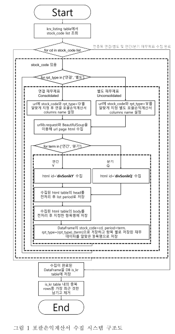
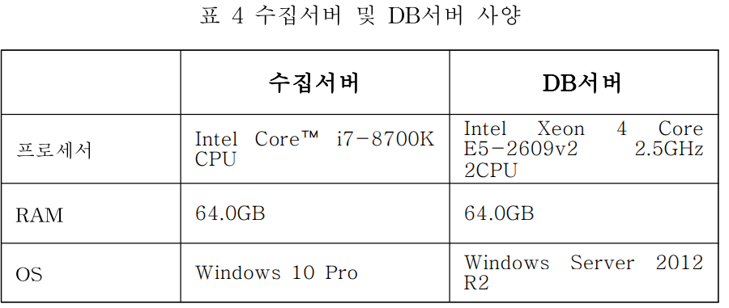
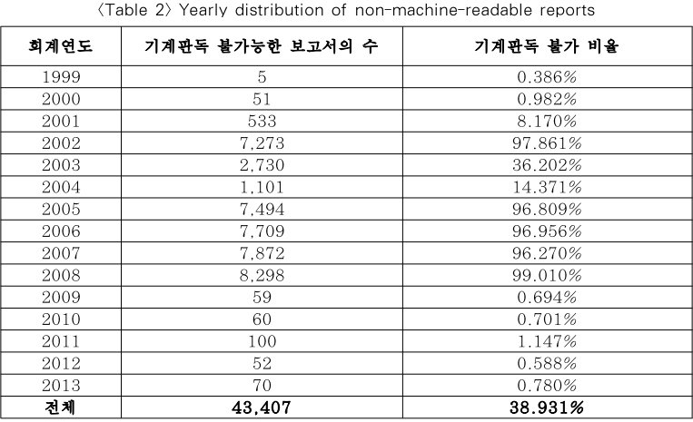

## PAPER LIST

> **keyword1** : `"전자공시시스템" AND "python"`

|   No. |   Publication date | Title                                                                                                                | Authors           | Relevance Score   |
|------:|-------------------:|:---------------------------------------------------------------------------------------------------------------------|:------------------|:------------------|
|     1 |               2022 | [파이썬을 이용한 기업 재무제표 수집 및 데이터베이스 설계 및 구현에 관한 연구](#no1)| 엄태선, 유성준, 구영현 ||
|     2 |               2015 | [전자공시시스템(DART)을 활용한 국내 텍스트 분석(Textual Analysis) 환경에 관한 연구](#no2) | 김형준, 박종원, 이재원 | |

> ***keyword2*** : "financial statements" AND "visualization"

| No. | Publication date | Title | Authors | Relevance Score|
|------:|-------------------:|:---------------------------------------------------------------------------------------------------------------------|:------------------|:------------------|
|     3 |               2015 | [Data Visualization Application for Analyzing Public Company Financial Statement](#k2-no1)| AA Khalil, A Reza, PA Junaedi, B Kanigoro ||

> ***keyword3*** : papers citing sPortfolio: Stratified Visual Analysis of Stock Portfolios ( *papers cited in 2024* )

|   No. |Publication date| Title                   | Authors           | Relevance Score   |
|------:|---------------:|:--------------------|:------------------|:------------------|
|     1 |           2024 | [Prismatic: Interactive multi-view cluster analysis of concept stocks](#s-no1)| W Kam-Kwai, Y Luo, X Yue, W Chen, H Qu  ||
|     2 |           2024 | [EBPVis: Visual Analytics of Economic Behavior Patterns in a Virtual Experimental Environment](#s-no2) | Y Liu, Y Ma, Q Shi, J Wen, W Zhen | |
|     3 |           2024 | [Asset pricing via fused deep learning with visual clues](#s-no3)| J Tan, M Deveci, J Li, K Zhong  ||
|     4 |           2024 | [FMLens: Towards Better Scaffolding the Process of Fund Manager Selection in Fund Investments](#s-no4) | L Chen, C Cheng, H Wang, X Wang | |
|     5 |           2024 | [DSTVis: toward better interactive visual analysis of Drones' spatio-temporal data](#s-no5)| F Chen, Y Yu, L Ni, Z Zhang, Q Lu  ||
|     6 |           2024 | [Sample2SQL: A Visual Interface for Querying Risky Enterprises](#s-no6) | H Wu, S Zou, J Xia, H Zhang | |
|     7 |           2024 | [Dynamic prediction of portfolio riskiness in financial markets based on multi-factor quantitative models](#s-no7)| W Zhang, H Dong  ||
|     8 |           2024 | [ A Visualization Tool for Private Investors: Stock Portfolio Planning and Risk Management](#s-no8) | JM Wang, EB Sørensen, G Walsh, J Kusnick, S Jänicke | |

---

## 1. (2022) 파이썬을 이용한 기업 재무제표 수집 및 데이터베이스 설계 및 구현에 관한 연구 

- 인용 수: 없음
- 엄태선, 유성준, 구영현
- 한국정보과학회 학술발표논문집

> 재무제표 데이터는 수집과 관리가 어렵다. 이를 해결하기 우해 FnGuide 사이트에서 기업 재무제표 데이터를 웹 크롤링으로 수집하고 MariaDB와 HeidiSQL을 이용해 데이터를 저장하는 시스템을 설계 및 구현한다. 수집 대상은 포괄 손익계산서(Income Statement), 재무상태표(Balance Sheet), 현금흐름표(Cash Flow Statement)이다.

`(참고)` : 금융감독원 전자공시시스템(DART:Data Analysis, Retrieval and Transfer System)은 우리나라 기업이 금융감독위원회 등 관계기관에 제출하는 신고 또는 보고서 등을 인터넷을 통하여 전자문서로 제출하고 그 내용을 실시간으로 일반인에게 공시함으로써 공시의 신속성과 기업경영의 투명성을 제고하기 위한 종합적인 공시시스템이다.

**1. 서론**

재무제표 데이터는 퀀트 투자자들에게 중요한 자료이나, 수집이 어려운 문제가 있다. FnGuide는 재무 항목이 통일되어 있어 데이터를 효율적으로 관리할 수 있는 장점을 제공하며, 이를 이용한 재무제표 수집 시스템을 제안한다.

**2. 관련 연구**

전통적인 재무제표 분석은 중요한 투자 방법 중 하낭다. 웹 크롤링을 통해 재무 데이터를 수집하고 이를 DB에 저장하는 기술이 여러 금융 연구에서 활용도고 있다.

**3. 재무 데이터 수집 시스템 설계**

재무 데이터 수집 시스템은 크게 3단계로 나뉜다. 

(1) FnGuide에서 데이터를 크롤링

(2) 각 재무 보고서를 구분하여 필요한 데이터를 수집

(3) 수집된 데이터를 전처리한 후 DB에 저장. 각각의 보고서는 포괄손익계산서, 재무상태표, 현금흐름표로 구분되며, 연간 및 분기 데이터로 나뉜다.

**4. 재무 데이터 DB 설계**

3개의 DB 테이블이 각각 포괄손익계산서(is_kr), 재무상태표(bs_kr), 현금흐름표(cf_kr) 데이터를 저장하며, 공통 컬럼으로는 종목코드(stock_code), 회계 종료 연월(period), 재무제표 종료(rpt_type)이 있다.

**5. 구현 환경**

시스템은 Python 3.8.5, MariaDB 10.3.7, HeidiSQL 11.3.0을 기반으로 구현되었으며, 수집 서버와 DB 서버의 사양이 명시되어 있다.

**6. 결론**

제안된 시스템은 퀀트 투자자들이 직접 재무제표 데이터를 수집하고 이를 통해 분석 및 팩터 생성을 가능하게 하여, 금융 데이터 관리의 효율성을 높인다.

## 2. (2015) 전자공시시스템(DART)을 활용한 국내 텍스트 분석(Textual Analysis) 환경에 관한 연구

> DART에 대한 자세한 설명이 나와있음. 
- 인용 수: 2회 인용
- 김형준，박종원，이재원
- 회계저널, 2015

`-` 이재원
- 박사 : Columbia University 경영학 (Accounting)
- 석사 : Purdue University 경영학 (Strategy) 수료
- 학사 : U.C. Berkeley 경영학
- [Research activities](https://home.sejong.ac.kr/researchlist.do?wslID=jaywonlee)

**1. 서론**
- 미국과 같은 국가에서는 텍스트 분석이 활발하게 이루어지고 있으나, 한국에서는 관련 연구가 부족하다.
- 본 연구는 금융감독원의 DART 시스템을 활용한 텍스트 분석 환경을 평가하고, 문제점들을 지적하며 개선방향을 제시한다.

**2. 선행연구**
- Li(2009)와 같은 연구를 기반으로 텍스트 분석의 유용성과 방법론을 설명한다.
- 텍스트 분석은 가독성, 어조, 단어 사용 등을 통해 기업 보고서의 질을 평가하고, 이는 투자자들에게 중요한 정보를 제공한다.

**3. DART 시스템의 전자문서 공시 절차 및 연구 방법**
- DART 시스템의 공시 절차를 설명하며, 연구에서 사용된 웹 크롤링 프로그램을 통해 1999년부터 2013년까지의 모든 분기 및 사업보고서를 수집하였다.
- 기계 판독 여부를 평가하기 위해 보고서 내 "임원의 현황"을 추출하는 프로그램을 개발하여 텍스트 분석 가능 여부를 확인하였다.

**4. 연구 결과 및 DART 시스템의 문제점**
- 약 40%의 보고서가 기계판독이 불가능한 상태로 나타났다.
- DART 시스템은 대량의 공시서류를 빠르고 쉽게 다운로드할 수 있는 환경을 제공하지 않는다.
- 보고서가 PDF형식으로 제공되어 텍스트 분석을 위해서는 추가적인 변환 작업이 필요하다.

**5. DART 시스템의 향후 개선 방향**
- EDGAR 시스템처럼 익명 FTP 서버 도입 필요성이 강조된다.
- PDF 파일 외에 TXT 또는 HTML 형식으로 공시 서류를 제공하여 텍스트 분석 환경을 개선해야 한다.

**6. 결론**
- DART 시스템은 현재 텍스트 분석을 수행하기에 적합하지 않으며, 시스템 개선이 필요하다.
- DART의 개선이 이루어지려면 국내 자본 시장에서 텍스트 분석 연구가 더욱 활성화 될 수 있을 것이다.

`*` ***(참고)***

금융감독원은 DART에 제출되는 공시서류의 양식을 통일하고, 제출자의 편리성과 효율성을 제고하기 위하여 공시서류를 "DART 편집기"라는 프로그램을 통해 전자문서의 형식으로 작성 및 제출하도록 요구하고 있다. DART 편집기는 각종 공시서류를 작성하는데 피리요한 기능을 제공하는 소프트웨어로서 이를 통해 작성된 문서는 DSD형식(구 DART편집기 하에서는 SGM형식)의 전자문서로 저장된다. 또한 작성이 완료된 DSD파일은 DART편집기를 이용해 제출담당자의 전자서명이 포함된 전송파일(DRT)로 변환시킨 후, DART 접수홈페이지를 통해 제출할 수 있다. DART에 제출된 전송파일은 첨부된 공시서류의 누락여부 및 오류 등을 통해 열람 및 다운로드 받을 수 있다.

모든 보고서들이 TXT 혹은 HTML 파일로 제공되는 미국(EDGAR)과 달리, DART에서 제공하는 국내 보고서들은 모두 Portable Document FOrmat(PDF) 형식으로 되어있다. 따라서 PDF 문서 내의 텍스트에 접근하기 위해 본 연구에서는 Python의 `pyPDF` 모듈을 이용하여 별도의 프로그램을 개발하였다.

"임원의 현황" 표를 추출하는 방식은 Li(2008)와 유사하게 표의 시작과 끝을 나타내는 문자들을 인식하는 조건을 부여하여 이에 해당하는 경우, 표를 추출하는 방식을 취하였다. 연구에 사용된 프로그램은 다음의 기준 중 하나를 만족하면, "임원의 현황" 표의 시작으로 간주하였다.

`*` ***DART 시스템의 문제점***

미국 EDGAR 시스템의 경우, 대량의 공시서류들을 내려 받고자 하는 이용자들을 위해 별도의 익명 FTP서버를 운용하고 있다. EDGAR의 익명 FTP서버는 개인 이메일 주소와 비밀번호로 입력한 후, 익명의 계정으로 서버 접속이 가능하며, SEC에 접수되는 모든 공시 서류들을 최대 200KB/sec의 속도로 내려 받을 수 있는 환경을 제공한다.
 
하지만 국내 DART 시스템의 경우, 공시서류를 대량으로 내려받기 어려운 실정이다.

특히 별도의 FTP서버를 운용하고 있지 않아, 이용자들이 특정 기업-연도의 사업보고서를 내려 받으려면 조건에 맞는 보고서들을 검색하고, 해당되는 보고서를 1건씩 내려받아야 한다. 그래서 해당 연구에서는 '크롤링'이라는 우회적인 방법을 선택하였다.

이러한 우회적인 방법에는 몇가지 문제점이 있는데 
- **`첫째`**, 웹크롤러을 통한 보고서의 대량 추출은 정보 이용자가 일정 수준의 컴퓨터 프로그래밍 기술을 보유한 경우에만 활용 가능하다.
- **`둘째`**, 웹 크롤링을 통한 대량의 공시서류 추출은 DART 서비스를 제공하는 서버에 과부하를 일으킬 수 있다. 본 연구에서는 이런 상황을 고려하여, DART 측과 사전 협조 하에 내려 받기 요청을 보내는 시간을 10초당 1건으로 설정하였다.
(DART 규정 상, 10초 미만의 간격으로 빈번하게 내려 받기 요청을 보낼 경우, DART 서버에대한 공격으로 간주하여 해당 IP 주소를 차단하도록 되어있다.)

$\Rightarrow$ 해당 연구에서는 모든 기업의 사업, 반기, 분기 보고서 총 $111,497$건을 내려 받는 데에 대략 1달이 소요됐다.

현재 국내 DART 시스템에서 제공되는 공시서류들의 경우 기계판독이 가능하더라고, 원활한 텍스트 분석을 하기 위해서는 문서로부터 텍스트를 추출하는 별도의 기술적인 작업이 필요하다. 이것은 TXT 혹은 HTML 등의 컴퓨터 친화적인 형식으로 작성된 문서에서는 불필요한 작업으로서 국내 텍스트 분석환경을 악화시키는 요인 중 하나이다.

## 3. (2015) Data Visualization Application for Analyzing Public Company Financial Statement
- 인용 수: 10회 인용
- AA Khalil, A Reza, PA Junaedi, B Kanigoro
- Procedia Computer Science, 2015

> 이 논문은 공기업의 재무제표를 분석하는 데이터 시각화 애플리케이션에 대해 설명하고 있다.

**1. 배경 (Background)**

데이터는 새로운 경쟁력의 핵심 자산으로 인식되고 있다. 많은 사람들은 재무제표의 복잡한 숫자들을 이해하기 어려워하며, 이를 시각적으로 표현하는 것이 더욱 효과적이다. 특히 시각화는 의사결정을 지원하는 데 중요한 역할을 한다.

**2. 문제 식별 (Problem Identification)**

인도네시아 증권거래소에 상장된 다수의 기업 데이터가 복잡하게 제공되며, 이를 체계적으로 분석하고 이해하는 데 많은 시간이 소요된다. 데이터를 더 쉽게 이해하고 분석할 수 있는 시각화 도구가 필요하다.

**3. 목적과 이점(Objectives and Benefits)**
- 공기업 재무제표 데이터를 시각화하여 사용자들이 쉽게 이해할 수 있게 한다.
- 사용자가 필요에 맞게 데이터를 분류할 수 있는 기능을 제공한다.
- 이 애플리케이션은 사용자가 재무 데이터를 비교하고 비즈니스 결정을 내리는 데 도움을 준다.

**4. 방법론 (Methodology)**

애플리케이션 개발에는 익스트림 프로그래밍(Extreme Programming) 방법론이 사용되었다. 이 방법론은 신속한 개발과 변화에 대한 적응력을 강조하며, 고객의 요구에 맞는 결과를 도출하는 데 중점을 둔다. 개발 과정은 계획, 설계, 코딩, 테스트로 구성된다.

**5. 소프트웨어 설계 및 구현 (Software Design and Implecation)**

애플리케이션은 백엔드, 프론트엔드, 웹 서비스로 나뉜다. 백엔드는 관리자 기능을, 프론트엔드는 사용자가 데이터를 조회하고 비교하는 기능을 담당하며, 웹 서비스는 이 둘을 연결하는 역할을 한다. 또한 애플리케이션은 MVC 패턴을 기반으로 설계도어 유지보수와 향후 개발을 용이하게 한다.

**6. 결론**

이 데이터 시각화 애플리케이션은 사용자가 필요한 데이터를 분류하고 시각적으로 분석할 수 있도록 도와준다. 이를 통해 사용자는 더 빠르고 쉽게 결론을 도출할 수 있다.